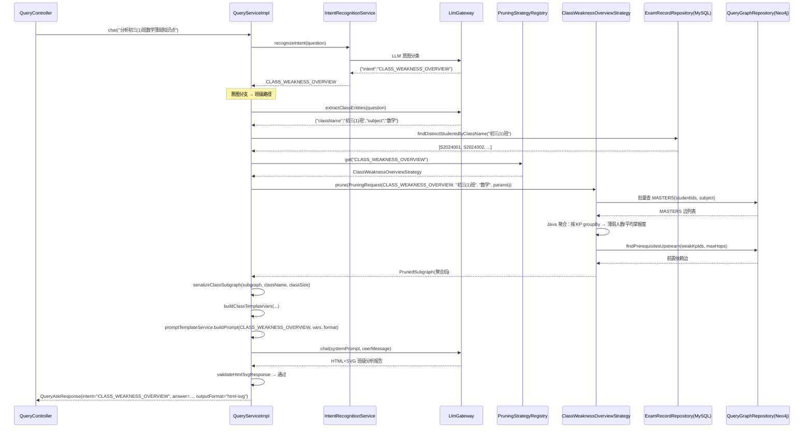
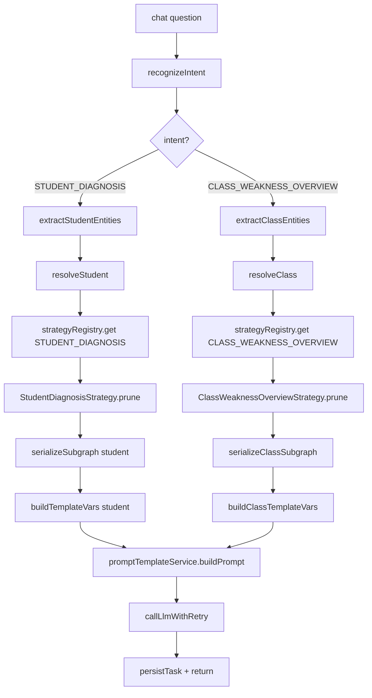
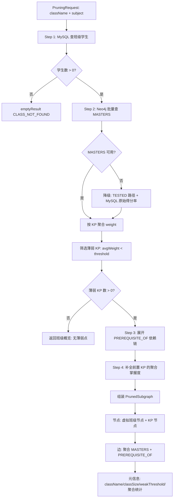

# DESIGN: 班级薄弱概览 — 智能问答新增第二意图

- **Change ID**: `class-weakness-overview`
- **关联**: `@.specs/class-weakness-overview/REQUIREMENT.md`、`@.specs/CONTEXT.md`
- **作者**: AI（Architect 角色）+ 人工 review

---

## 0. 技术栈选定

> CONTEXT.md「已锁技术决策」覆盖全部选型，本 change 不引入新栈。

- **后端**: Spring Boot 3.3.x + Java 17 + Maven 3.9.x（已锁）
- **LLM 集成**: Spring AI 1.0.x + 自研 LLMGateway（已锁，复用 `LlmGateway.chat()`）
- **前端**: Vue 3 + TypeScript + Vite（已锁，Q2=C 决定无 UI 变更）
- **图数据库**: Neo4j 5.x + `Neo4jClient` 手动 Cypher（已锁，新增只读查询）
- **关系数据库**: MySQL 8.0 + Spring Data JPA（已锁，新增 1 个查询方法）
- **不引入**: 新依赖、新库、新框架
- **理由**: 复用 `llm-intent-recognition` 的全部可插拔基础设施，仅在既有模块内做增量扩展

---

## 0.5 既有架构对齐（brownfield）

### 0.5.1 本次 change 触碰的既有模块

```
后端触碰（现有源码，需修改）：
- application/query/chat/model/QueryIntent.java — 新增 CLASS_WEAKNESS_OVERVIEW 枚举值
- application/query/chat/service/impl/QueryServiceImpl.java — 意图分支 + 班级实体解析 + 班级序列化
- application/query/chat/service/QueryService.java — 新增 askClass() 方法签名（可选）
- application/query/chat/intent/KeywordIntentRecognitionStrategy.java — 新增班级关键词
- application/analysis/model/PruningRequest.java — Javadoc 更新 entityId 语义
- api/query/dto/chat/QueryAskRequest.java — 新增可选 className 字段
- api/query/controller/QueryController.java — ask() 端点适配 className 参数
- infrastructure/neo4j/repository/QueryGraphRepository.java — 新增 findStudentsByClassName()
- infrastructure/mysql/file/repository/ExamRecordRepository.java — 新增 findDistinctStudentsByClassName()
- src/main/resources/db/init.sql — system_config 种子数据新增 4 条班级概览 prompt 配置项
- src/main/resources/prompts/intent-classification-system.md — 新增 CLASS_WEAKNESS_OVERVIEW few-shot

后端新增：
- application/analysis/strategy/ClassWeaknessOverviewStrategy.java — 班级剪枝策略
- src/main/resources/prompts/class-weakness-overview-system.md — Markdown system prompt
- src/main/resources/prompts/class-weakness-overview-user.md — Markdown user prompt
- src/main/resources/prompts/class-weakness-overview-system-html.md — HTML+SVG system prompt
- src/main/resources/prompts/class-weakness-overview-user-html.md — HTML+SVG user prompt

前端触碰（最小变更，Q2=C）：
- 无需修改任何前端文件。QueryAskResponse.intent 字段类型为 String，新值 "CLASS_WEAKNESS_OVERVIEW" 自动兼容。
  现有 HtmlSvgViewer/MarkdownViewer 自动渲染班级报告，无需适配。

禁动清单（与本次无关，AI 不许"顺手"碰）：
- application/query/chat/intent/IntentRecognitionStrategy.java — 接口不变
- application/query/chat/intent/IntentRecognitionService.java — 编排逻辑不变
- application/query/chat/intent/LlmIntentRecognitionStrategy.java — LLM 分类策略不变（prompt 由模板文件控制）
- application/query/chat/registry/PruningStrategyRegistry.java — 注册表不变
- application/analysis/strategy/StudentDiagnosisStrategy.java — 学生诊断剪枝逻辑完全不变
- application/query/prompt/service/PromptTemplateService.java — 模板加载逻辑不变（自动按 intent name 拼接文件名）
- infrastructure/llm/ — LLM 网关不变
- infrastructure/neo4j/repository/ConstructionGraphRepository.java — 构建模块不变
- infrastructure/neo4j/repository/FusionGraphRepository.java — 融合模块不变
- frontend/ — 全部文件不变
```

### 0.5.2 既有抽象沿用对照表

| 本次需要 | 既有有没有？ | 决定 |
|----------|------------|------|
| LLM 调用 | `LlmGateway.chat()` — `application/llmgateway/` | **沿用**。班级分析 LLM 调用与现有完全一致 |
| 意图识别 | `IntentRecognitionService` — LLM + keyword 策略链 | **沿用**。新意图通过枚举 + prompt + keyword 自动接入，编排器零改动 |
| 策略路由 | `PruningStrategyRegistry` — Map 自动注入 | **沿用**。`@Component("CLASS_WEAKNESS_OVERVIEW")` 自动注册 |
| Prompt 模板加载 | `PromptTemplateService` — `{{var}}` 替换 + 格式感知 | **沿用**。`buildPrompt(intent, vars, format)` 自动按 intent name 拼接文件名，方法签名不变 |
| 格式校验+重试 | `QueryServiceImpl.callLlmWithRetry()` | **沿用**。HTML+SVG/Markdown 校验规则不变 |
| 子图序列化 | `QueryServiceImpl.serializeSubgraph()` | **新建并列方法** `serializeClassSubgraph()`（班级聚合格式不同，不能复用学生版） |
| 实体解析 | `QueryServiceImpl.resolveStudent()` | **新建并列方法** `resolveClass()`（班级实体与学生实体解析逻辑不同） |
| 实体提取（chat） | `QueryServiceImpl.extractViaLlm()` + `extractViaRegex()` | **扩展**：LLM prompt 新增 `className` 字段（与 studentName/studentNo 互斥）；正则新增班级名 pattern |
| 配置管理 | `QueryProperties` — `@ConfigurationProperties` | **沿用**。班级概览复用同一套阈值/格式/重试配置 |
| API 响应体 | `ApiResult<T>` + `QueryAskResponse` | **沿用**。`intent` 字段新增可能值，旧客户端忽略 |
| 前端 HTML/SVG 渲染 | `HtmlSvgViewer.vue`（DOMPurify + v-html） | **沿用**。班级报告同为 HTML+SVG 格式，渲染器无关 |
| 前端 Markdown 渲染 | `MarkdownViewer.vue`（marked） | **沿用**。markdown 模式下班级报告同样适用 |
| 数据访问（MySQL） | `ExamRecordRepository` — Spring Data JPA | **沿用**。新增 1 个查询方法 |
| 数据访问（Neo4j） | `QueryGraphRepository` — Neo4jClient | **沿用**。新增 1 个只读查询 |
| 异常处理 | `BusinessException` + `GlobalExceptionHandler` | **沿用**。班级不存在抛 A0006 |

### 0.5.3 沿用模式 vs 引入新模式

```
- LLM 调用：**沿用** LlmGateway.chat()（所有 LLM 调用必须走网关）
- Prompt 管理：**沿用** classpath .md 模板 + {{var}} 占位符（ADR-011 范式）
- 意图识别：**沿用** 可插拔策略链（ADR-025），新增意图零改动编排器
- 策略路由：**沿用** Spring Map 自动注入（ADR-027），新增策略零改动 Registry
- 输出格式切换：**沿用** yml 配置驱动（ADR-026 D2），班级概览与现有共用同一配置项
- 格式校验+重试：**沿用** 现有 validateHtmlSvgResponse/validateMarkdownResponse + ≤2 次重试
- 实体解析分支：**引入新模式** QueryServiceImpl 内 if-else 意图分支 → 理由：仅 2 种意图，与 D2"仅 2 种格式不引入 Strategy 接口"逻辑一致。3+ 种意图时再重构为 EntityResolutionStrategy 接口
- 实体提取扩展：**沿用** LLM-first → regex fallback 模式 → 理由：与现有 extractViaLlm → extractViaRegex 一致，仅扩展提取字段（新增 className）
- 班级级子图序列化：**引入新模式** 独立 serializeClassSubgraph() 方法 → 理由：班级聚合数据格式（班级信息 + KP 排行表）与学生诊断格式（单生掌握度列表）差异大，强行共用会导致方法内大量条件分支
- 数据访问：**沿用** QueryGraphRepository（Neo4j 只读）+ ExamRecordRepository（MySQL），新增方法遵循既有命名和查询风格
- 构造器注入：**沿用** @RequiredArgsConstructor + private final（项目规范 §1.4.3）
```

---

## 1. 决策清单

| # | 决策 | 备选 | 选择理由 | 取舍代价 |
|---|------|------|---------|---------|
| D1 | **QueryServiceImpl 意图分支**: `chat()` 和 `ask()` 内按 intent 类型 if-else 分支，选择实体解析器 + 序列化器 + 模板变量 | A) `EntityResolutionStrategy` 接口 + `StudentEntityResolver` / `ClassEntityResolver` 实现 B) 仅通过 `chat()` 支持班级概览，`ask()` 不改 | 与 DESIGN D2"仅 2 种格式不引入 Strategy 接口"逻辑一致。仅 2 种实体类型（student/class），if-else 约 15 行分支代码，Strategy 接口至少新增 3 个文件。`chat()` 为主要入口（Q2=C），但 `ask()` 也需支持 className 参数以保证 API 完整性 | 新增第 3 种实体类型（如"年级"）时需改 if-else → 约 5 行。但按项目演进速度，该场景概率低。真要加时重构为接口，成本可控 |
| D2 | **ClassWeaknessOverviewStrategy 聚合方式**: Java 层 groupBy 聚合（分步 Cypher 查询 → Java Stream 统计），非 Neo4j Cypher 聚合 | A) Cypher `avg()`/`count()` 聚合 B) 全量查回 Java 层聚合 | 与 ADR-010"分步 Cypher + Java 合并"范式一致。Cypher 聚合对 MASTERS 边 weight 的统计表达能力有限（需同时计算薄弱人数 count + 平均 weight + min/max），且 MASTERS 降级路径需要从 MySQL 计算原始得分率（Cypher 无法跨存储查询）。Java Stream groupBy 灵活且可读 | 班级 ≤ 60 人时 Java 聚合 O(n) 耗时 < 50ms，可接受。若班级规模 > 200 人可能需要分页，但当前数据规模不存在此问题 |
| D3 | **班级学生查询**: 两步查询 — ① MySQL `exam_record` 查班级学生列表（DISTINCT studentNo）→ ② Neo4j 批量查 MASTERS 边 | A) 仅从 Neo4j `Student.className` 属性查 B) 仅从 MySQL 查 | MySQL `exam_record` 是学生数据的权威来源（成绩上传时写入），`className` 字段有索引。Neo4j Student 节点也可能有 className 属性（融合时创建），但融合可能未执行。MySQL 优先保证班级查询不依赖融合状态 | 需 2 次查询（MySQL → Neo4j），但单次查询 < 20ms，总延迟可忽略 |
| D4 | **PruningRequest 语义**: `entityId` 字段按意图语义复用 — STUDENT_DIAGNOSIS → studentNo；CLASS_WEAKNESS_OVERVIEW → className。不新增字段 | A) 新增 `entityType` + `entityId` 两个字段 B) 新增 `classEntityId` 字段 | `entityId` Javadoc 已写"如 studentNo"，表明设计时已预留扩展空间。`PruningRequest` 是 record，新增字段会破坏所有构造调用点。params Map 可携带额外上下文。保持 record 签名不变，向后兼容 | `entityId` 语义从"学生标识"变为"目标实体标识"，需更新 Javadoc。策略实现内部按 intent 判断如何使用 entityId。未来如果有同时需要 studentNo + className 的策略（如跨班级学生对比），需改造 PruningRequest |
| D5 | **实体提取扩展**: `chat()` 的 LLM 提取 prompt 新增 `className` 可选字段（与 studentName/studentNo 互斥）。正则兜底新增班级名 pattern：`\w+年级?\d+班` | A) 独立 `extractClassViaLlm()` 方法 B) 扩展现有 prompt | 扩展现有 prompt 是改动最小方案——在 JSON 输出格式中新增 `"className": "..."` 字段（可选），LLM 自行判断返回学生信息还是班级信息。正则兜底同样扩展现有 `extractViaRegex` 方法，新增 `extractClassName()` 私有方法 | LLM prompt 变长（新增 className 字段说明 + few-shot），可能略微增加意图分类的 token 消耗。但班级名提取比学生名简单（格式更固定），准确率预期较高 |
| D6 | **班级子图序列化格式**: 班级聚合视图 — 班级信息头 + KP 薄弱排行表（KP 名/薄弱人数/平均掌握度/最低） + 前置依赖链 | A) 复用学生诊断的序列化格式（逐生列举） B) 纯表格格式 | 班级概览的核心价值是"聚合排行"，逐生列举会生成大量文本（50 学生 × 10 KP = 500 行），既浪费 token 又淹没了聚合信息。聚合视图精简到 15-30 行，token 消耗与学生诊断相当 | 丢失个体学生差异信息（如"张三的二次函数特别薄弱"），但这正是班级概览 vs 学生诊断的定位差异——个体细节留给 STUDENT_DIAGNOSIS |
| D7 | **模板变量设计**: 班级概览专用变量集 — `{{className}}`/`{{classSize}}` 替换学生版的 `{{studentName}}`/`{{studentNo}}`。`{{subgraphText}}` 内容格式不同但变量名不变 | A) 统一变量名（studentName 也用于班级场景） B) 完全独立的变量名 | 独立变量名的好处：prompt 模板中可写"班级：{{className}}（共{{classSize}}人）"而非"学生：{{studentName}}"，语义清晰。`PromptTemplateService.buildPrompt()` 按 intent 自动加载不同模板文件，模板内容独立，变量名可自由定义 | 班级模板和学生模板变量名不一致，未来如果做"班级+学生联合诊断"需要合并两套变量。但该场景明确列为 out，不存在此问题 |
| D8 | **前端变更范围**: 零变更。Q2=C 决定了纯自然语言触发，现有渲染器自动适配新意图的报告 | A) 新增班级选择器组件 B) 新增意图切换 Tab | Q2 用户明确选择 C。`QueryAskResponse.intent` 类型为 `String`，新值 `"CLASS_WEAKNESS_OVERVIEW"` 自动兼容。`HtmlSvgViewer`/`MarkdownViewer` 对 HTML+SVG/Markdown 内容做通用渲染，与 intent 类型无关 | 无法在 UI 上显式切换意图模式，纯依赖 LLM 意图识别准确率。若 LLM 将"分析初三(1)班张三数学"误判为 CLASS_WEAKNESS_OVERVIEW，用户无法手动纠正。通过 few-shot 明确优先级（含学生名 → STUDENT_DIAGNOSIS 优先）来缓解 |
| D9 | **ask() 端点兼容**: `QueryAskRequest` 新增可选 `className` 字段（与 studentName/studentNo 互斥，至少提供一个实体标识）。Controller 按有无 className 选择分支 | A) 新增独立端点 `POST /api/v1/query/ask-class` B) 不改 ask()，仅 chat() 支持班级概览 | 新增可选字段是 JSON REST API 的标准扩展做法。`className` 为 `Optional<String>`，旧调用方不传时行为不变。比新增端点更简洁（避免端点膨胀） | `QueryAskRequest` 的校验逻辑从"studentName 或 studentNo 至少一个"变为"studentName/studentNo/className 至少一个"，需调整 `@Valid` 或手动校验 |

---

## 2. 数据流 / 架构图

### 2.1 班级概览完整链路（chat 入口）



### 2.2 QueryServiceImpl 意图分支（核心重构点）



### 2.3 ClassWeaknessOverviewStrategy 内部流程



### 2.4 模块依赖关系（L1/L2/L3）

```
L1 (api/query/controller/)
  └─ QueryController.java
       ├─ ask() → 新增 className 参数分支
       └─ chat() → 意图感知分支（MODIFIED）

L2 (application/)
  ├─ query/chat/service/impl/QueryServiceImpl.java (MODIFIED)
  │    ├─ injects IntentRecognitionService (UNCHANGED)
  │    ├─ injects PruningStrategyRegistry (UNCHANGED)
  │    ├─ injects PromptTemplateService (UNCHANGED)
  │    ├─ injects LlmGateway (UNCHANGED)
  │    ├─ 新增: resolveClass()
  │    ├─ 新增: serializeClassSubgraph()
  │    ├─ 新增: buildClassTemplateVars()
  │    ├─ 扩展: extractViaLlm() — className 字段
  │    └─ 扩展: extractViaRegex() — 班级名 pattern
  ├─ query/chat/model/QueryIntent.java (MODIFIED — 新增枚举值)
  ├─ query/chat/intent/KeywordIntentRecognitionStrategy.java (MODIFIED — 关键词)
  └─ analysis/strategy/ClassWeaknessOverviewStrategy.java (NEW)
       ├─ injects QueryGraphRepository
       ├─ injects ExamRecordRepository
       └─ injects ObjectMapper

L3 (infrastructure/)
  ├─ neo4j/repository/QueryGraphRepository.java (MODIFIED — 1 新方法)
  ├─ mysql/file/repository/ExamRecordRepository.java (MODIFIED — 1 新方法)
  └─ llm/client/SpringAiLlmGateway.java (UNCHANGED)

前端 (frontend/src/)
  └─ UNCHANGED (Q2=C)
```

---

## 3. 关键状态机

### 3.1 chat() 实体提取状态（扩展后）

```
                    ┌─────────┐
                    │  START  │
                    └────┬────┘
                         │
                         v
              ┌─────────────────────┐
              │  recognizeIntent    │
              └────┬────┬───────────┘
                   │    │
         STUDENT   │    │  CLASS_WEAKNESS
         _DIAGNOSIS│    │  _OVERVIEW
                   v    v
    ┌──────────────────┐ ┌──────────────────────┐
    │ extractViaLlm    │ │ extractClassViaLlm   │
    │ fields:          │ │ fields:              │
    │ studentName?     │ │ className?           │
    │ studentNo?       │ │ subject              │
    │ subject          │ │ (与 studentName/     │
    └────┬───┬─────────┘ │  studentNo 互斥)      │
         │   │           └────┬───┬─────────────┘
    non-null|null            │   │
         │   │          non-null|null
         v   └──────┐    ┌──────┘
    ┌─────────┐     v    v
    │ RESOLVED│   (正则 fallback)
    └─────────┘         │
         ^              │
         │    所有提取失败
         └──────────────┘
                        │
                        v
              ┌──────────────────┐
              │ FAILED (A0019)   │
              └──────────────────┘
```

### 3.2 班级剪枝 MASTERS 降级状态

```
PruningRequest(className, subject)
              │
              v
    ┌─────────────────────┐
    │ MySQL 查班级学生     │
    │ (DISTINCT studentNo)│
    └────────┬────────────┘
             │
             v
    ┌─────────────────────────┐
    │ Neo4j 查 MASTERS 边     │
    └────┬──────────┬─────────┘
         │          │
    rows>0│          │ rows=0 (MASTERS 不存在)
         │          │
         v          v
    ┌──────────┐  ┌──────────────────────────┐
    │ Java 聚合│  │ 降级: TESTED 路径查询     │
    │ weight   │  │ + MySQL exam_record 算分  │
    │ 统计     │  │ + meta.mastersAvailable   │
    └────┬─────┘  │   = false                │
         │        └────────────┬─────────────┘
         │                     │
         └──────────┬──────────┘
                    v
          ┌──────────────────┐
          │ 筛选薄弱 KP      │
          │ avgWeight<thresh │
          └────────┬─────────┘
                   v
          ┌──────────────────┐
          │ 展开依赖链        │
          │ PREREQUISITE_OF   │
          └────────┬─────────┘
                   v
          ┌──────────────────┐
          │ 组装 PrunedSubgraph│
          └──────────────────┘
```

---

## 4. ADR 索引

| ADR | 标题 | 关联决策 |
|-----|------|---------|
| [ADR-044](.specs/adr/ADR-044-class-weakness-overview-strategy.md) | 班级薄弱概览剪枝策略 — 批量 MASTERS 查询 + Java 聚合 | D2, D3, D4 |
| [ADR-045](.specs/adr/ADR-045-chat-entity-extraction-classname.md) | chat() 实体提取扩展 — className 字段 + 正则兜底 | D5 |
| [ADR-046](.specs/adr/ADR-046-query-service-impl-intent-branching.md) | QueryServiceImpl 意图分支 — if-else vs 策略接口 | D1, D9 |

---

## 5. 风险

| # | 风险 | 影响 | 概率 | 缓解 |
|---|------|------|------|------|
| R1 | **班级名格式不一致**：用户输入"初三一班"但数据库存的是"初三(1)班"，LLM 提取正确但 MySQL 精确匹配失败 → 班级不存在错误 | 班级概览功能不可用，用户困惑 | 高 | 提示词中要求 LLM 输出规范化班级名（如"初三(1)班"）。v1 不做模糊匹配（明确列为范围排除），在错误提示中展示数据库中存在的班级名列表，引导用户使用正确名称 |
| R2 | **LLM 意图区分边界模糊**："分析初三(1)班张三数学"含班级名又含学生名，LLM 可能误判 | 班级概览和学生诊断之间错误路由 | 中 | few-shot 中明确优先级规则：含明确学生姓名 → STUDENT_DIAGNOSIS；仅含班级不含学生名 → CLASS_WEAKNESS_OVERVIEW。prompt 中加一条："当用户同时提到班级和学生姓名时，意图为学生诊断" |
| R3 | **班级聚合子图 token 超预算**：班级 60 人 × 平均 15 KP MASTERS 边 + 前置依赖链 → 序列化文本可能超过 8000 token 预算 | 子图截断丢失关键信息，LLM 分析不完整 | 中 | 聚合视图大幅减少文本量（按 KP 汇总而非逐生列举）。控制输出 KP 数：仅输出 Top 15 薄弱 KP + Top 10 前置依赖边。超出预算时截断并标注省略的 KP 数量 |
| R4 | **N+1 查询问题（降级路径）**：MASTERS 不可用时，降级到 TESTED 路径需为每个学生单独计算原始得分率（当前 `StudentDiagnosisStrategy.calculateRawScoreRate` 已是逐生查询），班级 50 人 → 50 次 MySQL 查询 | 降级路径响应时间显著增加（可能从 500ms → 5s） | 中 | 新增批量查询方法 `ExamRecordRepository.findByStudentNoIn()`，一次查询获取全班学生的 exam_record，然后在 Java 层按 studentNo+kpName 分组计算得分率。避免逐生查询 |
| R5 | **新增意图导致 regression**：`QueryServiceImpl` 的意图分支改动可能影响现有 STUDENT_DIAGNOSIS 链路 | 现有学生诊断功能异常 | 低 | 分支逻辑在 `chat()` 和 `ask()` 入口处，STUDENT_DIAGNOSIS 分支走完全相同的既有代码路径。集成测试覆盖 AC-13（学生诊断不退化），CI 中跑全量 `QueryControllerIntegrationTest` |
| R6 | **班级节点为虚拟节点**：`ClassWeaknessOverviewStrategy` 输出的子图中没有真实的 Student 节点（只有聚合 KP），前端诊断子图可视化组件（`DiagnosisSubgraph.vue`）可能因缺少 Student 节点而渲染异常 | 班级概览的子图可视化不可用或显示异常 | 低 | 班级概览的子图结构与学生诊断不同（班级虚拟节点 vs 学生节点）。前端 `DiagnosisSubgraph.vue` 当前为 STUDENT_DIAGNOSIS 设计，班级概览的子图可视化属于 v2 范围。v1 的 LLM 报告中通过 SVG 呈现依赖链图，不依赖前端子图组件 |

---

## 6. 不在范围

- **班级名模糊匹配**：v1 仅精确匹配。用户必须输入与数据库完全一致的班级名。不做编辑距离/拼音/同义词匹配
- **前端子图可视化适配**：班级概览的子图结构与学生诊断不同，`DiagnosisSubgraph.vue` 不需要适配班级子图（LLM 报告中 SVG 呈现依赖链即可）
- **班级概览异步模式**：v1 仅同步 `/ask` 和 `/chat`，`/ask-async` 后续扩展
- **批量班级查询**：不支持一次请求查询多个班级（如"对比初三(1)班和初三(2)班"）
- **跨学科班级概览**：v1 仅支持单个学科
- **EntityResolutionStrategy 接口**：仅 2 种实体类型时不引入（与 D1 一致）
- **前端 UI 变更**：Q2=C，不做任何前端改动
- **班级概览导出格式定制**：复用现有 HTML 导出端点

---

## 9. 架构沉淀建议

### 9.1 新增的可复用抽象

| 路径 | 能力 | 触发场景 | 复用建议 |
|------|------|---------|---------|
| `application/analysis/strategy/ClassWeaknessOverviewStrategy.java` | 班级级 KP 聚合剪枝 — 全班 MASTERS 批量查询 + Java groupBy 聚合 | 任何需要"按班级/年级/学校等群体维度聚合知识点掌握度"的场景 | 未来新增"年级概览"（跨班级聚合）或"全校诊断"意图时，可直接复用聚合逻辑（抽象出 `AggregationStrategy` 接口），`ClassWeaknessOverviewStrategy` 作为首个实现 |
| `QueryServiceImpl` 的意图分支模式（if-else 选择实体解析器 + 序列化器 + 模板变量） | 在核心服务方法中按意图类型路由到不同的内部处理流程 | 任何需要在单一入口方法中按枚举类型路由到不同处理逻辑的场景 | 当意图 ≥ 3 种时，建议将 if-else 重构为 `EntityResolutionStrategy` + `SubgraphSerializationStrategy` 接口。本 change 的 if-else 代码结构可作为重构的起点 |

### 9.2 新增 / 改变的项目级技术决策

| 决策 | 取值 | 影响范围 | 推翻代价 |
|------|------|---------|---------|
| 班级概览意图 | `CLASS_WEAKNESS_OVERVIEW` — 智能问答第二个意图，className + subject 输入，聚合班级 MASTERS 输出薄弱 KP 排行 | 所有班级级诊断分析场景 | 低：移除意图只需删除枚举值 + 策略类 + 模板文件，QueryServiceImpl 去除对应分支 |
| PruningRequest entityId 多语义 | `entityId` 按意图类型语义不同（studentNo / className），不新增字段 | 所有 SubgraphPruningStrategy 实现 | 低：若未来出现同时需要多个实体标识的策略，可通过 params Map 传递额外标识 |
| 班级名精确匹配 | v1 不做模糊匹配，用户必须输入与数据库完全一致的班级名 | 班级概览 chat() 实体提取 | 中：引入模糊匹配需新增匹配策略 + 候选列表返回机制，与现有学生名模糊匹配逻辑一致 |

### 9.3 新增 / 修改的跨模块契约

```
- QueryIntent 枚举新增: CLASS_WEAKNESS_OVERVIEW("班级薄弱概览", "聚合全班学生在指定学科上的 MASTERS 数据...")
- API 请求新增可选字段: QueryAskRequest.className: String（与 studentName/studentNo 互斥）
- API 响应新增可能值: QueryAskResponse.intent 新增 "CLASS_WEAKNESS_OVERVIEW"（String 类型，旧客户端兼容）
- yml 配置不变: query.output-format / query.pruning.* / query.retry.* 班级概览与学生诊断共用
- Prompt 模板命名约定: class-weakness-overview-{system,user}.md + -html.md 变体（遵循既有 {intent小写}-{system/user}-{format}.md 约定）
- ExamRecordRepository 新增: findDistinctStudentsByClassName(String className) → List<Object[]>（返回 studentNo/name/className）
- QueryGraphRepository 新增: findMastersByStudentIds(List<String> studentNodeIds, String subjectName) → List<Map<String, Object>>（批量 MASTERS 查询）
- LlmGateway.chat() 调用频率: 班级概览与 STUDENT_DIAGNOSIS 相同（意图分类 + 实体提取 + 分析 = 3 次 LLM 调用 / 请求）
```

### 9.4 新增依赖

无新增依赖。

### 9.5 禁动清单变化

```
- 新增禁动: application/query/chat/intent/IntentRecognitionService.java — 策略链编排逻辑不允许为特定意图添加特殊分支（所有意图必须平等经过策略链）
- 新增禁动: application/query/chat/registry/PruningStrategyRegistry.java — 不允许为特定意图添加硬编码路由（必须通过 @Component bean name 自动发现）
- 新增禁动: application/query/prompt/service/PromptTemplateService.java — 不允许为特定意图添加硬编码模板选择逻辑（必须通过 intent name → 文件名约定自动发现）
- 解禁: 无
```

---

> 本文件不包含完整代码实现。函数签名、伪代码、接口定义可以；函数体不行。