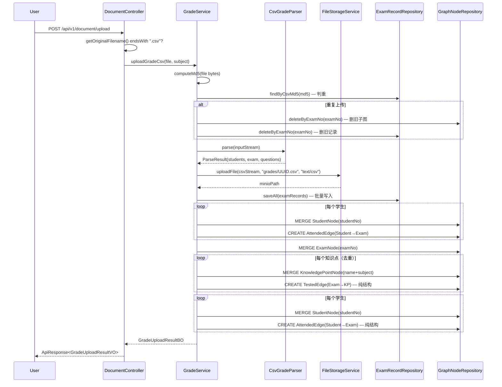
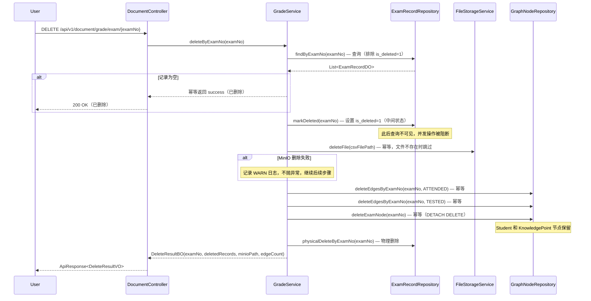

# DESIGN: CSV 成绩文件上传与解析入库

- **Change ID**: `csv-grade-import`
- **关联**: `@.specs/csv-grade-import/REQUIREMENT.md`、`@.specs/CONTEXT.md`
- **作者**: AI（Architect 角色）+ 人工 review

---

## 0. 技术栈选定

> 技术栈已在 `@.specs/CONTEXT.md`「已锁技术决策」中锁定，本 change 无新增依赖。

- **选定**：延续既有 Java 17 + Spring Boot 3.3.x 四层架构
- **后端**：Spring Boot 3.3.x / Spring MVC / Spring Data JPA + Neo4jClient
- **数据库**：MySQL 8.0（新增 `exam_record` 表）+ Neo4j 5.x（新增 `Student`/`Exam` 节点 + `ATTENDED`/`TESTED` 边）
- **文件存储**：MinIO 8.x（复用 `FileStorageService`）
- **关键依赖**：Apache Commons CSV（解析库，需新增到 `pom.xml`）、Jackson（JSON 列序列化，已有）
- **理由**：与既有 `document-process-pdf-minimal` 和 `knowledge-graph-extraction` 保持一致的技术基线，无新框架引入
- **明确排除**：不引入 Spring Batch（批处理过度，v1 仅单文件同步处理）、不引入专门的 CSV 解析微服务

> ⚠️ `pom.xml` 新增 `commons-csv` 依赖属于依赖变更，按禁动清单规则需走独立评估。本次在 DESIGN 阶段声明，TASK 阶段新增独立任务 T00 单独提交。

---

## 0.5 既有架构对齐（brownfield）

### 0.5.1 本次 change 触碰的既有模块

```
触碰模块（grep/确认的实际清单）：
- api/document/controller/DocumentController.java       （既有 · 扩展 upload 方法，增加 CSV 分支 + DELETE 端点）
- application/document/service/DocumentService.java      （既有 · 新增 uploadGradeCsv/deleteByExamNo 方法签名）
- application/document/service/impl/DocumentServiceImpl.java （既有 · 新增 GradeService 委托调用）
- infrastructure/storage/FileStorageService.java          （既有 · 复用 uploadFile/deleteFile）
- infrastructure/neo4j/repository/GraphNodeRepository.java （既有 · toNodeProps 重构为多态委托 node.toProperties() + deleteByExamNo 查询删除，见 D11）
- infrastructure/neo4j/node/NodeType.java                 （既有 · 新增 STUDENT、EXAM 枚举值）
- infrastructure/neo4j/edge/EdgeType.java                 （既有 · 新增 ATTENDED、TESTED 枚举值）
- infrastructure/neo4j/node/KnowledgePointNode.java       （既有 · 复用，CSV 解析的 KP 使用无 documentId 构造）
- common/exception/ErrorCode.java                         （既有 · 新增 A0011~A0015）

新增模块：
- api/document/dto/GradeUploadResultVO.java               （新 VO）
- api/document/dto/DeleteResultVO.java                    （新 VO · 级联删除响应）
- application/document/model/GradeUploadResultBO.java     （新 BO）
- application/document/model/DeleteResultBO.java          （新 BO · 级联删除结果）
- application/document/parser/FileParser.java              （新接口 · D12 统一解析器接口）
- application/document/parser/FileParseRequest.java        （新 record · D12 统一输入）
- application/document/parser/FileParseResult.java         （新 record · D12 统一输出）
- application/document/parser/FileParserRegistry.java      （新工厂 · D12 按扩展名路由）
- application/document/parser/CsvGradeParser.java          （新解析器 · 实现 FileParser）
- application/document/service/GradeService.java           （新接口）
- application/document/service/impl/GradeServiceImpl.java  （新实现）
- infrastructure/neo4j/node/StudentNode.java               （新节点类 · 含 toProperties() 覆盖，见 D11）
- infrastructure/neo4j/node/ExamNode.java                  （新节点类 · 含 toProperties() 覆盖，见 D11）
- infrastructure/neo4j/edge/AttendedEdge.java              （新边类）
- infrastructure/neo4j/edge/TestedEdge.java                （新边类）
- infrastructure/mysql/document/ExamRecordDO.java          （新 DO）
- infrastructure/mysql/document/ExamRecordRepository.java  （新 Repository）

禁动清单（与本次无关，AI 不许"顺手"碰）：
- infrastructure/llm/                                    （LLM 模块，与 CSV 解析无关）
- application/graph/                                     （图谱抽取模块，CSV 不走 LLM）
- application/document/parser/DocumentParser.java         （PDF 解析接口，CSV 不经过它）
- infrastructure/neo4j/config/Neo4jIndexConfig.java      （索引配置，新节点类型需加索引但独立任务处理）
- pom.xml                                                （除非仅新增 commons-csv 依赖，否则禁动）
```

### 0.5.2 既有抽象沿用对照表

| 本次需要 | 既有有没有？路径 | 决定 |
|---|---|---|
| 文件上传到 MinIO | `FileStorageService.uploadFile(InputStream, String, String)` | **沿用**，objectKey 传入 `grades/{UUID}.csv`（CSV 成绩文件）和 `textbooks/{UUID}.pdf`（教辅 PDF） |
| MinIO 文件删除 | `FileStorageService.deleteFile(String)` | **沿用**，级联删除时按 `csvFilePath` 删除 |
| 图节点持久化 | `GraphNodeRepository.save(GraphNode)` | **沿用**，StudentNode/ExamNode 走同一 MERGE 逻辑 |
| 图边持久化 | `GraphNodeRepository.saveEdge(GraphEdge)` | **沿用**，AttendedEdge/TestedEdge 走同一 CREATE 逻辑 |
| 图节点属性映射 | `GraphNodeRepository.toNodeProps()` | **重构**为多态 `GraphNode.toProperties()`（见 D11），Repository 侧缩减为 1 行委托 `node.toProperties()` |
| 文件解析器接口 | `DocumentParser`（PDF 专用 @FunctionalInterface） | **引入新模式** `FileParser` 统一接口 + `FileParserRegistry` 按扩展名路由（见 D12），`DocumentParser` 保持不动 |
| KnowledgePoint 节点 | `KnowledgePointNode`（已有） | **沿用**，新增不含 documentId 的构造器重载，新增 `toProperties()` 覆盖 |
| API 响应包装 | `ApiResponse<T>`（record） | **沿用** |
| 分页查询 | `PageResult<T>` + Spring Data `Page` | **沿用**，成绩查询分页走同样模式 |
| 异常处理 | `BusinessException` + `ErrorCode` | **沿用** |
| CSV 解析 | **没有** | **新建** `CsvGradeParser`（理由：项目首次处理 CSV 格式） |
| JSON 列存储 | Jackson（已有依赖） | **沿用**，MySQL `score_details` 列通过 JPA `@Convert` 或 Jackson 序列化 |
| MD5 判重 | `DocumentServiceImpl.computeMd5()`（private） | **提取**为 `common/util/Md5Utils` 公共方法，PDF 和 CSV 复用 |
| 构造器注入 | `@RequiredArgsConstructor` | **沿用** |

### 0.5.3 沿用模式 vs 引入新模式

```
- 依赖注入：    **沿用** 构造器注入（@RequiredArgsConstructor）
- 分层架构：    **沿用** L1(Controller+VO) → L2(Service+BO) → L3(Repository+DO)
- Neo4j 持久化：**沿用** Neo4jClient + 手动 Cypher（MERGE/CREATE/UNWIND）
- 节点属性映射：**引入新模式** 多态 toProperties()（D11 · 理由：消除 instanceof 链，符合开闭原则）
- 文件解析路由：**引入新模式** 策略+工厂 FileParser + FileParserRegistry（D12 · 理由：新增文件类型只需加 Parser 类，Controller 零改动）
- 文件上传：    **沿用** MultipartFile → InputStream → MinIO；**引入新模式** 按文件类型分文件夹存储（`documents/` 教辅 PDF，`grades/` 成绩 CSV）
- CSV 解析：    **引入新模式** CsvGradeParser（理由：项目首次处理 CSV，无既有解析器）
- MD5 工具：    **提取公共方法** Md5Utils（理由：PDF 和 CSV 都需要 MD5，避免重复）
```

---

## 1. 决策清单

| # | 决策 | 备选 | 选择理由 | 取舍代价 |
|---|---|---|---|---|
| D1 | **文件分流**：Controller 层按 `getOriginalFilename()` 后缀分流 `.csv` → `GradeService`，`.pdf` → 既有 `DocumentService` | ① Service 层内部分支 ② 独立 `/grade/upload` 端点 | ① Service 返回类型不同（DocumentBO vs GradeUploadResultBO），内部分支需改返回类型签名，影响既有 PDF 调用方；② 用户明确要求复用 upload 接口。Controller 分流最轻量，不改既有 Service 签名 | Controller 承担了路由职责（非其传统角色），但分支逻辑仅 3 行 |
| D2 | **CSV 解析库**：Apache Commons CSV | ① OpenCSV ② 手写 `String.split` | Commons CSV 处理引号转义、BOM、编码检测，API 简洁，Apache 基金会维护稳定。OpenCSV 功能重叠但已较少更新 | 需新增 `pom.xml` 依赖（禁动清单项，独立 T00 提交评估） |
| D3 | **exam_record 表设计**：MySQL JSON 列存 `score_details` | ① 题号-得分单独建关联表 ② 每道题一行记录 | 成绩 CSV 的题目数是动态的（不同考试题目数不同），JSON 列天然适配动态列数，且查询成绩时通常整体读取而非按题号检索 | JSON 列无法在 MySQL 层做按知识点的聚合查询（如 `WHERE kpName='对称轴'`），但 v1 不做此类分析，查询走 Neo4j |
| D4 | **Neo4j Student 节点唯一标识**：CSV `学号` 列 → `studentNo` 属性，MERGE 匹配 | ① `姓名+班级` 组合键 ② 自增 ID | 学号是教务系统的标准唯一标识，天然适合做 merge key。姓名可能重复（同班同名），组合键不可靠 | CSV 必须含学号列，否则拒收（v1 约束） |
| D5 | **Neo4j Exam 节点唯一标识**：CSV `考试编号` 列 → `examNo` 属性 | ① `考试名称+日期` 组合 ② 系统 UUID | 用户明确要求考试编号格式 `E+日期+序号`，来源于 CSV，系统不生成 | 依赖外部提供的编号唯一性 |
| D6 | **KnowledgePoint 节点策略**：每次 CSV 上传创建新 KP 节点（`name` + `subject` 做 MERGE key），不关联 `documentId` | ① 复用已有文档抽取的 KP ② 每题独立 KP 不做去重 | 用户明确 v1 不做 KP 融合。同 CSV 内同名 KP（多题考同一知识点或一题多 KP 中重复出现）通过 MERGE 自动去重，只创建一个节点。不设 documentId（CSV 不是 Document） | KP 节点与文档图谱的 KP 无 ALIGNED_TO 连接，融合前查询需分别遍历两条路径 |
| D7 | **分数存储策略**：分数全部存 MySQL `exam_record.score_details` JSON，Neo4j 边不携带分数属性 | ① Neo4j 边存分数（rawScore/maxScore/weight）② 两边都存 | Neo4j 擅长关系遍历而非数值存储。分数留在 MySQL 避免数据冗余和同步问题，图做结构关联（哪些知识点被考查），MySQL 做数值查询（得分多少） | 查询需两步：先 Neo4j 拿到知识点列表，再 MySQL 查分数，组合分析 |
| D8 | **幂等策略**：CSV 文件 MD5 判重，重复上传 → 先删旧 Neo4j 子图再写新子图 | ① 在线更新边属性（MERGE 边） ② 版本号标记 | 选择先删后写：GraphNodeRepository 的边操作是 CREATE（非 MERGE），重复上传会产生重复边。先按 examNo 删旧 ATTENDED/TESTED 边再重新创建，保证数据一致且实现简单 | 删除到重建之间有短暂窗口无数据（毫秒级，同步操作内可接受） |
| D9 | **同步处理**：上传请求线程内完成全部链路 | ① MQ 异步 + taskId 轮询 ② 先返回后处理 | v1 目标文件规模小（≤50 学生），同步处理可接受。与 `document-process-pdf-minimal` 保持一致模式 | 大文件会阻塞请求线程，v2 切异步 |
| D10 | **级联删除策略**：遵循全局删除约束（`@.specs/CONTEXT.md` §全局删除约束），使用 `is_deleted` 作中间状态标记 → MinIO 文件 → Neo4j 边 → Neo4j Exam 节点 → MySQL 物理删除。Student 和 KnowledgePoint 节点保留 | ① 直接物理删除无中间状态 ② Neo4j 先删后 MySQL | ① 无中间状态时外部系统删除失败无法重试，且并发上传可能操作已半删的数据；② 先删 Neo4j 再删 MySQL，若 MySQL 删除失败则 Neo4j 已不可恢复。选择 MySQL 优先 + 中间状态：先标记 `is_deleted=1`（阻止查询/并发），再逐级清理外部系统，最后物理删除。MinIO 删除失败不阻塞（记 WARN 日志） | 需在 `ExamRecordRepository` 中排除 `is_deleted=1` 的查询；MinIO 删除失败后文件成为孤儿（需定期清理任务，v2 补） |
| D11 | **toNodeProps 重构**：在 `GraphNode` 基类新增 `toProperties()` 方法（返回 `Map<String, Object>`），每个子类覆盖自己的独有字段映射。`GraphNodeRepository.toNodeProps()` 缩减为 `return node.toProperties()` | ① 保持现状（instanceof 链）② 访问者模式 `NodeVisitor<R>` | ① 违背开闭原则（风险 R5 已记录），新增节点类型必须改 Repository；② 每新增节点类型需改 Visitor 接口 + 所有实现类，对 6 种节点类型过度设计。选择多态 `toProperties()`：改动量最小（每节点类 +5 行），符合 OOP 多态原则，新增节点类型零改动 Repository。`toProperties()` 是字段→Map 的机械映射，放在领域模型里不构成"领域逻辑污染" | 持久化映射逻辑从 Repository 层渗入领域模型层（贫血模型→半充血模型），但当前节点类本就是@Data 结构体，`toProperties()` 仅多一个 getter |
| D12 | **文件解析器统一接口**：新增 `FileParser` 接口（`supportedType()` + `supportedExtensions()` + `parse(FileParseRequest)`）+ `FileParserRegistry`（Spring 自动注入所有 `FileParser` 实现，按扩展名路由）。CsvGradeParser 实现 `FileParser`。Controller 不再做 if-else 分流，改为 `registry.getParser(ext).parse(request)` | ① 保持 Controller if-else 分流（TASK v1 方案）② 每个文件类型独立端点 | ① 新增文件类型需改 Controller + Service 接口，违反开闭原则；② 端点爆炸且用户要求复用 upload 接口。选择策略+工厂模式：新增文件类型只需写新 Parser 类实现 `FileParser`，Spring 自动注册，Controller 零改动。`DocumentParser`（PDF 专用）本次不改造（禁动清单），待独立 refactor change | `FileParser` 接口统一了输入/输出类型，CsvGradeParser 从 `parse(InputStream, String)` 改为 `parse(FileParseRequest)`，`PdfBoxDocumentParser` 未来也可统一到此接口 |

---

## 2. 数据流 / 架构图

### 2.1 上传链路流程图



### 2.1a 级联删除流程图



### 2.2 文件分流决策树

```
         POST /api/v1/document/upload
                    │
         getOriginalFilename()
              ┌─────┴─────┐
        .csv              .pdf (及其他)
          │                  │
   GradeService      DocumentService
   .uploadGradeCsv   .upload()
          │                  │
    成绩处理链路        既有 PDF 链路
```

### 2.3 Neo4j 图模型（纯结构，不存分数）

```
┌──────────┐  ATTENDED   ┌──────────┐   TESTED    ┌────────────────┐
│ Student  │ ──────────> │   Exam   │ ──────────> │ KnowledgePoint │
│          │             │          │             │                │
│ studentNo│             │  examNo  │             │     name       │
│ name     │             │  name    │             │     subject    │
│ className│             │ examDate │             │                │
│ grade    │             │  subject │             │                │
└──────────┘             └──────────┘             └────────────────┘
```

- **ATTENDED**：纯结构边，无属性。N 个 Student 指向 1 个 Exam
- **TESTED**：纯结构边，无属性。1 个 Exam 指向 M 个 KnowledgePoint（去重后）
- **所有分数**（rawScore/maxScore/totalScore/classRank）仅在 MySQL `exam_record` 中

### 2.4 查询模式（两步组合）

```
"张三在 E20200041 考试中的薄弱知识点"
        │
        ▼
① Neo4j（结构查询）：
   MATCH (s:Student {studentNo:'S2024001'})-[:ATTENDED]->
         (e:Exam {examNo:'E20200041'})-[:TESTED]->(kp)
   RETURN kp.name    → ["二次函数顶点式", "对称轴", ...]
        │
        ▼
② MySQL（分数查询）：
   SELECT score_details FROM exam_record
   WHERE student_no='S2024001' AND exam_no='E20200041'
   → [{"question":"题4", "kpNames":["对称轴"], "rawScore":3, "maxScore":8}, ...]
        │
        ▼
③ 组合分析：按 kp.name 对齐分数 → 筛选 weight < 0.6 的 KP
```

### 2.5 toProperties 多态模式（D11）

```
                     ┌──────────────────────────┐
                     │       GraphNode           │
                     │  (abstract)               │
                     │                           │
                     │ + toProperties()          │  ← 基类默认实现：id, nodeType,
                     │   → Map<String, Object>   │     documentId, createdAt
                     └──────────┬───────────────┘
                                │ extends + @Override
            ┌───────────────────┼───────────────────┐
            │                   │                   │
   ┌────────┴────────┐ ┌───────┴───────┐ ┌─────────┴─────────┐
   │  DocumentNode   │ │  StudentNode  │ │ KnowledgePointNode│
   │                 │ │               │ │                   │
   │ toProperties()  │ │ toProperties()│ │ toProperties()    │
   │ + name, subject │ │ + studentNo,  │ │ + name, subject   │
   │   pageCount     │ │   name,       │ │   description,    │
   └─────────────────┘ │   className,  │ │   gradeLevel      │
                        │   grade       │ └───────────────────┘
                        └───────────────┘

GraphNodeRepository.toNodeProps(node):
    return node.toProperties();   // 多态分发，不再需要 instanceof
```

- **新增节点类型**：只需覆盖 `toProperties()`，`GraphNodeRepository` 零改动
- **既有节点类型**（Document/Entity/KP/Category）：各新增一个 `@Override toProperties()` 方法（每类约 5 行）
- **公共字段**（id/nodeType/documentId/createdAt）由基类 `GraphNode.toProperties()` 统一处理

### 2.6 FileParser 策略+工厂模式（D12）

```
         POST /api/v1/document/upload
                    │
         FileParserRegistry.getParser(ext)
              ┌─────┴─────┐
        ".csv"            ".pdf"
          │                  │
   ┌──────┴──────┐   ┌──────┴──────┐
   │CsvGradeParser│   │ PdfBox      │  ← 未来改造（本次不碰）
   │ implements   │   │ Document    │
   │ FileParser   │   │ Parser      │
   └──────┬──────┘   └──────┬──────┘
          │                  │
   成绩处理链路         既有 PDF 链路

Spring 自动注入：
    @Component
    public class FileParserRegistry {
        private final Map<String, FileParser> parsers;

        public FileParserRegistry(List<FileParser> allParsers) {
            // Spring 自动注入所有 FileParser 实现
            this.parsers = allParsers.stream()
                .flatMap(p -> p.supportedExtensions().stream()
                    .map(ext -> Map.entry(ext, p)))
                .collect(toMap(Map.Entry::getKey, Map.Entry::getValue));
        }

        public Optional<FileParser> getParser(String filename) { ... }
    }
```

- **新增文件类型**：实现 `FileParser` 接口，Spring 自动注册，Controller 零改动
- **统一输入**：`FileParseRequest` record（InputStream + filename + subject + rawBytes）
- **统一输出**：`FileParseResult<T>` record（T payload + FileParseType）
- **DocumentParser 本次不改造**（禁动清单），留待独立 refactor change

---

## 3. 关键状态机

本 change 无复杂状态机。CSV 处理为同步一次性操作，无 `UPLOADED → PROCESSING → COMPLETED` 等中间状态。

`exam_record` 表使用逻辑删除（`is_deleted`），无业务状态流转。

---

## 4. ADR 索引

| ADR | 标题 | 可逆性 |
|---|---|---|
| `@.specs/adr/003-csv-grade-neo4j-model.md` | CSV 成绩的 Neo4j 简化三元模型（Student→Exam→KP） | 中（升级为 EventNode 需迁移边） |
| `@.specs/adr/004-csv-dual-header-format.md` | CSV 双行表头格式规范 | 低（格式变更需通知所有 CSV 提供方） |

---

## 5. 风险

| # | 风险 | 类型 | 影响 | 概率 | 缓解 |
|---|---|---|---|---|---|
| R1 | **Neo4j 同步写入性能**：大 CSV（>100 学生 × >30 题 → >3000 条 TESTED 边）同步写入延迟可能超过 5s 目标 | 实现风险 | 请求超时，用户体验差 | 高（初期 CSV 小） | v1 限制文件 ≤10MB / ≤200 行；GraphNodeRepository 已支持 UNWIND 批量写边；v2 切 MQ 异步 |
| R2 | **CSV 编码兼容性**：学校提供的 CSV 可能是 GBK 编码，非 UTF-8 | 上线风险 | 解析乱码或失败 | 中 | CsvGradeParser 自动检测 BOM，失败时尝试 GBK 回退解析；AC-2 已覆盖格式错误返回明确错误码 |
| R3 | **KnowledgePoint 节点膨胀**：每次 CSV 上传创建新 KP 节点（不融合），同一知识点（如"二次函数顶点式"）在不同考试 CSV 中可能因名称微小差异（如多了空格）创建多个节点 | 长期债务 | 图谱中 KP 冗余，查询结果分散 | 高 | v1 用 `name + subject` 做 MERGE key，同 CSV 内去重；跨 CSV 的 KP 去重与融合属于 `wide-graph-fusion` change，明确在范围排除中 |
| R4 | **pom.xml 依赖变更**：新增 `commons-csv` 需修改 `pom.xml`，属于禁动清单项 | 流程风险 | 依赖评审不通过则阻塞 | 低 | 独立 T00 任务单独提交，仅新增 1 个成熟 Apache 依赖，风险可控 |
| R5 | ~~**GraphNodeRepository.toNodeProps() 分支膨胀**~~ | ~~长期债务~~ | — | — | **已解决**：D11 多态 `toProperties()` 消除 instanceof 链，新增节点类型不再需要改 Repository |
| R6 | **FileParser 接口演进**：未来若 `DocumentParser`（PDF 专用）改造为 `FileParser` 实现，需改动 `PdfBoxDocumentParser` 和所有调用方 | 重构风险 | 改造时 Controller 和 Service 调用方式需同步调整 | 低（当前不改造） | `DocumentParser` 本次不碰（禁动清单），新解析器直接实现 `FileParser`；`DocumentParser` 改造作为独立 refactor change |

---

## 6. 不在范围

> 本次设计不解决但未来需要的问题：

- **EventNode 事件模型升级**：当前 `Student→Exam→KP` 三元模型无法表达"同一学生同一考试同一知识点多次作答"的细粒度场景，升级路径见 ADR-003
- **跨 CSV KnowledgePoint 融合**：与文档图谱 KP 对齐（`ALIGNED_TO`），属于 `wide-graph-fusion` change
- **MASTERS 聚合边的生成与更新**：跨考试掌握度累积计算
- **CSV 解析预览与确认**：上传后先预览前 N 行再由用户确认入库
- **成绩修改与版本历史**：上传后修正单条成绩或回滚到历史版本
- **Neo4j 新节点类型索引**：StudentNode/ExamNode 的索引创建（`Neo4jIndexConfig`）
- **MySQL JSON 列按知识点查询**：MySQL 层不做 JSON 内字段的 WHERE 过滤，复杂查询走 Neo4j

---

## 9. 架构沉淀建议

### 9.1 新增的可复用抽象

| 路径 | 能力 | 触发场景 | 复用建议 |
|---|---|---|---|
| `application/document/parser/CsvGradeParser.java` | 双行表头 CSV 解析器，实现 `FileParser` 接口，输出结构化 `ParseResult` | CSV 成绩文件上传 | 后续其他 CSV 格式（如学生名单导入）可参考但不直接复用，因为双行表头是成绩特有格式 |
| `application/document/parser/FileParser.java` | 统一文件解析器接口（策略模式），定义 `supportedType()` + `supportedExtensions()` + `parse(FileParseRequest)` | 任何文件类型接入 | 新增文件类型只需实现此接口，Spring 自动注册到 `FileParserRegistry`，Controller 零改动（见 D12） |
| `application/document/parser/FileParserRegistry.java` | 按文件扩展名路由到对应 `FileParser` 实现的工厂（Spring 自动注入所有实现） | 文件上传分流 | 替代 Controller 的 if-else，符合开闭原则 |
| `common/util/Md5Utils.java` | MD5 计算工具方法（从 `DocumentServiceImpl` 提取） | 文件判重 | PDF 上传和 CSV 上传均使用，后续任何需要 MD5 判重的场景 |
| `GraphNode.toProperties()` | 多态节点属性映射方法，基类提供公共字段默认实现，子类覆盖追加独有字段 | Neo4j 节点持久化 | 新增节点类型只需覆盖此方法，`GraphNodeRepository` 不再需要修改（见 D11） |

### 9.2 新增 / 改变的项目级技术决策

| 决策 | 取值 | 影响范围 | 推翻代价 |
|---|---|---|---|
| CSV 成绩图谱模型 | 简化三元模型 `Student-[ATTENDED]->Exam-[TESTED]->KnowledgePoint`，不创建 EventNode | 所有成绩相关的图查询和分析 | 升级到 EventNode 需数据迁移（删旧边+建新节点+重建边），中等代价 |
| CSV 解析库选型 | Apache Commons CSV | 所有 CSV 解析场景 | 替换库需重写 CsvGradeParser |
| Neo4j 节点属性映射模式 | 多态 `toProperties()`（基类默认 + 子类覆盖），替代 instanceof 链 | 所有 `GraphNode` 子类的 Neo4j 持久化 | 若改为访问者模式需改所有节点类 + Repository |
| 文件解析路由模式 | 策略+工厂：`FileParser` 接口 + `FileParserRegistry` 自动注册 | 所有文件上传分流场景 | 若改为独立端点需拆分 Controller |

### 9.3 新增 / 修改的跨模块契约

```
- 扩展 POST /api/v1/document/upload：新增 .csv 分支处理，参数不变（file + subject）
  返回类型由 ApiResponse<DocumentVO> 扩展为 ApiResponse<?>（实际返回 DocumentVO 或 GradeUploadResultVO）
- 新增 GET /api/v1/document/grade/exam/{examName}?examDate=...：成绩查询端点
- 新增 DELETE /api/v1/document/grade/exam/{examNo}：级联删除端点，按 examNo 物理删除 MySQL exam_record 记录 + MinIO CSV 文件 + Neo4j Exam 节点及 ATTENDED/TESTED 边（Student/KP 节点保留）
- 新增 MySQL 表 exam_record：独立表，与 document 表无关
- 新增 Neo4j 节点类型：Student(label:Student)、Exam(label:Exam)
- 新增 Neo4j 边类型：ATTENDED(Student→Exam)、TESTED(Exam→KnowledgePoint)
- MinIO 存储路径引入文件夹前缀：教辅 PDF → `textbooks/{UUID}.pdf`，成绩 CSV → `grades/{UUID}.csv`
  （既有 PDF 上传路径 `{UUID}.pdf` 同步改为 `textbooks/{UUID}.pdf`，已存文件不受影响）
```

### 9.4 新增 / 升级的依赖

| 包 | 版本 | 用途 | 是否替换既有 |
|---|---|---|---|
| `commons-csv` (org.apache.commons) | 1.11.0+ | CSV 文件解析（BOM 检测、引号转义、编码处理） | 否（新增） |

### 9.5 禁动清单变化

```
- 新增禁动：infrastructure/neo4j/repository/GraphNodeRepository.toNodeProps() — 已重构为 `return node.toProperties()` 委托调用，禁止回退为 instanceof 链（D11 已落地）
- 新增禁动：application/document/parser/CsvGradeParser — 仅处理双行表头成绩 CSV，禁止在此类中添加其他 CSV 格式逻辑（新格式→新 Parser 类，实现 FileParser 接口即可自动注册）
- 新增禁动：application/document/parser/DocumentParser — 本次不改造为 FileParser 实现，留待独立 refactor change（D12 决策）
- 解禁：无
```

---

> 本文件不包含完整代码实现。函数签名、伪代码、接口定义可以；函数体不行。