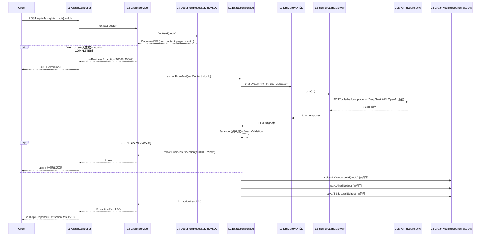
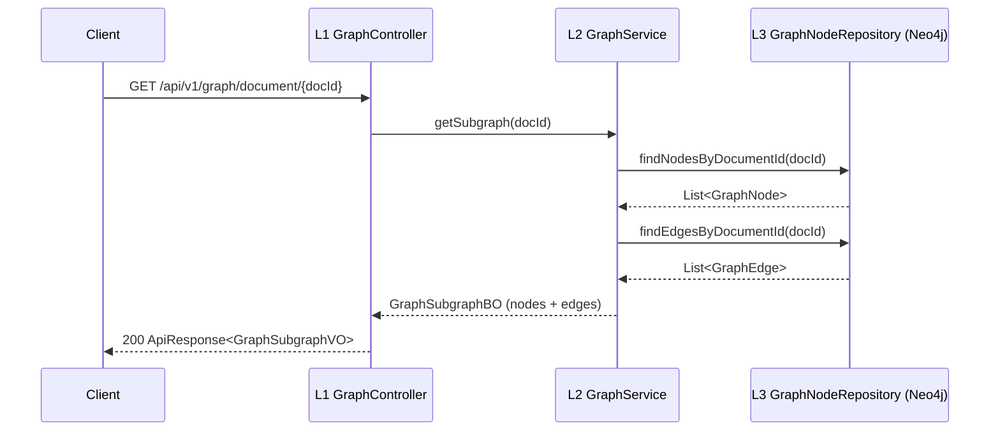

# DESIGN: 知识图谱抽取 — LLM 驱动的文档实体/知识点/关系识别

- **Change ID**: `knowledge-graph-extraction`
- **关联**: `@.specs/knowledge-graph-extraction/CHANGE.md`、`@.specs/knowledge-graph-extraction/REQUIREMENT.md`
- **角色**: Architect
- **日期**: 2026-06-13

---

## 0. 技术栈选定

从 `.specs/CONTEXT.md` 已锁技术决策直接锁定，本次不引入新栈：

| 层 | 技术 | 来源 |
|----|------|------|
| 核心框架 | Spring Boot 3.3.x + JDK 17 | 已锁 |
| 图数据库 | Neo4j 5.x + Spring Data Neo4j 7.x | 已锁，`application-dev.yml` 已配置 `bolt://localhost:7687` |
| LLM 调用 | Spring AI 1.0.0-M4（OpenAI starter） + 自研 LLMGateway | 已锁，`pom.xml` 已有 `spring-ai-openai-spring-boot-starter` |
| LLM API | DeepSeek API（`api.deepseek.com`，`deepseek-chat` 模型，兼容 OpenAI 协议） | 本次新增配置，通过 `spring.ai.openai.*` 对接 |
| 依赖注入 | 构造器注入（`@RequiredArgsConstructor`） | 已锁项目规范 |
| 异常体系 | `BusinessException` + `ErrorCode` 枚举 + `GlobalExceptionHandler` | 已锁，本次追加枚举值 |
| 响应体 | `ApiResponse<T>` record | 已锁 |

**LLM 调用方案说明**：使用 Spring AI 的 `ChatClient`（基于 `spring-ai-openai-spring-boot-starter`，OpenAI 兼容协议）对接 DeepSeek API（`api.deepseek.com`，模型 `deepseek-chat`）。上层通过 LlmGateway 接口封装以隔离 Spring AI 具体 API，未来切换模型/供应商只需改 yml 配置或新建 LlmGateway 实现类。

---

## 0.5 既有架构对齐

### 0.5.1 本次 change 触碰的既有模块

**会复用/触碰的既有文件**：

```
# L1 API 层（沿用模式）
src/main/java/com/graphnexus/api/document/controller/DocumentController.java  → 读取（查询文档 text_content）

# L2 Application 层（沿用模式）
src/main/java/com/graphnexus/application/document/parser/DocumentParser.java    → 参考（策略模式范本）
src/main/java/com/graphnexus/application/document/model/ParseResult.java        → 参考（BO 模型范本）

# L3 Infrastructure 层
src/main/java/com/graphnexus/infrastructure/mysql/document/DocumentDO.java      → 读取（获取 text_content、page_count、status）
src/main/java/com/graphnexus/infrastructure/mysql/document/DocumentRepository.java → 读取（查询文档）

# Common 层（直接复用）
src/main/java/com/graphnexus/common/ApiResponse.java                            → 复用
src/main/java/com/graphnexus/common/exception/ErrorCode.java                    → 追加枚举值（C0001/A0008/A0009）
src/main/java/com/graphnexus/common/exception/BusinessException.java            → 复用
src/main/java/com/graphnexus/common/exception/GlobalExceptionHandler.java       → 复用（自动处理 BusinessException）
src/main/java/com/graphnexus/common/logging/TraceIdFilter.java                  → 复用（traceId 贯穿 LLM 调用）

# 配置文件
src/main/resources/application-dev.yml                                          → 追加 LLM 配置段
```

**本次新增的包/文件**：

```
src/main/java/com/graphnexus/api/graph/controller/GraphController.java          → 新增（L1）
src/main/java/com/graphnexus/api/graph/dto/GraphSubgraphVO.java                 → 新增（响应 DTO）
src/main/java/com/graphnexus/api/graph/dto/ExtractionResultVO.java              → 新增（响应 DTO）
src/main/java/com/graphnexus/application/graph/service/GraphService.java        → 新增（L2 接口）
src/main/java/com/graphnexus/application/graph/service/impl/GraphServiceImpl.java → 新增（L2 实现）
src/main/java/com/graphnexus/application/graph/service/ExtractionService.java   → 新增（L2 抽取编排）
src/main/java/com/graphnexus/application/graph/model/GraphSubgraphBO.java       → 新增
src/main/java/com/graphnexus/application/graph/model/ExtractionResultBO.java    → 新增
src/main/java/com/graphnexus/application/llmgateway/service/LlmGateway.java     → 新增（LLM 网关接口）
src/main/java/com/graphnexus/application/llmgateway/service/impl/SpringAiLlmGateway.java → 新增（Spring AI 实现）
src/main/java/com/graphnexus/infrastructure/neo4j/node/GraphNode.java           → 新增（抽象基类）
src/main/java/com/graphnexus/infrastructure/neo4j/node/EntityNode.java          → 新增
src/main/java/com/graphnexus/infrastructure/neo4j/node/KnowledgePointNode.java  → 新增
src/main/java/com/graphnexus/infrastructure/neo4j/node/KnowledgeCategoryNode.java → 新增
src/main/java/com/graphnexus/infrastructure/neo4j/node/DocumentNode.java        → 新增
src/main/java/com/graphnexus/infrastructure/neo4j/edge/GraphEdge.java           → 新增（抽象基类）
src/main/java/com/graphnexus/infrastructure/neo4j/edge/ExtractsEdge.java        → 新增
src/main/java/com/graphnexus/infrastructure/neo4j/edge/...（其余 7 个边类）   → 新增
src/main/java/com/graphnexus/infrastructure/neo4j/repository/GraphNodeRepository.java → 新增（通用 Repository）
src/main/java/com/graphnexus/infrastructure/neo4j/config/Neo4jConfig.java       → 可能新增（如需要额外 Cypher template 配置）
```

**不应该触碰但 AI 容易"顺手改"的**：

```
pom.xml                                      → 禁动（pom.xml 已有所有依赖，不新增）
docs/项目规范.md                              → 禁动
docs/tech-stack-java.md                       → 禁动
src/main/java/com/graphnexus/application/document/** → 禁动（本次只读取，不修改）
infrastructure/storage/**                     → 禁动（与本次无关）
```

### 0.5.2 对齐既有抽象（防重复实现）

| 本次需要 | 既有有没有？ | 决定 |
|----------|-------------|------|
| 调用 LLM API | `application-dev.yml` 有 claude 预留配置段 + `pom.xml` 有 `spring-ai-openai` | **引入新模式**：新建 `LlmGateway` 接口封装 Spring AI `ChatClient`。理由：既有 LLM 配置仅预留，无可用抽象，本次创建 v1 最小网关供后续复用。默认对接 DeepSeek API |
| Neo4j 节点/边持久化 | `infrastructure/neo4j/` 仅有 `package-info.java` | **引入新模式**：新建抽象基类 `GraphNode`/`GraphEdge` + SDN Repository。理由：项目首次使用 Neo4j，无既有抽象可复用 |
| 策略模式可扩展接口 | `DocumentParser` 接口 + `PdfBoxDocumentParser` 实现 | **沿用** 策略模式范本：`ExtractionService` 编排流程类似 `DocumentService.process()` 的职责 |
| Controller 返回统一响应 | `ApiResponse<T>` record | **沿用**：所有 Controller 返回 `ApiResponse<VO>` |
| 异常处理 | `BusinessException` + `ErrorCode` 枚举 | **沿用**：LLM 失败抛 `BusinessException(ErrorCode.C0001)`，空文本抛新枚举值 |
| 构造器注入 | `@RequiredArgsConstructor` + `private final` | **沿用** |
| Trace ID 链路 | `TraceIdFilter` → MDC | **沿用**：LLM 调用前后日志携带 traceId |

### 0.5.3 沿用模式 vs 引入新模式

```
- 数据访问（MySQL）：**沿用** JPA Repository + DO 模式（读取 DocumentDO）
- 数据访问（Neo4j）：**引入新模式**（GraphNode 抽象 + SDN Repository）→ 理由：项目首次操作图数据库，无既有模式，需要建立 Neo4j 持久化规范
- 错误处理：**沿用** ErrorCode 枚举 + BusinessException + GlobalExceptionHandler
- API 路由组织：**沿用** `/api/v1/<resource>` + Controller 风格（参考 DocumentController）
- 可扩展策略：**沿用** 接口 + 实现类模式（参考 DocumentParser 的策略模式）
- LLM 调用：**引入新模式**（LlmGateway 接口 + SpringAiLlmGateway 实现）→ 理由：既有抽象不存在，v1 最小契约，后续可插拔切换模型/供应商
```

---

## 1. 技术决策

### D1 · LLM 调用抽象层归属

- **决策**：`LlmGateway` 接口定义在 L2 `application/llmgateway/service/`，实现类 `SpringAiLlmGateway` 放在 L3 `infrastructure/llm/client/`
- **备选**：① 接口和实现都放 L2（如 DocumentParser）；② 接口和实现都放 L3
- **选择理由**：`DocumentParser` 接口放 L2 的理由是"解析策略选择是业务决策"（ADR-001）。但 LLM 调用不同——LLM 是**基础设施能力**，不是业务决策。L2 的 `GraphService` 只需要"给我一段文本回复"，不关心底层是 Spring AI 还是 WebClient 直调。接口在 L2 让业务层只依赖抽象，实现在 L3 隔离了 Spring AI 的具体 API 依赖。
- **取舍代价**：接口与实现跨层，需要额外的包导入，但符合四层架构"L2 不依赖第三方库具体 API"的原则

### D2 · 图节点/边抽象层设计

- **决策**：定义 `GraphNode` 抽象基类（非接口），通过 `@Node` 注解的 SDN 继承 + 类型注册表实现扩展。每个具体子类通过 `NodeType` 枚举注册其 `label`、属性模板
- **备选**：① 纯接口 `GraphNode` + 各节点类独立 `@Node` 注解；② 不用 SDN 继承，直接用 Cypher 模板拼语句；③ 每个节点类型独立的 Repository
- **选择理由**：
  - 方案①（纯接口）：SDN 7.x 不支持接口映射到 Neo4j label，必须用具体类 + `@Node`。抽象基类携带通用字段（`id`、`createdAt`），子类只加专有字段
  - 方案②（纯 Cypher）：灵活但丢失 SDN 的类型安全和自动映射优势，代码量膨胀。v1 先用 SDN，后续需要复杂图遍历时再引入 Cypher template
  - 方案③（独立 Repository）：新增节点类型需要新建 Repository 类，违反 CHANGE.md 的"新增类型不改核心链路"约束
- **取舍代价**：SDN 7.x 的继承映射对 `@Node` 有限制——父类若被标注 `@Node`，所有子类必须共享同一组 label，这不符合我们"每种节点不同 label"的需求。解决方案：**父类不标注 `@Node`**，只作为 Java 层面的字段容器，子类各自标注 `@Node("Entity")`/`@Node("KnowledgePoint")` 等。通用 Repository 通过 `<T extends GraphNode>` + Cypher 动态 label 实现类型无关查询

### D3 · LLM 抽取 Prompt 策略

- **决策**：使用 **单一 System Prompt + 结构化 JSON 输出**，一次 LLM 调用完成全部抽取（Entity + KP + Category + 全部关系边）。Prompt 包含：① 角色设定（你是教育领域的知识图谱构建专家）；② 5 种实体类型定义 + Few-shot 示例（参考文档中的二次函数示例）；③ JSON Schema 约束输出格式；④ 中文教辅领域的特殊要求（数学公式用 LaTeX、忽略页眉页脚噪音）
- **备选**：① 多步 Pipeline（先抽 Entity → 再对齐 KP → 再建 Category → 再抽关系）；② 不做 Few-shot，依赖 LLM 通用 NER 能力
- **选择理由**：
  - 方案①（多步 Pipeline）：精度更高但 LLM 调用次数 ×4，延迟和成本显著增加。v1 优先验证端到端可行性，后续按需拆分
  - 方案②（无 Few-shot）：中文教辅领域特异性高（如"配方法"既是解法名又是动词），通用 NER 容易误判。Few-shot 用二次函数示例锚定输出风格。
- **取舍代价**：单次调用的 token 消耗大（System Prompt + 全文 + JSON Schema ≈ 文档文本的 2-3 倍），但延迟最优。长文档（>50K chars）需后续引入分块策略（v2）

### D4 · LLM 输出 JSON Schema 校验策略

- **决策**：使用 Jackson 反序列化 + `jakarta.validation`（`@NotNull`/`@Size`/`@Pattern`）做 Schema 校验，校验失败抛 `BusinessException` 并拒绝写入 Neo4j，日志中保留原始 LLM 响应供调试
- **备选**：① 引入 JSON Schema 库（如 `networknt/json-schema-validator`）；② 不做校验直接写 Neo4j
- **选择理由**：Jackson + Bean Validation 已能满足需求（字段必填、枚举值范围检查），无需引入额外的 Schema 验证库。方案②不可接受——LLM 输出不可靠，直接入库会产生脏数据
- **取舍代价**：Jackson 校验只能验证结构合法性，无法验证语义正确性（如 LLM 虚构了一个不存在的公式）。语义校验是 v2 置信度评分的事

### D5 · Neo4j 事务策略

- **决策**：重复抽取时，在 **单个 Neo4j 事务** 内完成「删旧子图 → 写新子图」，LLM 调用失败或 Schema 校验失败则整个事务回滚。使用 `@Transactional`（SDN 事务管理器）
- **备选**：① 先删后写但不加事务（脏数据风险）；② 先写后删（短暂双倍数据）
- **选择理由**：方案①不可接受（AC-7 要求无脏数据）。方案②增加写入压力（大文档可能数百节点）。事务原子性保证要么全成功要么全不写
- **取舍代价**：长事务期间该文档的子图处于锁定状态。v1 单次抽取耗时约 30-60s，事务窗口可接受。后续改为异步抽取时需重新设计事务边界

### D6 · API 路径设计

- **决策**：
  - `POST /api/v1/graph/extract/{documentId}` — 触发抽取
  - `GET /api/v1/graph/document/{documentId}` — 查询文档子图
- **备选**：① 把抽取作为 `POST /api/v1/document/{id}/extract`（挂在 document 路径下）；② 用 `/api/v1/knowledge-graph/...`
- **选择理由**：方案①暗示抽取是 document 模块的子功能，但实际上 graph 是独立业务域（有自己的 Service、Repository、Controller）。独立路径 `/api/v1/graph/` 为后续图查询、图分析 API 预留命名空间。方案②过长，`graph` 足够表意
- **取舍代价**：前端需要知道两个独立路径前缀（`/document` 和 `/graph`），但这是合理的资源分离

---

## 2. 数据流 / 架构图

### 2.1 抽取流程（主链路）



### 2.2 查询流程



### 2.3 图模型拓扑

```
┌─────────────────────────────────────────────────────────────┐
│                      Neo4j 图空间                              │
│                                                               │
│  DocumentNode ──EXTRACTS──▶ EntityNode                        │
│       │                         │                             │
│       │                    DERIVES/CONTAINS/REFERENCES        │
│       │                         │                             │
│       │                         ▼                             │
│       │                    EntityNode (其他实体)               │
│       │                         │                             │
│       │                    ALIGNED_TO                         │
│       │                         │                             │
│       │                         ▼                             │
│       │              KnowledgePointNode                        │
│       │              │           │                             │
│       │     BELONGS_TO     PREREQUISITE_OF                    │
│       │              │           │                             │
│       │              ▼           ▼                             │
│       │   KnowledgeCategoryNode  KnowledgePointNode (前置依赖) │
│       │         │                                              │
│       │     CHILD_OF                                           │
│       │         │                                              │
│       │         ▼                                              │
│       │   KnowledgeCategoryNode (父分类)                       │
└─────────────────────────────────────────────────────────────┘
```

### 2.4 四层架构映射

```
L1 api/graph/
   ├── controller/GraphController.java     ← @RestController, 仅编排调用
   └── dto/
       ├── ExtractionResultVO.java         ← 抽取结果响应
       └── GraphSubgraphVO.java            ← 子图查询响应 {nodes[], edges[]}

L2 application/graph/
   ├── service/
   │   ├── GraphService.java               ← 接口（extract + getSubgraph）
   │   └── impl/GraphServiceImpl.java      ← 编排 L3 repository + ExtractionService
   ├── model/
   │   ├── ExtractionResultBO.java         ← 抽取摘要（节点/边计数）
   │   └── GraphSubgraphBO.java            ← 子图业务模型
   └── extraction/
       └── ExtractionService.java          ← 纯文本 → JSON Schema → 领域对象 的转换编排

L2 application/llmgateway/
   └── service/
       └── LlmGateway.java                 ← 接口：String chat(systemPrompt, userMessage)

L3 infrastructure/neo4j/
   ├── node/
   │   ├── GraphNode.java                  ← 抽象基类（id, createdAt, documentId）
   │   ├── DocumentNode.java               ← @Node("Document")
   │   ├── EntityNode.java                 ← @Node("Entity")
   │   ├── KnowledgePointNode.java         ← @Node("KnowledgePoint")
   │   └── KnowledgeCategoryNode.java      ← @Node("KnowledgeCategory")
   ├── edge/
   │   ├── GraphEdge.java                  ← 抽象基类
   │   ├── ExtractsEdge.java               ← @RelationshipProperties
   │   ├── ReferencesEdge.java             ← (DERIVES/CONTAINS/REFERENCES 共用)
   │   ├── AlignedToEdge.java
   │   ├── BelongsToEdge.java
   │   ├── ChildOfEdge.java
   │   └── PrerequisiteEdge.java
   ├── repository/
   │   └── GraphNodeRepository.java        ← 通用 Repository<T extends GraphNode>
   └── config/
       └── Neo4jConfig.java                ← SDN 配置（如需要）

L3 infrastructure/llm/
   └── client/
       └── SpringAiLlmGateway.java         ← LlmGateway 实现，封装 Spring AI ChatClient
```

---

## 3. ADR

以下 3 个 ADR 各自独立文件，存放于 `.specs/adr/`。

| ADR | 标题 | 概要 |
|-----|------|------|
| ADR-002 | GraphNode/GraphEdge 抽象层设计 | 父类不标注 `@Node`，子类各自标注 label；通用 Repository `<T extends GraphNode>` + 动态 Cypher；类型注册枚举 `NodeType`/`EdgeType` |
| ADR-003 | LLM 抽取 Prompt 策略 | 单次 System Prompt + Few-shot（二次函数示例）+ JSON Schema 约束；Jackson + Bean Validation 校验；同步执行 |
| ADR-004 | LlmGateway 接口契约与归属 | 接口 L2 `chat(String, String)` → `String`；实现 L3 封装 Spring AI `ChatClient`；失败抛 `BusinessException(C0001)` |

详见：
- `.specs/adr/002-graph-node-edge-abstraction.md`
- `.specs/adr/003-llm-extraction-prompt-strategy.md`
- `.specs/adr/004-llm-gateway-interface.md`

---

## 4. 风险

| # | 风险 | 类型 | 概率 | 影响 | 缓解方案 |
|---|------|------|------|------|----------|
| R1 | **LLM JSON 输出格式不稳定**：DeepSeek 偶尔在 JSON 外包裹 markdown code block 或遗漏闭合括号，导致 Jackson 反序列化失败 | 实现 | 中 | 高 | 预处理：去除 ```json ... ``` 包裹；JSON 解析失败时重试一次（带"请严格输出纯 JSON"指令）；日志保留原始响应 |
| R2 | **Neo4j SDN 继承映射不兼容**：SDN 7.x 对父类字段映射有限制，子类 `@Node` 可能无法正确继承父类的 `@Id`/`@Property` 字段 | 实现 | 中 | 高 | DESIGN 阶段已规避：父类不标注 `@Node`，字段通过 `@MappedSuperclass` 或手动在子类重复声明。若 SDN 不支持，回退方案为每个节点类独立定义所有字段（不继承）|
| R3 | **中文教辅文本 token 消耗大**：15 页 PDF ≈ 8000-12000 字中文，加上 System Prompt + JSON Schema，单次调用可能消耗 15K-20K tokens，DeepSeek API 成本极低但仍需关注 token 上限 | 上线 | 高 | 低 | v1 接受此成本（每篇文档仅抽取一次）；v2 引入 chunking 分块抽取降成本；配置 `max-tokens` 上限防止失控 |
| R4 | **Spring AI 1.0.0-M4 为 Milestone 版本**：API 可能不够稳定，升级到 1.0.0 GA 时有 breaking changes | 长期 | 中 | 中 | LlmGateway 接口隔离了 Spring AI 的具体 API，升级时只需改 `SpringAiLlmGateway` 实现类；pom.xml 锁定 `<spring-ai.version>` 不自动升级 |
| R5 | **抽取质量依赖 LLM 模型能力**：不同模型对中文教辅 NER 效果差异大，DeepSeek 对中文内容有天然优势但数学公式识别需实测验证 | 上线 | 中 | 高 | AC-3 的 Schema 校验至少拦截格式错误；v2 引入置信度评分 + 人工抽检；Prompt 持续调优迭代 |

---

## 5. 不在范围内（本次设计不解决）

- **跨文档 KnowledgePoint 去重合并**：每次抽取创建独立 KP（AC-8 全量覆盖文档子图），不检测新抽取的 KP 是否与已有 KP 同名同义。v2 引入
- **LLM 调用失败重试/降级**：LLM 失败直接抛 `BusinessException`，不做指数退避重试或 fallback 到备选模型。v2 在 LlmGateway 中引入路由/降级
- **文档文本分块（chunking）**：假设单篇文档文本 ≤ 50K 字符，不做分段提交 LLM。长文档在 v2 解决
- **Cypher 注入防护**：查询子图时 `documentId` 直接拼入 Cypher 语句。由于 `documentId` 来自 URL 路径参数，Spring 类型转换确保其为 `Long`，不存在注入风险
- **Neo4j 索引优化**：不在本次创建显式索引（SDN 默认会为 `@Id` 创建），后续性能压测按需加
- **抽取结果缓存**：每次查询子图实时查 Neo4j，不做 Redis 缓存。v2 引入

---

## 9. 架构沉淀建议

### 9.1 新增可复用抽象

| 抽象 | 路径 | 复用场景 |
|------|------|----------|
| `GraphNode` 抽象基类 | `infrastructure/neo4j/node/GraphNode.java` | 后续新增 StudentNode、ExamNode、QuestionNode 等图钉节点时继承 |
| `GraphEdge` 抽象基类 | `infrastructure/neo4j/edge/GraphEdge.java` | 后续新增 MasteryEdge、HasEventEdge、BelongsToExamEdge 时继承 |
| `GraphNodeRepository<T>` 通用仓库 | `infrastructure/neo4j/repository/GraphNodeRepository.java` | 任何新节点类型的 CRUD 无需新建 Repository |
| `LlmGateway` 接口 | `application/llmgateway/service/LlmGateway.java` | 后续智能查询、图分析、剪枝策略等模块调用 LLM 时统一入口 |
| `ExtractionService` 抽取编排 | `application/graph/extraction/ExtractionService.java` | 后续支持 Word/Markdown 多文档类型时，只需扩展 Prompt 模板，不改造编排流程 |

### 9.2 项目级技术决策

| 决策 | 内容 |
|------|------|
| Neo4j 节点定义规范 | 所有图节点继承 `GraphNode`，各自标注 `@Node("Label")`，父类不标注 `@Node` |
| Neo4j 边定义规范 | 所有图边继承 `GraphEdge`，通过 `@RelationshipProperties` 标注，source/target 引用节点 |
| LLM 调用规范 | 所有 LLM 调用走 `LlmGateway.chat()` 接口，不直接使用 Spring AI `ChatClient`；失败抛 `BusinessException(C0001)` |
| JSON Schema 校验规范 | LLM 返回的结构化 JSON 必须经 Jackson + Bean Validation 校验后才能进入业务逻辑 |

### 9.3 跨模块契约

| 契约 | 类型 | 说明 |
|------|------|------|
| `POST /api/v1/graph/extract/{documentId}` | REST API | 触发文档图谱抽取 |
| `GET /api/v1/graph/document/{documentId}` | REST API | 查询文档子图（节点+边） |
| `LlmGateway.chat(String, String) → String` | Java 接口契约 | LLM 调用统一入口 |

### 9.4 依赖变动

无新增 pom.xml 依赖（Spring AI、SDN 均已在 pom.xml 中存在）。`application-dev.yml` 新增 `spring.ai.openai.*` 配置段对接 DeepSeek API（base-url: `https://api.deepseek.com`，model: `deepseek-chat`）。

### 9.5 禁动清单变动

无新增禁动项。本次新增的 `GraphNode`/`GraphEdge` 基类属于扩展点，不应禁动。

---

## 附录：实际实现偏差（DEV 阶段记录）

> 以下为 DEV 阶段执行过程中相对于本 DESIGN.md 的调整。每条说明原因和影响。

### A1. 图节点持久化方式

| 设计 | 实际 | 原因 |
|------|------|------|
| `Neo4jTemplate.save(node)` SDN 自动映射 | `Neo4jClient.query(MERGE ... SET n = $props)` 手动 Cypher | SDN 7.x 对抽象父类 `GraphNode` 的 `@Node` 继承映射存在兼容问题；手动 Cypher 绕过 SDN 的映射层，更可控 |

**影响**：`findByDocumentId` 同步改为 `Neo4jClient.query().fetch()` + 手动从 `org.neo4j.driver.types.Node` 提取属性构建 `SimpleGraphNode` 实例。

### A2. 节点 @Node 注解

| 设计 | 实际 | 原因 |
|------|------|------|
| `@Node(primaryLabel = "Document", labels = {"GraphNode"})` | `@Node("Document")` | SDN 7.x 的 `labels` 属性在 `Neo4jTemplate.save()` 中触发 NPE；改为单 label 后通过 Cypher MERGE 手动设置 label |

**影响**：`COMMON_LABEL` 回退为空字符串，`findByDocumentId` 等查询使用 `MATCH (n {documentId: ...})` 做属性过滤（无标签扫描）。索引改为按每种节点类型分别创建。

### A3. Neo4j 索引策略

| 设计 | 实际 | 原因 |
|------|------|------|
| 统一 `CREATE INDEX FOR (n:GraphNode) ON (n.documentId)` | 按节点类型分别创建 4 组索引（Document/Entity/KP/KP-Category） | 无公共 label 后无法创建跨类型索引，改为每种类型独立索引 |

### A4. ChatModel Bean 创建

| 设计 | 实际 | 原因 |
|------|------|------|
| 依赖 Spring AI `OpenAiAutoConfiguration` 自动创建 | `LlmConfig` 手动创建 `OpenAiChatModel` bean | Spring AI 1.0.0-M4 的自动配置在 Surefire fork JVM 中环境变量传递不稳定；手动创建确保 bean 始终可用 |

### A5. LLM API 端点

| 设计 | 实际 | 原因 |
|------|------|------|
| `https://token.cvte.com`（内部代理） | `https://api.deepseek.com` | 内部代理返回 `cch_session_id` 参数错误；直接使用 DeepSeek 官方 API 兼容 OpenAI 协议 |

### A6. GraphEdge 属性扩展

| 设计 | 实际 | 原因 |
|------|------|------|
| GraphEdge 仅有 `sourceNodeId/targetNodeId/edgeType/createdAt/properties` | 新增 `weight`(Double, 默认 1.0) + `description`(String) | DEV 阶段用户要求：weight 用于后续事件边，description 用于说明关系含义；`PrerequisiteEdge.strength` 同步映射到 `weight` |

### A7. ReferencesEdge 拆分

| 设计 | 实际 | 原因 |
|------|------|------|
| 1 个类 `ReferencesEdge(referenceType)` 表示 3 种边 | 3 个独立类 `DerivesEdge` / `ContainsEdge` / `ReferencesEdge` | DEV 阶段用户要求：每类边独立成类，保持与 EdgeType 枚举一一对应 |

### A8. DocumentRepository JPQL 修复

| 设计 | 实际 | 原因 |
|------|------|------|
| 派生查询 `findByIsDeletedFalse` / `findByIdAndIsDeletedFalse` | `@Query("SELECT ... WHERE d.isDeleted = 0")` 显式 JPQL | Hibernate 6.5.3 对 `Boolean` 类型 + MySQL TINYINT 的 `isFalse()` 谓词构建存在 AssertionError；`existsByDocumentNoAndSubjectAndIsDeletedFalse` → `findIdByDocumentNoAndSubjectAndIsDeletedFalse` 返回 `Optional<Long>` 避免布尔返回类型 |

### A9. 事务管理器

| 设计 | 实际 | 原因 |
|------|------|------|
| `@Transactional("neo4jTransactionManager")` | `@Transactional`（无参数） | SDN `neo4jTransactionManager` bean 名可能不是此格式；使用默认事务管理器 |

### A10. 集成测试策略

| 设计 | 实际 | 原因 |
|------|------|------|
| 单元测试 Mock + 集成测试 Testcontainers | 单元测试 Mock + 集成测试 @SpringBootTest + @ActiveProfiles("dev") 直连 podman | podman 环境已就绪（CONTEXT.md 记录），无需 Testcontainers；`@DynamicPropertySource` 确保 API Key 正确注入 |

### A11. 文档删除联动图谱清除

| 设计 | 实际 | 原因 |
|------|------|------|
| 未设计 | `DocumentServiceImpl.deleteDocument()`：① `findById`（含 DELETING）→ ② `isDeleted=1` 幂等返回 → ③ 进入/保持 DELETING → ④ MinIO 删除（容错）→ ⑤ Neo4j 清除 → ⑥ `markDeleted()`。正常查询排除 DELETING。幂等：已删除文档直接返回，DELETING 状态重复调用从中断点续跑 |

---