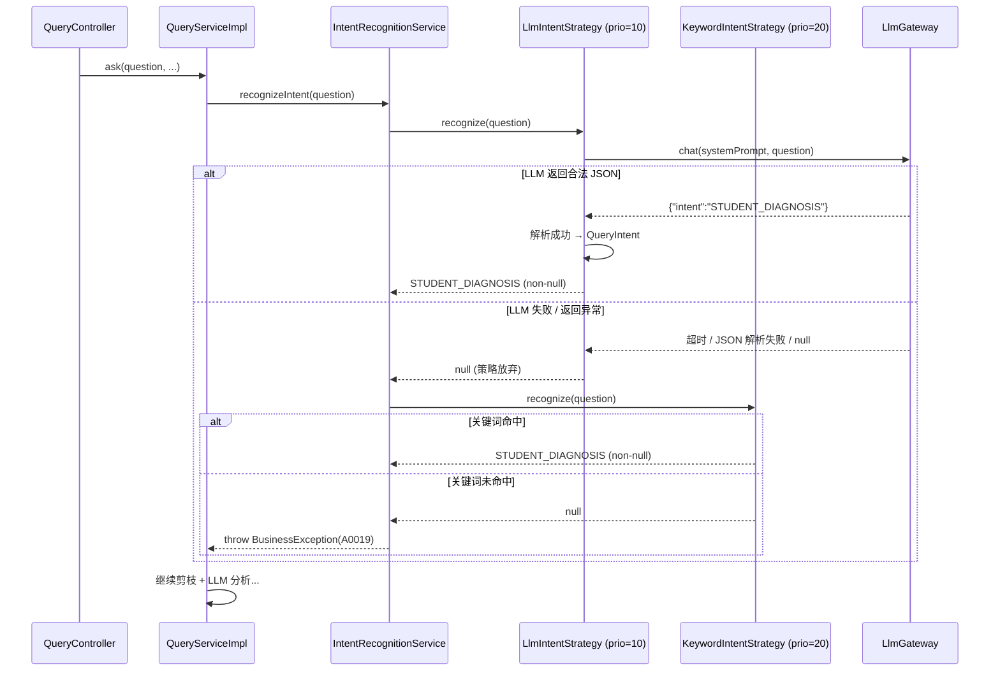
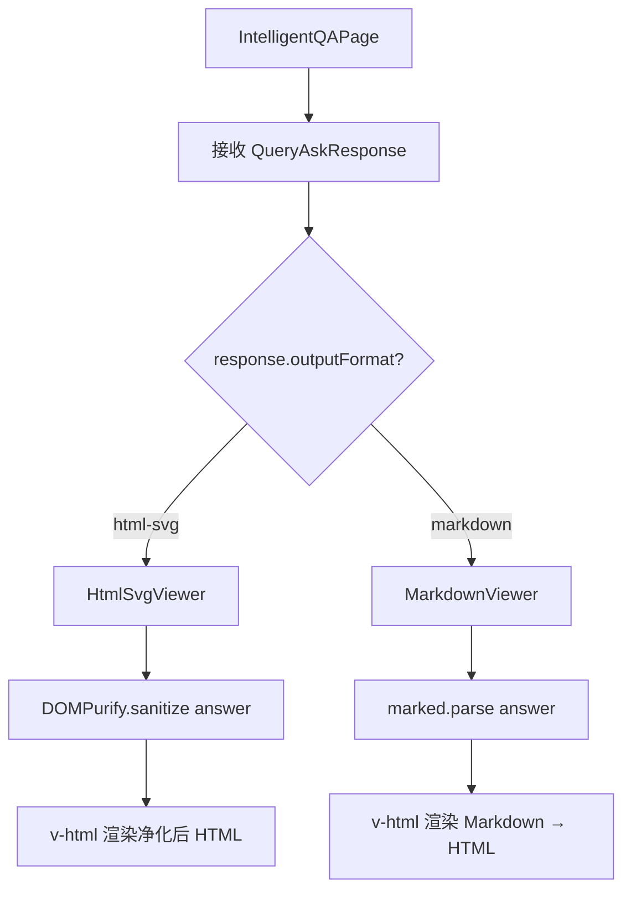

# DESIGN: LLM 意图识别 + HTML/SVG 输出

- **Change ID**: `llm-intent-recognition`
- **关联**: `@.specs/llm-intent-recognition/REQUIREMENT.md`、`@.specs/CONTEXT.md`
- **作者**: AI（Architect 角色）+ 人工 review

---

## 0. 技术栈选定

> CONTEXT.md「已锁技术决策」覆盖全部选型，本 change 不引入新栈。

- **后端**: Spring Boot 3.3.x + Java 17 + Maven 3.9.x（已锁）
- **LLM 集成**: Spring AI 1.0.x + 自研 LLMGateway（已锁，复用 `LlmGateway.chat()`）
- **前端**: Vue 3 + TypeScript + Vite（已锁）
- **图数据库**: Neo4j 5.x + `Neo4jClient` 手动 Cypher（已锁，只读查询不变）
- **新增前端依赖**: `dompurify` 3.x（约 20KB gzipped，纯前端 XSS 净化，零后端依赖）
- **不引入**: 图表库（ECharts/Chart.js）、LaTeX 渲染引擎（MathJax/KaTeX）、新 LLM 客户端、向量数据库
- **理由**: 复用既有四层架构 + LLMGateway + PromptTemplateService，仅在 query 模块内做增量扩展

---

## 0.5 既有架构对齐（brownfield）

### 0.5.1 本次 change 触碰的既有模块

```
后端触碰（现有源码，需修改）：
- application/query/chat/service/impl/QueryServiceImpl.java — 重构意图识别 + 策略路由 + 格式感知
- application/query/chat/config/QueryProperties.java — 新增 outputFormat 配置项
- application/query/prompt/service/PromptTemplateService.java — 新增按输出格式选择模板
- application/query/chat/model/QueryResultBO.java — 新增 outputFormat 字段
- api/query/dto/chat/QueryAskResponse.java — 新增 outputFormat 字段
- api/query/dto/chat/QueryResultResponse.java — 新增 outputFormat 字段

后端新增：
- application/query/chat/intent/IntentRecognitionStrategy.java — 意图识别策略接口（可插拔）
- application/query/chat/intent/IntentRecognitionService.java — 策略链编排器
- application/query/chat/intent/LlmIntentRecognitionStrategy.java — LLM 分类实现（priority=10）
- application/query/chat/intent/KeywordIntentRecognitionStrategy.java — 关键词兜底（priority=20）
- application/query/chat/registry/PruningStrategyRegistry.java — 策略注册表
- src/main/resources/prompts/intent-classification-system.md — 意图分类 prompt（意图列表由枚举动态注入）
- src/main/resources/prompts/student-diagnosis-system-html.md — HTML+SVG system prompt
- src/main/resources/prompts/student-diagnosis-user-html.md — HTML+SVG user prompt

前端触碰（现有源码，需修改）：
- frontend/src/views/query/IntelligentQAPage.vue — 按 outputFormat 选择渲染器
- frontend/src/views/query/queryStore.ts — 存储 outputFormat 状态
- frontend/src/views/query/components/MarkdownReport.vue — 改为条件渲染入口
- frontend/src/api/types.ts — QueryAskResponse/QueryResultResponse 加 outputFormat
- frontend/src/api/query.ts — 类型同步

前端新增：
- frontend/src/common/components/HtmlSvgViewer.vue — DOMPurify 净化 + HTML/SVG 渲染

禁动清单（与本次无关，AI 不许"顺手"碰）：
- application/analysis/strategy/StudentDiagnosisStrategy.java — 剪枝逻辑不变，只改调用方式
- application/analysis/model/PruningRequest.java — 接口契约不变
- api/query/controller/QueryController.java — 端点签名不变，仅响应体多字段
- infrastructure/neo4j/repository/QueryGraphRepository.java — 只读查询不变
- infrastructure/mysql/query/ — query_task 表结构不变
- application/llmgateway/ — LLM 网关接口不变
- frontend/src/common/components/MarkdownViewer.vue — 编译输出不变
- frontend/src/views/graph/* — 图谱可视化模块，与本次无关
```

### 0.5.2 既有抽象沿用对照表

| 本次需要 | 既有有没有？ | 决定 |
|----------|------------|------|
| LLM 调用 | `LlmGateway.chat()` — `application/llmgateway/` | **沿用**。意图分类 + HTML+SVG 分析均通过同一接口 |
| Prompt 模板加载 | `PromptTemplateService` — `{{var}}` 替换 | **沿用**。扩展其 `buildPrompt` 方法增加 format 参数 |
| 配置管理 | `QueryProperties` — `@ConfigurationProperties` | **沿用**。新增 `outputFormat` 内嵌类属性 |
| 策略路由 | `QueryServiceImpl` 内部 switch-case（ADR-010） | **替换**为 `PruningStrategyRegistry`（supersede ADR-010 switch-case） |
| 格式校验+重试 | `QueryServiceImpl.callLlmWithRetry()` + `validateLlmResponse()` | **扩展**为按格式选择校验规则，重试机制复用 |
| 子图序列化 | `QueryServiceImpl.serializeSubgraph()` | **沿用**。HTML+SVG 模式下子图数据注入方式不变 |
| 前端 Markdown 渲染 | `MarkdownViewer.vue`（marked） | **保留不变**。markdown 模式下继续使用 |
| 前端 HTML 渲染 | 没有 | **新建** `HtmlSvgViewer.vue`（DOMPurify + v-html） |
| XSS 防护 | 没有 | **新建**。DOMPurify 是行业标准方案 |
| LLM 实体提取 fallback | `extractViaLlm` → `extractViaRegex` 模式 | **沿用**相同 fallback 模式到意图识别 |
| API 响应体 | `ApiResult<T>` 统一包装 | **沿用**。仅 `T` 内部新增字段 |

### 0.5.3 沿用模式 vs 引入新模式

```
- LLM 调用：**沿用** LlmGateway.chat()（所有 LLM 调用必须走网关，不直接使用 WebClient）
- Prompt 管理：**沿用** classpath .md 模板 + {{var}} 占位符（ADR-011 范式）
- Fallback 编排：**沿用** LLM-first → regex fallback 模式（与 extractViaLlm → extractViaRegex 一致）
- 意图识别策略链：**引入新模式** `IntentRecognitionStrategy` 接口 + 优先级链（Spring 自动发现）→ 理由：用户要求"意图识别设计为可插拔模式，便于扩展新的意图"。与 `SubgraphPruningStrategy`（ADR-027）形成一致的可插拔扩展模式。v2 新增意图识别策略（如 embedding 匹配）只需实现接口 + `@Component`，不修改编排代码
- 策略路由：**引入新模式** Spring Map 自动注入替代 switch-case → 理由：ADR-010 明确预留"意图 > 10 种后重构为策略工厂 + Map"，本次虽只 1 种意图，但引入 Registry 为实现 AC-12（策略路由解耦）所必需，且为 v2 多意图扩展铺路
- 输出格式切换：**引入新模式** 配置驱动（非 Strategy 接口）→ 理由：仅 2 种格式（html-svg / markdown），Strategy 接口是过度工程。yml 配置 + if-else 模板选择足够，与既有 `query.*` 配置管理模式一致
- 前端条件渲染：**引入新模式** outputFormat 字段驱动渲染器选择 → 理由：既无"内容格式自动检测"机制，前端需要后端告知格式类型
- HTML/SVG 安全渲染：**引入新模式** DOMPurify 净化 → 理由：首次在前端渲染 LLM 生成的 HTML，XSS 风险是新增的，既无对应防护
- 数据访问：**沿用** QueryGraphRepository（Neo4j 只读）+ ExamRecordRepository（MySQL），无新增 Repository
- 异常处理：**沿用** BusinessException + GlobalExceptionHandler，意图识别失败抛 A0019（不变）
- 构造器注入：**沿用** @RequiredArgsConstructor + private final（项目规范 §1.4.3）
```

---

## 1. 决策清单

| # | 决策 | 备选 | 选择理由 | 取舍代价 |
|---|------|------|---------|---------|
| D1 | **意图识别**: 可插拔策略链 — `IntentRecognitionStrategy` 接口 + `IntentRecognitionService` 编排器，按优先级链式执行（LLM → keyword），任一返回非 null 即成功 | A) 内联在 QueryServiceImpl 中（更简单，少文件） B) 单个 IntentRecognitionService 内硬编码 if-else | 与 `SubgraphPruningStrategy`（ADR-027）形成一致的可插拔模式。接口 + 优先级链天然支持扩展：v2 新增策略（如 embedding 匹配）只需实现接口 + `@Component`，编排器零改动。各策略独立可测。Prompt 中意图列表由 `QueryIntent` 枚举动态生成，新增意图自动反映到 LLM 分类 | 对仅 2 个策略的场景（LLM + keyword）多了接口 + 编排器共 4 个文件，但为 v2 多意图扩展铺路，性价比较好 |
| D2 | **输出格式切换**: yml 配置 `query.output-format` 驱动，非 Strategy 接口 | A) `OutputFormatStrategy` 接口 + HtmlSvgStrategy / MarkdownStrategy 实现 B) yml 配置 + if-else | 仅 2 种格式，Strategy 接口（至少 3 个文件）是过度工程。yml 配置与既有 `query.retry.max-retries`、`query.pruning.weak-threshold` 等管理模式一致，运维人员修改 yml + 重启即可 | 新增第 3 种格式时需改 if-else（约 3 行），但按项目演进速度该场景概率低。真要加时再重构为 Strategy，成本可控 |
| D3 | **HTML+SVG Prompt 模板**: 独立文件 `student-diagnosis-*-html.md`，与 Markdown 模板并存 | A) 单模板内含 `{{outputFormat}}` 条件段 B) 双文件独立管理 | 双文件方案模板内容差异大（输出格式约束完全不同：一个要 `## ` 开头，一个要 `<h2>` 开头），合并会导致模板内大量条件分支难以维护。`PromptTemplateService` 按 format 参数动态拼模板文件名（`{intent}-{system/user}-{format}.md` fallback 到 `{intent}-{system/user}.md` for markdown） | 新增意图时需配 2 套模板（markdown + html），但 Q1 锁定了仅 STUDENT_DIAGNOSIS，实际仅维护 2 套。模板文件名约定在 PromptTemplateService 中集中管理 |
| D4 | **HTML+SVG 校验规则**: 标签检测（必须以 HTML 标签开头 + 至少含 1 个 `<svg>`） | A) 完整 HTML 解析（Jsoup 验证结构合法性） B) 简单正则/字符串检测 | 简单标签检测足够：LLM 输出不规范的 HTML 仍可被浏览器容错渲染。引入 Jsoup 增加依赖且有性能开销，而校验目的仅是过滤"明显不是 HTML"的响应（如纯文本、JSON）。AC-5 已允许重试耗尽时降级返回原始文本 | 可能放过"标签不闭合"等格式问题的输出，但浏览器容错可兜底。边缘案例通过线上监控 + prompt 迭代修复 |
| D5 | **前端 HTML/SVG 渲染**: DOMPurify 白名单净化 + `v-html` | A) IFrame sandbox 隔离 B) `v-html` 直接渲染（不做净化） C) Sanitizer API（实验性） | DOMPurify 是行业标准（npm 周下载 200 万+），白名单可精确控制允许的标签/属性。IFrame 方案隔离性强但无法与父页面共享样式（视觉割裂），且消息通信复杂。Sanitizer API 浏览器支持不完整（Chrome 120+ 仍实验性）。直接渲染不可接受——LLM 输出完全不可信 | 白名单需维护（HTML 结构 + SVG 图形 + MathML），新标签需求需改配置。20KB gzipped 额外加载 |
| D6 | **策略路由**: `PruningStrategyRegistry`（Spring `Map<String, SubgraphPruningStrategy>` 自动注入），替代 ADR-010 的 switch-case | A) 保留 switch-case（仅 1 个策略不需要 Map） B) 工厂模式 + 手动注册 | ADR-010 明确预留"意图 > 10 种后重构为策略工厂 + Map"。虽本次仅 1 种策略，但 AC-12 要求 `QueryServiceImpl` 不直接注入具体策略，引入 Registry 是实现该 AC 的最简方案。Spring Map 注入零配置：策略类加 `@Component`，Registry 构造器注入 `List<SubgraphPruningStrategy>` 自动发现 | 对仅 1 个策略的场景显得过度设计，但 10 行代码换来 v2 扩展零改动，性价比较好 |
| D7 | **API 向后兼容**: `outputFormat` 为响应新增字段（非必填），旧客户端忽略 | A) 新 API 版本 `/v2/query/ask` B) 响应体不变，通过 HTTP Header 传格式信息 | 新增可选字段是 JSON REST API 的标准兼容做法——Jackson 反序列化忽略未知字段，TypeScript 接口新增可选属性不破坏编译。新版本 API 会引入维护负担（两套端点）。HTTP Header 传递格式信息不利于前端直接读取 | 旧客户端无法感知格式变化（始终按 Markdown 渲染），但对于本管理后台项目，前端和后端同步部署，不存在旧客户端长期存续的场景 |

---

## 2. 数据流 / 架构图

### 2.1 意图识别链路（可插拔策略链）



> 新增策略（v2）：实现 `IntentRecognitionStrategy` + `@Component` → `IntentRecognitionService` 自动发现并按 priority 排序插入链中。无需改编排代码。

### 2.2 输出格式切换链路

```mermaid
flowchart TD
    A[QueryServiceImpl.ask] --> B{query.output-format?}
    B -->|html-svg| C[加载 HTML 模板]
    B -->|markdown| D[加载 Markdown 模板]
    C --> E[PromptTemplateService.buildPrompt(intent, vars, format)]
    D --> E
    E --> F[LlmGateway.chat]
    F --> G{校验规则}
    G -->|format=html-svg| H[HTML 标签检测 + SVG 存在检测]
    G -->|format=markdown| I[## 开头 + 列表检测]
    H -->|通过| J[返回 answer + outputFormat=html-svg]
    I -->|通过| K[返回 answer + outputFormat=markdown]
    H -->|失败| L{重试次数 < 2?}
    I -->|失败| L
    L -->|是| M[追加格式修正提示 → 重试]
    L -->|否| N[WARN 降级返回原始文本]
```

### 2.3 前端渲染器选择



### 2.4 模块依赖关系（L1/L2/L3）

```
L1 (api/query/controller/)
  └─ QueryController.java
       └─ injects QueryService (L2)

L2 (application/query/chat/)
  ├─ QueryServiceImpl.java
  │    ├─ injects IntentRecognitionService (NEW L2)
  │    ├─ injects PruningStrategyRegistry (NEW L2)
  │    ├─ injects PromptTemplateService (EXISTING L2)
  │    └─ injects LlmGateway (EXISTING L3)
  ├─ intent/ (NEW package)
  │    ├─ IntentRecognitionStrategy.java (接口)
  │    ├─ IntentRecognitionService.java (编排器，注入 List<Strategy>)
  │    ├─ LlmIntentRecognitionStrategy.java (priority=10)
  │    └─ KeywordIntentRecognitionStrategy.java (priority=20)
  └─ registry/PruningStrategyRegistry.java (NEW)
       └─ injects List<SubgraphPruningStrategy> (Spring 自动发现)

L3 (infrastructure/)
  ├─ neo4j/repository/QueryGraphRepository.java (UNCHANGED)
  ├─ mysql/query/QueryTaskRepository.java (UNCHANGED)
  └─ llm/client/SpringAiLlmGateway.java (UNCHANGED)

前端 (frontend/src/)
  ├─ views/query/IntelligentQAPage.vue (MODIFIED)
  ├─ views/query/components/MarkdownReport.vue (MODIFIED → 条件渲染入口)
  ├─ common/components/HtmlSvgViewer.vue (NEW)
  └─ common/components/MarkdownViewer.vue (UNCHANGED)
```

---

## 3. 关键状态机

### 3.1 意图分类状态（策略链视角）

```
              ┌─────────┐
              │  START  │
              └────┬────┘
                   │
                   v
         ┌─────────────────────┐
         │  STRATEGY_CHAIN     │
         │  try strategies in  │
         │  priority order     │
         └────┬────┬────┬──────┘
              │    │    │
      prio=10 │   /    │  prio=20
              v  /     v
    ┌──────────────────┐   ┌──────────────────┐
    │  LlmStrategy     │   │  KeywordStrategy │
    │  → LLM 分类       │   │  → 关键词匹配     │
    └────┬───┬─────────┘   └────┬───┬─────────┘
         │   │                  │   │
    non-null | null        non-null|null
         │   │                  │   │
         v   └──────┐    ┌──────┘   │
    ┌─────────┐     v    v          │
    │ RESOLVED│   (继续下一策略)      │
    └─────────┘                     │
         ^                          │
         │    所有策略返回 null       │
         └──────────────────────────┘
                        │
                        v
              ┌──────────────────┐
              │ FAILED (A0019)   │
              └──────────────────┘
```

状态说明：
- `STRATEGY_CHAIN`: `IntentRecognitionService` 按 priority 升序遍历 `List<IntentRecognitionStrategy>`
- 任一策略返回 non-null → `RESOLVED`，不执行后续策略
- 所有策略返回 null → `FAILED`，抛 `BusinessException(A0019)`，HTTP 400
- 新增策略（v2）只需实现接口 + `@Component(priority=N)`，自动插入链中对应位置

### 3.2 输出格式生命周期

```
yml 配置 query.output-format
        │
        ├─── "html-svg"
        │     ├─ 选择模板: {intent}-{system/user}-html.md
        │     ├─ 校验规则: HTML 标签开头 + <svg> 存在
        │     └─ 响应字段: outputFormat="html-svg"
        │
        └─── "markdown"
              ├─ 选择模板: {intent}-{system/user}.md (现有)
              ├─ 校验规则: ## 开头 + 列表 (现有)
              └─ 响应字段: outputFormat="markdown"
```

**无运行时状态转换**。格式在应用启动时确定，一次请求内一致。不支持的格式值 → 启动时 `@Validated` 校验失败，应用拒绝启动。

---

## 4. ADR 索引

| ADR | 标题 | 关联决策 |
|-----|------|---------|
| [ADR-025](.specs/adr/025-llm-intent-recognition-fallback.md) | 可插拔意图识别策略链（`IntentRecognitionStrategy` 接口 + 优先级编排） | D1 |
| [ADR-026](.specs/adr/026-html-svg-output-format-switch.md) | HTML+SVG 输出格式与配置驱动切换 | D2, D3, D4 |
| [ADR-027](.specs/adr/027-pruning-strategy-registry.md) | PruningStrategyRegistry Spring 自动发现（supersede ADR-010 switch-case） | D6 |

---

## 5. 风险

| # | 风险 | 影响 | 概率 | 缓解 |
|---|------|------|------|------|
| R1 | **LLM 生成 SVG 布局错乱**：节点重叠、文本溢出、坐标越界，导致可视化不可读 | 用户体验差，诊断报告核心价值受损 | 中 | Prompt 中约束 SVG 最小尺寸（柱宽≥30px、间距≥10px、字体≥12px）；校验层做基础 SVG schema 校验（含 viewBox、宽高>0）；收集 bad case 迭代 prompt |
| R2 | **LLM 调用次数翻倍导致配额超限**：每次问答 2 次 LLM 调用（意图分类 + 分析），高峰期可能触发 LLM 网关配额或成本失控 | 服务不可用（LLM 配额耗尽→所有问答失败） | 中 | 意图分类 prompt 精简（< 500 tokens），预期响应 < 50 tokens；在 DESIGN 中预留"意图分类走轻量模型"扩展点（v2）；LlmGateway 配额告警阈值需同步调整 |
| R3 | **DOMPurify 白名单遗漏 SVG 合法标签**：如 `<tspan>`、`<defs>`、`<linearGradient>` 被误删，导致 SVG 渲染残缺 | SVG 图表显示不完整或渲染异常 | 低 | 白名单基于 [SVG 1.1 规范](https://www.w3.org/TR/SVG11/) 常用图形子集 + DOMPurify 默认 SVG 配置；测试用例覆盖 LLM 常见 SVG 输出模式（柱状图/雷达图/依赖图） |
| R4 | **HTML+SVG 输出 token 消耗显著高于 Markdown**：SVG markup 冗余（每个 `<rect>` 需 100+ 字符），诊断报告从 ~2K tokens 膨胀到 ~4K tokens | LLM 成本 +50%~100%，同步问答延迟增加 | 高 | Prompt 约束"每个图表最多 10 个数据点、最大画布 800×600"；不要求 LLM 生成全部 3 种 SVG——数据多时用表格替代图表；token 消耗记录到 `query_task` 供事后对比 Markdown 基线 |
| R5 | **Config 切换后前端渲染器不匹配**：后端切 `markdown` 但前端缓存了旧 JS bundle（仍用 HtmlSvgViewer），marked 渲染 HTML 字符串产乱码 | 诊断报告不可读 | 低 | API 响应携带 `outputFormat` 字段，前端运行时按字段选择渲染器，不依赖编译时常量。`markdown` 模式下 `HtmlSvgViewer` 不触发 |
| R6 | **LLM 意图分类的 few-shot 过拟合**：prompt 中的 few-shot 示例过多或领域过窄，导致 LLM 将"纯闲聊问题"（如"你好"）误判为 STUDENT_DIAGNOSIS | 错误路由 → 无效剪枝 → LLM 分析生成无意义报告 → 浪费 token + 用户困惑 | 中 | 意图分类 prompt 使用 negative example（如"你好"/"今天天气怎么样"→ `{"intent":null}`），并约束"无法判定时返回 null"；fallback 层关键词 Map 做最后兜底 |

---

## 6. 不在范围

- **意图分类走轻量模型**：v1 意图分类与分析共用同一 LLM。v2 可通过 `LlmGateway` 的 model 参数路由到 Haiku 等轻量模型降成本
- **HTML+SVG 模板的学科/学段定制**：v1 仅 1 套 HTML 模板，不按 subject/gradeLevel 切换。机制在 `PromptTemplateService` 中预留（format 参数已扩展），内容定制留给 v2
- **前端 SVG 交互（tooltip/缩放/点击节点展开）**：v1 SVG 为纯静态。交互留给 v2 或由独立图谱可视化页面（G6 v5）覆盖
- **LLM 输出缓存**：不引入 Redis/本地缓存，每次请求实时调用 LLM
- **HTML+SVG 流式输出（SSE）**：v1 仅同步 + 异步轮询，不做 streaming
- **查询意图范围扩展**：不新增 STUDENT_DIAGNOSIS 以外的意图，不实现新剪枝策略

---

## 9. 架构沉淀建议

### 9.1 新增的可复用抽象

| 路径 | 能力 | 触发场景 | 复用建议 |
|------|------|---------|---------|
| `application/query/chat/intent/IntentRecognitionStrategy.java` | 可插拔意图识别策略接口 + 优先级链编排 | 从自然语言文本中识别枚举型分类结果 | 任何需要多策略链式分类的场景（LLM → embedding → 规则）。与 `SubgraphPruningStrategy` 接口形成项目统一的"可插拔策略"模式 |
| `application/query/chat/intent/IntentRecognitionService.java` | 策略链编排器（注入 `List<IntentRecognitionStrategy>`，按 priority 排序链式执行） | 多策略 fallback 编排 | 任何需要"主策略→降级策略→兜底策略"链式执行的场景 |
| `application/query/chat/registry/PruningStrategyRegistry.java` | Spring Map 自动注入策略注册表 | 按名称路由到策略实现 | 任何需要"枚举→实现"路由的场景（融合匹配策略、权重计算策略已在用接口模式但未用 Map 注入）。比 switch-case 更易扩展 |
| `frontend/src/common/components/HtmlSvgViewer.vue` | DOMPurify 净化 + HTML/SVG 安全渲染 | 渲染 LLM 生成或用户提交的富文本 HTML | 未来任何"LLM 输出 HTML 片段"的前端渲染场景（如 AI 生成的富文本报告、图表卡片）都可复用 |

### 9.2 新增 / 改变的项目级技术决策

| 决策 | 取值 | 影响范围 | 推翻代价 |
|------|------|---------|---------|
| 意图识别模式 | LLM-first + 关键词 fallback（双链路） | 所有需从自然语言中识别分类的场景 | 中：回退到纯关键词需恢复旧代码（保留在 fallback 路径中） |
| LLM 输出格式 | HTML+SVG（默认），Markdown 可配置回滚 | 所有 LLM 分析类输出（当前仅 STUDENT_DIAGNOSIS） | 低：切回 markdown 仅需改 1 行 yml 配置 |
| 策略路由机制 | Spring Map 自动注入（替代 switch-case） | 所有策略模式注册场景 | 低：改回 switch-case 仅影响 Registry 类内部实现 |

### 9.3 新增 / 修改的跨模块契约

```
- API 响应新增字段: QueryAskResponse.outputFormat: String ("html-svg" | "markdown")
- API 响应新增字段: QueryResultResponse.outputFormat: String ("html-svg" | "markdown")
- yml 配置新增: query.output-format (String, 默认 "html-svg", 枚举校验 @Validated)
- Prompt 模板命名约定扩展: {intent}-{system/user}-{format}.md（format 默认 "markdown" 时文件名省略后缀保持向后兼容）
- LlmGateway.chat() 调用频率增加: 每次问答从 1 次变为 2 次（意图分类 + 分析）
```

### 9.4 新增依赖

| 包 | 版本 | 用途 | 是否替换既有 |
|----|------|------|-------------|
| dompurify | ^3.x | 前端 HTML/SVG XSS 净化 | 否（首次引入前端安全净化库） |
| @types/dompurify | ^3.x | TypeScript 类型定义 | 否 |

### 9.5 禁动清单变化

```
- 新增禁动: application/query/chat/intent/IntentRecognitionService.java — LLM 意图分类 prompt 模板必须走 classpath:/prompts/*.md，禁止在 Java 代码中内联 prompt 文本
- 新增禁动: frontend/src/common/components/HtmlSvgViewer.vue — 禁止绕过 DOMPurify 直接渲染 LLM 原始输出（必须走 sanitize()）
- 新增禁动: application/query/chat/service/impl/QueryServiceImpl.java — 禁止直接注入具体 SubgraphPruningStrategy 实现（必须通过 PruningStrategyRegistry）
- 解禁: 无
```

---

> 本文件不包含完整代码实现。函数签名、伪代码、接口定义可以；函数体不行。