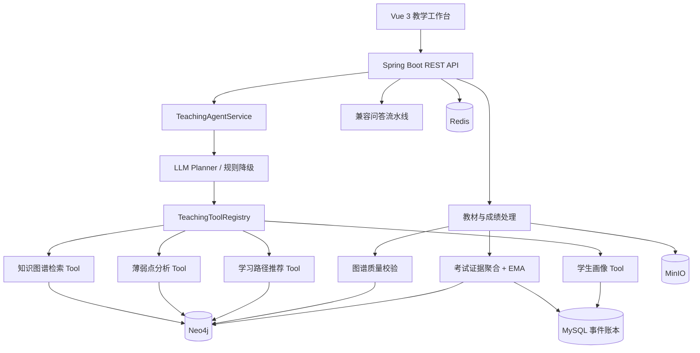

# GraphNexus — 学情智图

> 基于知识图谱、动态掌握度与受控 ReAct Agent 的智慧教育分析平台。

[](https://adoptium.net/)
[](https://spring.io/projects/spring-boot)
[](https://neo4j.com/)
[](https://vuejs.org/)

GraphNexus 将教材、考试和学生历史学习数据组织成可推理的教育知识图谱。系统既保留原有的知识图谱增强问答，也提供教学辅助 Agent：模型负责理解问题和选择工具，图算法负责薄弱点诊断与学习顺序，所有关键数值均可追溯到知识图谱路径和考试题目证据。

## 主要能力

- 教材知识图谱：从 PDF/TXT 中抽取实体、知识点、分类、来源和前置依赖。
- 图谱质量门禁：写入前校验无效端点、自环、重复边、权重范围和有向环。
- 成绩事件图谱：将 CSV/XLSX 成绩转换为 Student、Exam、KnowledgePoint 及其关系。
- 动态掌握度：按学生、考试、知识点聚合得分率，通过 EMA 更新 `MASTERS.weight`。
- 可解释剪枝：保留薄弱知识点及其真实前置路径，按薄弱度、置信度、关系强度和跳数稳定排序。
- 教学辅助 Agent：基于严格 JSON 动作协议动态调用四类白名单 Tool。
- 确定性学习路径：对薄弱点依赖子图进行环检测、拓扑排序和时间预算分配。
- 审计与可观测性：记录公开 Tool 决策、观察、证据、耗时、降级原因及 Micrometer 指标。
- 多角色工作台：支持管理员、教师、学生及运营角色的 JWT/RBAC 访问控制。

## 系统架构



### 后端分层

```text
com.graphnexus
├── api/                 REST、鉴权入口、DTO
├── application/
│   ├── agent/           ReAct 编排、四类 Tool、轨迹与指标
│   ├── mastery/         证据聚合、EMA、重放与查询
│   ├── analysis/        图谱融合与剪枝策略
│   ├── graph/           教材图谱抽取、质量校验、图指标
│   ├── query/           兼容问答链路
│   └── file/            教材和考试文件处理
├── infrastructure/     Neo4j、MySQL、LLM、MinIO 适配
└── common/             安全、异常、配置和通用模型
```

### 前端功能

| 路由 | 功能 | 主要角色 |
|---|---|---|
| `/materials` | 教材上传、解析和图谱构建 | 管理员、教师 |
| `/knowledge-graph` | 学科/文档知识图谱可视化 | 管理员、教师、运营经理 |
| `/grades` | 考试成绩导入和管理 | 管理员、教师 |
| `/diagnosis` | 原有知识图谱增强问答 | 管理员、教师、学生 |
| `/teaching-agent` | Agent 分析、证据、轨迹、掌握度与学习路径 | 管理员、教师、学生 |
| `/ops` | 运营指标仪表盘 | 管理员、运营经理 |
| `/settings/*` | 用户和系统配置 | 管理员 |
| `/system/*` | 健康状态与日志 | 管理员、运营角色 |

## 核心设计

### 1. 前置关系与图谱剪枝

系统只采用一种前置关系语义：

```text
A -[:PREREQUISITE_OF]-> B
```

表示学习 B 之前需要掌握 A。诊断目标 B 时，系统沿入向路径查找 A，并保留多跳路径中的每一条真实关系。

薄弱点基础分数：

```text
weakScore = (1 - mastery) × confidence
```

前置节点分数结合目标薄弱度、关系强度和跳数衰减，再执行稳定 Top-K。相同输入会得到相同节点与顺序，不依赖数据库无序 `LIMIT`。

### 2. EMA 动态掌握度

每次考试先按以下粒度聚合题目证据：

```text
studentNo + examNo + knowledgePoint
scoreRate = Σ rawScore / Σ maxScore
```

一题对应多个知识点时，每个知识点获得该题完整得分率，并在 `evidence_json` 中保存题号、原始分和满分。

```text
首次：newWeight = scoreRate
后续：newWeight = α × scoreRate + (1 - α) × oldWeight
默认：α = 0.30
```

MySQL 的 `mastery_update_event` 是可审计、可重放的事实源；Neo4j 的 `MASTERS` 是面向查询的最新状态。重复事件由唯一键保证幂等，删除考试或乱序导入后可按考试时间重建状态。

### 3. 受控 ReAct Agent

Planner 每轮只能返回以下两类动作之一：

```json
{"type":"TOOL_CALL","tool":"student_profile","arguments":{},"decisionSummary":"读取学生画像"}
```

```json
{"type":"FINAL_ANSWER","answerPlan":"根据已取得的证据生成回答"}
```

Agent 不提供通用 SQL/Cypher 执行能力，只能使用注册表中的四个教学 Tool：

| Tool | 作用 |
|---|---|
| `knowledge_graph_search` | 定位问题涉及的知识点、教材定义和邻接关系 |
| `student_profile` | 查询近期考试、掌握度、置信度和薄弱分层 |
| `weakness_analysis` | 根据剪枝子图识别直接薄弱点和前置根因 |
| `learning_path_recommendation` | 按拓扑顺序和时间预算生成学习计划 |

默认安全边界：

- 最大 6 轮；
- Agent 总时长 30 秒；
- 单 Tool 超时 5 秒；
- Observation 最大 12000 字符；
- 连续错误上限 2 次；
- 重复 Tool 调用拦截；
- LLM 规划失败时降级为确定性规则路由；
- 权限范围由服务端登录态注入，模型参数不能扩大访问范围。

## 快速开始

### 环境要求

| 依赖 | 建议版本 |
|---|---|
| JDK | 17+ |
| Maven | 3.9+，或使用仓库内 Maven Wrapper |
| Node.js | 18+ |
| Docker Compose 或 Podman Compose | 当前稳定版 |

AI 能力还需要：

- 兼容 OpenAI 协议的 `LLM_API_KEY`；
- 解析 PDF 时使用的 `MINERU_API_TOKEN`。

### 1. 准备环境变量

```bash
cp .env.example .env
```

至少修改以下配置，生产环境不得沿用示例凭证：

```dotenv
LLM_API_KEY=sk-your-key
MINERU_API_TOKEN=your-mineru-token
JWT_SECRET=replace-with-a-strong-secret
```

### 2. 启动基础设施

Docker：

```bash
docker compose --project-directory . -f deployment/docker-compose.yml up -d
```

Podman：

```bash
podman compose --project-directory . -f deployment/podman-compose.yml up -d
```

基础设施包括 Neo4j、MySQL、Redis 和 MinIO。首次创建 MySQL 数据卷时会执行 `deployment/init-sql/` 中的初始化脚本。

已有数据库需要按顺序手工执行新增迁移：

```bash
mysql -h 127.0.0.1 -u graphnexus -p graphnexus < deployment/init-sql/002-agent-mastery.sql
mysql -h 127.0.0.1 -u graphnexus -p graphnexus < deployment/init-sql/003-agent-trace.sql
```

### 3. 启动后端

Linux/macOS：

```bash
export LLM_API_KEY=sk-your-key
export MINERU_API_TOKEN=your-mineru-token
./mvnw spring-boot:run -Dspring-boot.run.profiles=dev
```

Windows PowerShell：

```powershell
$env:LLM_API_KEY = "sk-your-key"
$env:MINERU_API_TOKEN = "your-mineru-token"
.\mvnw.cmd spring-boot:run "-Dspring-boot.run.profiles=dev"
```

后端默认监听 `http://localhost:8080`。

### 4. 启动前端

```bash
cd frontend
npm ci
npm run dev
```

访问 `http://localhost:5173`。开发环境默认管理员为 `admin / admin123`，仅用于本地初始化，部署前必须修改。

### 5. 验证服务

```bash
curl http://localhost:8080/actuator/health
curl http://localhost:8080/api/v1/system/health
```

- Swagger UI：`http://localhost:8080/swagger-ui/index.html`
- Neo4j Browser：`http://localhost:7474`
- MinIO Console：`http://localhost:9001`
- Prometheus 指标：`http://localhost:8080/actuator/prometheus`

## 容器化部署

基础设施启动后，构建并启动双副本应用与 Nginx：

```bash
./mvnw -DskipTests package
podman build --format docker -t graphnexus-app:0.1.0 -f deployment/Containerfile .
podman compose --project-directory . -f deployment/podman-compose.app.yml up -d
podman compose --project-directory . -f deployment/podman-compose.nginx.yml up -d
```

网关默认监听 `http://localhost:8080`，两个应用副本分别映射到 `8081` 和 `8082`。完整部署说明见 [deployment/deploy.md](deployment/deploy.md)。

## API 概览

所有业务接口统一使用 `/api/v1` 前缀，除登录等公开端点外均需要 JWT。

| 模块 | 端点 | 说明 |
|---|---|---|
| 认证 | `POST /api/v1/auth/login` | 登录并签发 Token |
| 教材 | `POST /api/v1/file/textbooks/upload` | 上传 PDF/TXT |
| | `POST /api/v1/file/textbooks/parse/{id}` | 解析教材 |
| 图谱 | `POST /api/v1/graph/construction/extract/{documentId}` | 抽取并写入知识图谱 |
| | `GET /api/v1/graph/construction/full` | 查询完整图谱 |
| 成绩 | `POST /api/v1/file/grades/upload` | 上传 CSV/XLSX 成绩 |
| | `DELETE /api/v1/file/grades/exam/{examNo}` | 删除考试并触发掌握度重放 |
| Agent | `POST /api/v1/agent/chat` | 执行受控教学 Agent |
| | `GET /api/v1/agent/tasks` | 查询本人最近任务 |
| | `GET /api/v1/agent/result/{taskId}/trace` | 查询授权任务的 Tool 轨迹 |
| 掌握度 | `GET /api/v1/mastery/{studentNo}?subject=数学` | 查询最新掌握度 |
| | `GET /api/v1/mastery/{studentNo}/{kpId}/history` | 查询知识点更新历史 |
| | `POST /api/v1/mastery/rebuild` | 管理员重建掌握度 |
| 兼容问答 | `POST /api/v1/query/chat` | 原有自然语言诊断入口 |
| | `POST /api/v1/query/ask` | 参数化同步问答 |
| | `POST /api/v1/query/ask-async` | 异步问答 |
| 融合 | `POST /api/v1/analysis/fusion/execute` | 执行宽图谱融合 |
| 图指标 | `GET /api/v1/graph/metrics/pagerank` | PageRank |
| 运营 | `GET /api/v1/ops/stats/summary` | 运营摘要 |

Agent 请求示例：

```bash
curl -X POST http://localhost:8080/api/v1/agent/chat \
  -H "Authorization: Bearer <access-token>" \
  -H "Content-Type: application/json" \
  -d '{
    "question": "分析我的薄弱知识点，并制定一周复习计划",
    "studentNo": "S-FIXTURE-001",
    "subject": "数学",
    "dailyMinutes": 45,
    "days": 7
  }'
```

响应包含 `answer`、`toolsUsed`、`evidence`、`trace`、`warnings` 和 `fallbackReason`。

## 配置与可观测性

核心默认参数：

```yaml
agent:
  max-rounds: 6
  total-timeout-ms: 30000
  tool-timeout-ms: 5000
  max-observation-chars: 12000
  max-consecutive-errors: 2

mastery:
  strategy: ema
  ema:
    alpha: 0.30
  weak-threshold: 0.60
  mastered-threshold: 0.80
```

Agent 暴露的核心 Micrometer 指标包括：

```text
graphnexus.agent.tasks
graphnexus.agent.duration
graphnexus.agent.rounds
graphnexus.agent.tool.calls
graphnexus.agent.tool.duration
graphnexus.agent.fallbacks
```

系统只保存公开决策摘要，不保存模型隐藏推理。轨迹读取按任务所有者隔离，学生掌握度接口限制为本人访问；教师和管理员按 RBAC 授权。

## 测试与演示数据

后端：

```bash
./mvnw -DskipTests package
./mvnw test
```

前端：

```bash
cd frontend
npm run build
```

完整集成测试需要可访问的 MySQL、Neo4j、Redis 和 MinIO。当前验收范围、已知历史测试问题及复现命令见 [智慧教育 Agent 改造验收报告](docs/智慧教育Agent改造验收报告.md)。

固定演示数据位于 `src/test/resources/fixtures/agent/`：

- 9 个知识点、11 条无环前置依赖；
- 3 名学生、3 次考试；
- 覆盖满分、部分得分、零分和缺考；
- 包含固定诊断期望结果。

## 项目结构

```text
GraphNexus/
├── src/main/java/com/graphnexus/       # Spring Boot 后端
├── src/main/resources/                 # 环境配置、Prompt、数据库脚本
├── src/test/                           # 单元/集成测试与 Agent 夹具
├── frontend/                           # Vue 3 + TypeScript 前端
├── deployment/                         # Compose、Containerfile、Nginx、SQL 迁移
├── docs/                               # 架构、测试、Agent 改造与验收文档
├── pom.xml
└── README.md
```

## 相关文档

- [智慧教育 AI 教学辅助 Agent 系统改造实施计划](docs/智慧教育AI教学辅助Agent系统改造实施计划.md)
- [智慧教育 Agent 改造验收报告](docs/智慧教育Agent改造验收报告.md)
- [部署指南](deployment/deploy.md)
- [项目状态](STATE.md)
