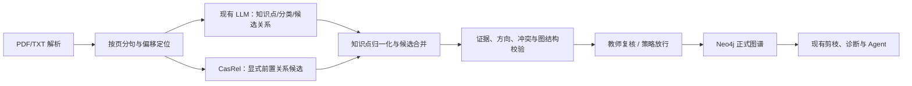

# GraphNexus：CasRel 关系抽取引入设计方案

日期：2026-09-13　　状态：设计提案，尚未修改 GraphNexus 代码或数据

## 1. 决策与目标

在教材图谱构建环节引入 **CasRel 候选关系抽取器**，第一阶段只处理有原文依据的知识点前置关系 `A -[:PREREQUISITE_OF]-> B`（学习 B 前需要掌握 A）。它与现有 LLM 抽取并行，先用于比对和教师复核；评测证明有收益后，再按学科逐步允许高可信候选入图。保留现有的知识点、分类、实体对齐抽取，以及成绩导入、掌握度、问答和 Agent 流程。

目标是提高**前置边的正确性和可追溯性**，而非增加边的数量。CasRel 是句子级三元组抽取框架，擅长同一句中共享实体的重叠三元组；论文在通用关系抽取数据集上的结果不能直接当作教育教材效果，须用 GraphNexus 数据实测。[CasRel 原始论文](https://aclanthology.org/2020.acl-main.136/)

## 2. 现状与接入点

- 生产教材流程位于 `ExtractionService.extract()`：LLM 输出 `ExtractionRawResult`，经结构校验、转换及 `GraphQualityValidator` 后，由 `ConstructionServiceImpl` 写入 Neo4j。[抽取入口](D:/GraphNexus/src/main/java/com/graphnexus/application/graph/construction/extract/ExtractionService.java:87) · [写入入口](D:/GraphNexus/src/main/java/com/graphnexus/application/graph/construction/service/impl/ConstructionServiceImpl.java:74)
- `RawPrerequisite` 只有源/目标知识点数组索引、教学强度和描述；正式 `PrerequisiteEdge` 也没有原文位置、抽取方式或审核状态。[原始结构](D:/GraphNexus/src/main/java/com/graphnexus/application/graph/construction/model/ExtractionRawResult.java:83) · [边结构](D:/GraphNexus/src/main/java/com/graphnexus/infrastructure/neo4j/edge/PrerequisiteEdge.java:17)
- 当前提示词要求知识点广泛连接，且抽取后对边数偏少发出警告。这会奖励“关系密度”，与本方案的“有证据才入图”目标冲突，必须同步调整。[提示词](D:/GraphNexus/src/main/resources/prompts/extraction-system.md:34) · [覆盖率警告](D:/GraphNexus/src/main/java/com/graphnexus/application/graph/construction/extract/ExtractionService.java:105)
- 现有 `NLP_NER_RE` 构建器是规则词项识别加规则关系提取，并非已部署的 BERT、BiLSTM+CRF 或 CasRel。图谱评测已有金标加载和严格指标计算，但公开接口当前仅能提交手工候选图；需接通模型运行与评测的调用链。[规则构建器](D:/GraphNexus/src/main/java/com/graphnexus/application/evaluation/graph/builder/nlp/NlpGraphBuilder.java:16) · [评测接口](D:/GraphNexus/src/main/java/com/graphnexus/api/evaluation/controller/GraphEvaluationController.java:22)

## 3. 范围与关系定义

第一阶段只训练和预测 `PREREQUISITE_OF`，方向固定为“前置知识点 → 后续知识点”。例如“学习二次函数顶点坐标前，先掌握配方法”可得到 `(配方法, PREREQUISITE_OF, 二次函数顶点坐标)`。单纯同章、同时出现、相似或“相关”不构成前置关系。教材未明说、只能由教学经验推断的关系，仍可由现有 LLM 提议，但标记为 `INFERRED` 并交给教师复核，不作为 CasRel 的正例。

CasRel 的**抽取置信度**表示模型对该句标签的把握；现有 `PrerequisiteEdge.strength` 表示教学依赖强弱。二者分别存储，严禁把前者直接写成 `MASTERS` 分析和学习路径使用的教学强度。关系审核时由学科规则或教师确定 `strength`。

初期不覆盖 `CONTAINS`、`DERIVES`、分类树、知识点跨文档对齐及学生考试数据。尤其不额外串接 BiLSTM+CRF：CasRel 自带主体、客体标注，先评测其自身输出；若实体边界确实成为瓶颈，再单独评估专用 NER。

## 4. 目标架构



**模型边界。**新增独立 CasRel 推理服务，由 Spring Boot 通过适配器调用，不让 Python 训练依赖进入 Java 主应用。服务输入为 `documentId`、学科、文本片段及其页码/字符偏移、模型版本；输出为片段内主体和客体的文本及起止偏移、方向、关系标签、模型置信度。超时或不可用时记录降级原因，教材构建继续走现有 LLM 流程；影子模式下失败不得影响当前构建结果。

推理接口可采用如下最小契约。`start/end` 均为**原始片段中的字符偏移**，采用左闭右开区间；服务不得返回片段外的词语或关系。

```json
POST /v1/relation-candidates
{
  "runId": "run-001",
  "documentId": "42",
  "subject": "数学",
  "segments": [{"segmentId": "p3-s8", "page": 3, "text": "学习二次函数顶点坐标前，先掌握配方法。"}]
}
```

```json
{
  "modelVersion": "casrel-edu-v1",
  "candidates": [{
    "segmentId": "p3-s8",
    "head": {"text": "配方法", "start": 15, "end": 18},
    "relation": "PREREQUISITE_OF",
    "tail": {"text": "二次函数顶点坐标", "start": 2, "end": 10},
    "relationConfidence": 0.91
  }]
}
```

接口测试必须验证偏移能准确回贴到原始片段；实际预测结果以模型输出为准。

**证据定位。**分句前保留原文片段、文档哈希、页码以及段落/字符偏移。PDF 解析结果若无法可靠恢复页码，至少保存可复查的原文片段和文档标识，不伪造页码。模型输出的 span 必须能回贴到输入片段，否则隔离该候选。

**知识点映射。**CasRel 提取的是文本表面词，不直接创建正式知识点。先限定同一学科，在 LLM 输出及现有图谱知识点中按规范名、别名、人工映射表匹配；无法唯一确定时进入待审核队列。合并与去重使用稳定的知识点标识，而非 `RawPrerequisite` 的数组索引；复用已有知识点节点后须重新映射边端点，再执行质量校验与写入。

**候选判定。**同一方向、同一对知识点的 LLM 与 CasRel 候选可合并证据；方向相反、证据不在原文、端点不确定或跨学科的候选一律隔离。仅 CasRel 命中的高置信显式关系先交教师抽检，阈值由验证集校准。仅 LLM 推断的隐式关系维持人工审核，不因候选数量不足而放行。`GraphQualityValidator` 继续拦截自环、重复边和环路；正式入图前还需检查**归一化后及跨文档**可能形成的冲突或环路。[现有质量门禁](D:/GraphNexus/src/main/java/com/graphnexus/application/graph/construction/validate/GraphQualityValidator.java:18)

**审计存储。**建议新增候选关系记录，至少包含 `runId/documentId/documentHash`、源与目标知识点 ID、原文片段及位置、抽取器与版本、模型置信度、审核状态、审核人和审核时间。Neo4j 正式前置边保存证据记录 ID 与独立的教学强度；同一边可关联多条证据。重抽取以文档哈希和运行 ID 区分版本，旧候选保留审计记录，正式图谱只反映当前批准版本。

## 5. 评测与上线门槛

先做按**教材/章节分组**的人工金标，保证训练集、验证集、测试集不共享同一段落。标注知识点表面 span、标准知识点 ID、关系方向、原文证据，以及“显式前置 / 仅相关 / 无关系 / 隐式教学推断”类别。必须纳入**没有任何三元组的句子**、多三元组重叠句、跨行公式和 PDF 解析噪声；只测含关系句会高估实际效果。[现实评测偏差研究](https://aclanthology.org/2023.genbench-1.1/)

固定测试集比较：现有 LLM、现有规则方法、CasRel 单独输出，以及“LLM＋CasRel 候选合并”。主指标是**前置关系精确率、召回率、F1、方向准确率、无关系句误报率**；另测知识点映射准确率、证据可回贴率、推理耗时和每份文档成本。通过现有 `StrictGraphEvaluator` 对比知识点与依赖结构，并补充候选证据和下游诊断抽样评测。[严格评测器](D:/GraphNexus/src/main/java/com/graphnexus/application/evaluation/graph/core/StrictGraphEvaluator.java:32)

建议上线门槛：在锁定测试集上，**关系精确率高于现有生产基线且差异具有可信区间支持**；召回率不得出现业务不可接受的下降；反向前置、无证据边和诊断答案错误不得增加。正式阈值由测试集规模和教师复核成本确定，不沿用论文在 NYT/WebNLG 上的分数。当前仓库有金标加载器，但默认指向外部 `pep-math-taxonomy/data`；需核实是否已有可用数据，并另建句子级证据金标。[金标配置](D:/GraphNexus/src/main/java/com/graphnexus/application/evaluation/graph/config/EvaluationProperties.java:17)

## 6. 分阶段实施与验收

| 阶段 | 工作 | 可评审产物与验收 |
|---|---|---|
| 0. 基线与证据 | 去掉前置边数量硬要求；定义关系标注规范；保存教材文本定位信息；抽样审查现有边 | 基线误差报告、版本化金标、关系与证据字段设计；现有问答行为保持一致 |
| 1. 离线试验 | 训练/适配 CasRel；开发片段输入和候选输出；接入评测运行器 | 可重复模型版本、四方案对比、方向和无关系句误差分析；不写正式图 |
| 2. 影子运行 | 教材抽取时并行调用 CasRel，只记录候选及与 LLM 的一致/冲突情况 | 服务失败可降级；现有图谱与诊断输出不变；形成教师抽检样本 |
| 3. 受控入图 | 审核队列、知识点映射、证据与跨文档校验；仅选定学科按策略放行 | 每条新增边可回溯到证据与模型版本；诊断抽样无回归；可按文档回滚 |

配置开关建议分为 `OFF`、`SHADOW`、`REVIEW`、`LIMITED_WRITE`。回滚时先关闭自动放行，再按运行 ID 找出受影响文档/边并恢复上一批准版本；不要把尚未审核的候选放入诊断子图。

## 7. 主要风险与控制

1. **教育依赖常是隐式知识。**CasRel 只负责有文本证据的候选；未命中不等于没有前置关系，教学推断保留教师审核。
2. **模型分数与教学权重混淆。**分别存 `relationConfidence` 和 `strength`，前者仅用于候选筛选。
3. **跨文档知识点重用后的端点变化。**当前构建流程可能重用已有知识点 ID；合并后必须重映射候选边并验证写入端点，不能沿用临时索引。[知识点复用代码](D:/GraphNexus/src/main/java/com/graphnexus/application/graph/construction/service/impl/ConstructionServiceImpl.java:176)
4. **错误边传导到诊断。**影子和审核阶段均不进入正式 `PREREQUISITE_OF`；上线后监控关系被教师撤回比例、诊断证据一致性和学习路径变化。

本方案的首个交付应是**基线审查、句子级金标和证据字段**。这些完成后，才能判断 CasRel 对 GraphNexus 是否确有净收益。
