# GraphNexus 时序图设计文档

> 基于图谱技术的 AI 上下文处理与精准问答系统 — 时序图
>
> 版本：v1.0 | 创建日期：2026-06-08
>
> 本文档以 **Mermaid 时序图** 形式描述 GraphNexus 的关键运行时场景，覆盖 5 类参与者、8 个模块、4 层架构之间的交互流程。场景选取与 [use-case-view.md](use-case-view.md) §6.4 保持一致。

---

## 一、场景概览

| # | 场景名称 | 对应用例 | 参与者 | 覆盖模块 | 交互模式 |
|---|---------|---------|--------|---------|---------|
| **S1** | 教师查询学生归因分析 | UC-10 | 教师 (A2) | P2→M6→M1→M4→M5→A6 | 同步编排 + LLM 降级 |
| **S2** | PDF上传与图谱构建 | UC-01 | 管理员 (A1) | P1→M3→M2→M4→M7 | 异步流水线（消息队列） |
| **S3** | 成绩CSV导入触发权重更新 | UC-02 + UC-07 | 管理员 (A1) | P1→M3→M1→M2→M4 | 同步导入 + 前置链传播 |
| **S4** | 学生自助薄弱点查询 | UC-21 | 学生 (A3) | P3→M6→M1→M4 | 同步查询 + 隐私保护 |
| **S5** | 实体对齐审核与合并 | UC-04 | 管理员 (A1) | P1→M2→M4 | 同步操作 + 回滚支持 |
| **S6** | 运营看板数据聚合 | UC-28 | 运营人员 (A5) | P5→M6→M8→M1/M2/M3/M4 | 编排聚合（分层调用） |
| **S7** | LLM调用降级与熔断 | 横切 (UC-10/16) | — | M5→A6 | 降级链 + 配额控制 |

### 分层调用路径验证

所有场景遵循统一分层规则：

```
L1 表示层 (P1-P5) → L2 应用层 (M6) → L3 领域层 (M1-M5, M8) → L4 基础设施层
                        ↑ 横切: M7 (系统运维)
```

> **特殊说明**：S2（PDF上传）和S3（成绩导入）中管理员直接操作 L3（M3），属于管理类用例的特殊路径（P1 → M3），不经过 M6 编排。

---

## 二、S1 · 教师查询学生归因分析 (UC-10)

### 2.1 场景描述

**这是 GraphNexus 的核心价值交付场景。** 教师发现学生A连续多次在"二次函数"题目上出错，通过自然语言输入查询，系统调用剪枝引擎提取子图、LLM 生成结构化归因报告，并对 LLM 不可用场景进行降级处理。

```
教师 → P2教师工作台 → M6应用服务(编排) → M1(权限) → M4(剪枝) → M5(上下文+LLM) → A6(LLM服务)
```

### 2.2 主成功流程

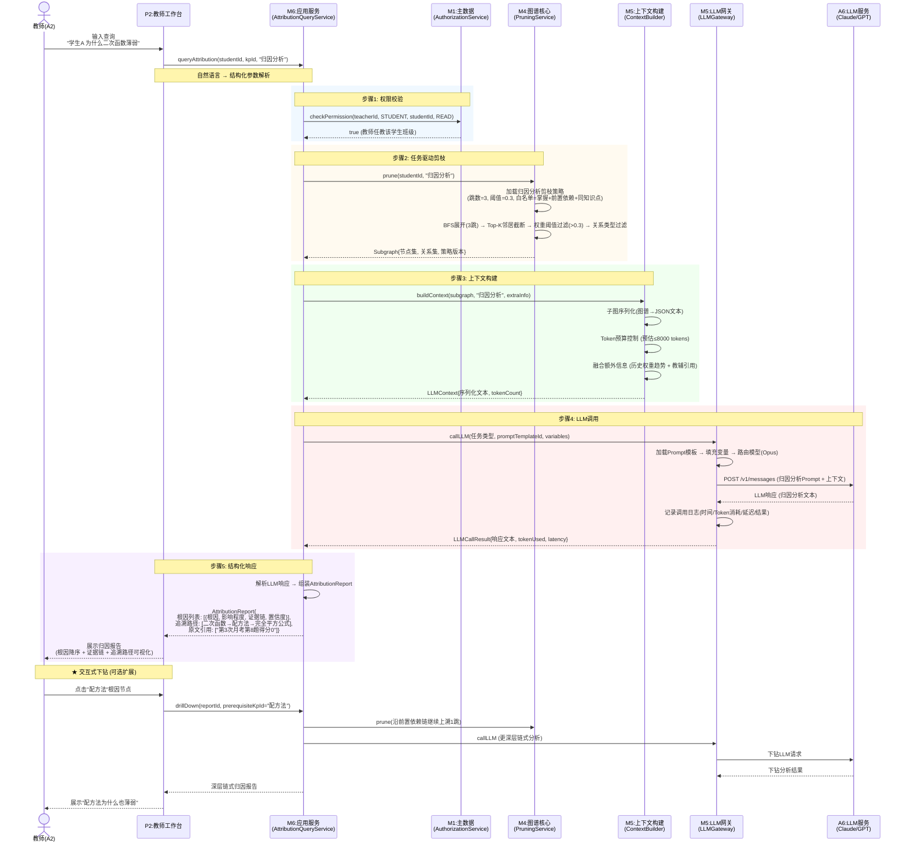
```mermaid
sequenceDiagram
    actor T as 教师(A2)
    participant P2 as P2:教师工作台
    participant M6 as M6:应用服务<br/>(AttributionQueryService)
    participant M1 as M1:主数据<br/>(AuthorizationService)
    participant M4 as M4:图谱核心<br/>(PruningService)
    participant M5Ctx as M5:上下文构建<br/>(ContextBuilder)
    participant M5LLM as M5:LLM网关<br/>(LLMGateway)
    participant A6 as A6:LLM服务<br/>(Claude/GPT)

    T->>P2: 输入查询<br/>"学生A 为什么二次函数薄弱"
    P2->>M6: queryAttribution(studentId, kpId, "归因分析")
    Note over P2,M6: 自然语言 → 结构化参数解析

    rect rgb(240, 248, 255)
        Note over M6,M1: 步骤1: 权限校验
        M6->>M1: checkPermission(teacherId, STUDENT, studentId, READ)
        M1-->>M6: true (教师任教该学生班级)
    end

    rect rgb(255, 250, 240)
        Note over M6,M4: 步骤2: 任务驱动剪枝
        M6->>M4: prune(studentId, "归因分析")
        M4->>M4: 加载归因分析剪枝策略<br/>(跳数=3, 阈值=0.3, 白名单=掌握+前置依赖+同知识点)
        M4->>M4: BFS展开(3跳) → Top-K邻居截断 → 权重阈值过滤(>0.3) → 关系类型过滤
        M4-->>M6: Subgraph{节点集, 关系集, 策略版本}
    end

    rect rgb(240, 255, 240)
        Note over M6,M5Ctx: 步骤3: 上下文构建
        M6->>M5Ctx: buildContext(subgraph, "归因分析", extraInfo)
        M5Ctx->>M5Ctx: 子图序列化(图谱→JSON文本)
        M5Ctx->>M5Ctx: Token预算控制 (预估≤8000 tokens)
        M5Ctx->>M5Ctx: 融合额外信息 (历史权重趋势 + 教辅引用)
        M5Ctx-->>M6: LLMContext{序列化文本, tokenCount}
    end

    rect rgb(255, 240, 240)
        Note over M6,A6: 步骤4: LLM调用
        M6->>M5LLM: callLLM(任务类型, promptTemplateId, variables)
        M5LLM->>M5LLM: 加载Prompt模板 → 填充变量 → 路由模型(Opus)
        M5LLM->>A6: POST /v1/messages (归因分析Prompt + 上下文)
        A6-->>M5LLM: LLM响应 (归因分析文本)
        M5LLM->>M5LLM: 记录调用日志(时间/Token消耗/延迟/结果)
        M5LLM-->>M6: LLMCallResult{响应文本, tokenUsed, latency}
    end

    rect rgb(248, 240, 255)
        Note over M6,P2: 步骤5: 结构化响应
        M6->>M6: 解析LLM响应 → 组装AttributionReport
        M6-->>P2: AttributionReport{<br/>根因列表: [{根因, 影响程度, 证据链, 置信度}],<br/>追溯路径: [二次函数→配方法→完全平方公式],<br/>原文引用: ["第3次月考第8题得分0"]}
        P2-->>T: 展示归因报告<br/>(根因降序 + 证据链 + 追溯路径可视化)
    end

    Note over T,P2: ★ 交互式下钻 (可选扩展)
    T->>P2: 点击"配方法"根因节点
    P2->>M6: drillDown(reportId, prerequisiteKpId="配方法")
    M6->>M4: prune(沿前置依赖链继续上溯1跳)
    M6->>M5LLM: callLLM (更深层链式分析)
    M5LLM->>A6: 下钻LLM请求
    A6-->>M5LLM: 下钻分析结果
    M6-->>P2: 深层链式归因报告
    P2-->>T: 展示"配方法为什么也薄弱"
```

### 2.3 LLM 配额不足降级流程

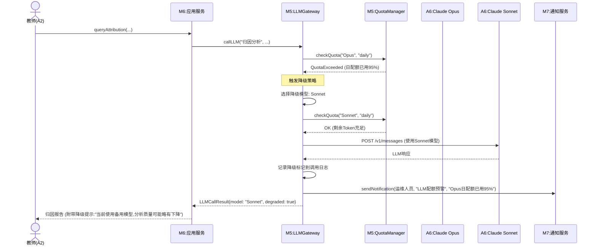
```mermaid
sequenceDiagram
    actor T as 教师(A2)
    participant M6 as M6:应用服务
    participant M5LLM as M5:LLMGateway
    participant M5Quota as M5:QuotaManager
    participant A6_Opus as A6:Claude Opus
    participant A6_Sonnet as A6:Claude Sonnet
    participant M7 as M7:通知服务

    T->>M6: queryAttribution(...)
    M6->>M5LLM: callLLM("归因分析", ...)

    M5LLM->>M5Quota: checkQuota("Opus", "daily")
    M5Quota-->>M5LLM: QuotaExceeded (日配额已用95%)

    Note over M5LLM: 触发降级策略
    M5LLM->>M5LLM: 选择降级模型: Sonnet

    M5LLM->>M5Quota: checkQuota("Sonnet", "daily")
    M5Quota-->>M5LLM: OK (剩余Token充足)

    M5LLM->>A6_Sonnet: POST /v1/messages (使用Sonnet模型)
    A6_Sonnet-->>M5LLM: LLM响应

    M5LLM->>M5LLM: 记录降级标记到调用日志
    M5LLM->>M7: sendNotification(运维人员, "LLM配额预警", "Opus日配额已用95%")
    M5LLM-->>M6: LLMCallResult{model: "Sonnet", degraded: true}

    M6-->>T: 归因报告 (附带降级提示:"当前使用备用模型,分析质量可能略有下降")
```

### 2.4 LLM 完全不可用熔断

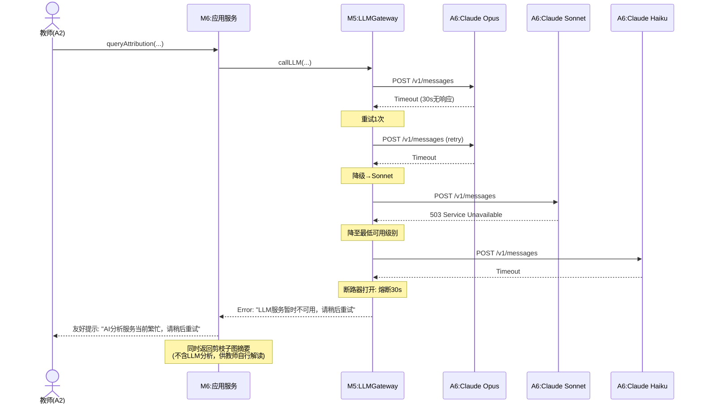
```mermaid
sequenceDiagram
    actor T as 教师(A2)
    participant M6 as M6:应用服务
    participant M5LLM as M5:LLMGateway
    participant A6_Opus as A6:Claude Opus
    participant A6_Sonnet as A6:Claude Sonnet
    participant A6_Haiku as A6:Claude Haiku

    T->>M6: queryAttribution(...)
    M6->>M5LLM: callLLM(...)

    M5LLM->>A6_Opus: POST /v1/messages
    A6_Opus-->>M5LLM: Timeout (30s无响应)

    Note over M5LLM: 重试1次
    M5LLM->>A6_Opus: POST /v1/messages (retry)
    A6_Opus-->>M5LLM: Timeout

    Note over M5LLM: 降级→Sonnet
    M5LLM->>A6_Sonnet: POST /v1/messages
    A6_Sonnet-->>M5LLM: 503 Service Unavailable

    Note over M5LLM: 降至最低可用级别
    M5LLM->>A6_Haiku: POST /v1/messages
    A6_Haiku-->>M5LLM: Timeout

    Note over M5LLM: 断路器打开: 熔断30s
    M5LLM-->>M6: Error: "LLM服务暂时不可用，请稍后重试"

    M6-->>T: 友好提示: "AI分析服务当前繁忙，请稍后重试"
    Note over M6: 同时返回剪枝子图摘要<br/>(不含LLM分析，供教师自行解读)
```

### 2.5 权限拒绝流程

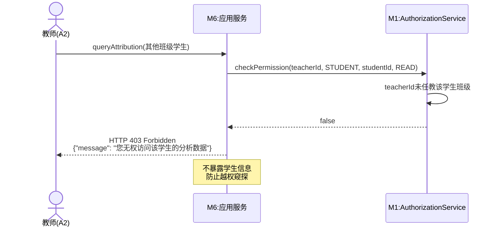
```mermaid
sequenceDiagram
    actor T as 教师(A2)
    participant M6 as M6:应用服务
    participant M1 as M1:AuthorizationService

    T->>M6: queryAttribution(其他班级学生)

    M6->>M1: checkPermission(teacherId, STUDENT, studentId, READ)
    M1->>M1: teacherId未任教该学生班级
    M1-->>M6: false

    M6-->>T: HTTP 403 Forbidden<br/>{"message": "您无权访问该学生的分析数据"}
    Note over M6: 不暴露学生信息<br/>防止越权窥探
```

---

## 三、S2 · PDF上传与图谱构建 (UC-01)

### 3.1 场景描述

管理员上传教辅 PDF，系统异步执行版面分析→NER实体抽取→RE关系抽取→图谱导入的完整流水线事件，并融合至宽图谱。**关键特征：上传立即返回，处理异步进行，完成后通知。**

```
管理员 → P1管理后台 → M3入库引擎(Pipeline) → M2(知识匹配) → M4(宽图谱融合) → M7(通知)
```

### 3.2 主成功流程（异步流水线）

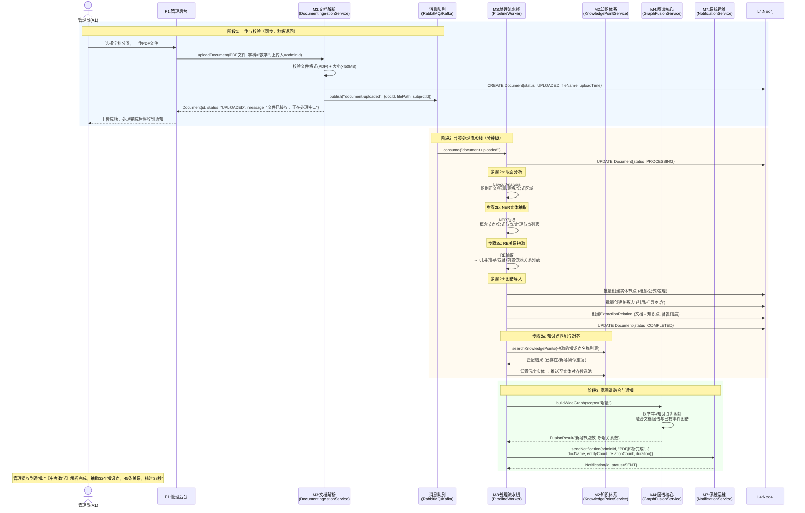
```mermaid
sequenceDiagram
    actor A as 管理员(A1)
    participant P1 as P1:管理后台
    participant M3Doc as M3:文档解析<br/>(DocumentIngestionService)
    participant MQ as 消息队列<br/>(RabbitMQ/Kafka)
    participant Pipeline as M3:处理流水线<br/>(PipelineWorker)
    participant M2 as M2:知识体系<br/>(KnowledgePointService)
    participant M4 as M4:图谱核心<br/>(GraphFusionService)
    participant M7 as M7:系统运维<br/>(NotificationService)
    participant DB as L4:Neo4j

    rect rgb(240, 248, 255)
        Note over A,MQ: 阶段1: 上传与校验（同步，秒级返回）
        A->>P1: 选择学科分类，上传PDF文件
        P1->>M3Doc: uploadDocument(PDF文件, 学科="数学", 上传人=adminId)
        M3Doc->>M3Doc: 校验文件格式(PDF) + 大小(<50MB)
        M3Doc->>DB: CREATE Document{status=UPLOADED, fileName, uploadTime}
        M3Doc->>MQ: publish("document.uploaded", {docId, filePath, subjectId})
        M3Doc-->>P1: Document{id, status="UPLOADED", message="文件已接收，正在处理中..."}
        P1-->>A: 上传成功，处理完成后将收到通知
    end

    rect rgb(255, 250, 240)
        Note over MQ,Pipeline: 阶段2: 异步处理流水线（分钟级）
        MQ->>Pipeline: consume("document.uploaded")
        Pipeline->>DB: UPDATE Document{status=PROCESSING}

        Note over Pipeline: 步骤2a: 版面分析
        Pipeline->>Pipeline: LayoutAnalysis<br/>识别正文/标题/表格/公式区域

        Note over Pipeline: 步骤2b: NER实体抽取
        Pipeline->>Pipeline: NER抽取<br/>→ 概念节点/公式节点/定理节点列表

        Note over Pipeline: 步骤2c: RE关系抽取
        Pipeline->>Pipeline: RE抽取<br/>→ 引用/推导/包含/前置依赖关系列表

        Note over Pipeline: 步骤2d: 图谱导入
        Pipeline->>DB: 批量创建实体节点 (概念/公式/定理)
        Pipeline->>DB: 批量创建关系边 (引用/推导/包含)
        Pipeline->>DB: 创建ExtractionRelation (文档→知识点, 含置信度)
        Pipeline->>DB: UPDATE Document{status=COMPLETED}

        Note over Pipeline,M2: 步骤2e: 知识点匹配与对齐
        Pipeline->>M2: searchKnowledgePoints(抽取的知识点名称列表)
        M2-->>Pipeline: 匹配结果 (已存在/新增/疑似重复)
        Pipeline->>M2: 低置信度实体 → 推送至实体对齐候选池
    end

    rect rgb(240, 255, 240)
        Note over Pipeline,M7: 阶段3: 宽图谱融合与通知
        Pipeline->>M4: buildWideGraph(scope="增量")
        M4->>M4: 以学生+知识点为图钉<br/>融合文档图谱与已有事件图谱
        M4-->>Pipeline: FusionResult{新增节点数, 新增关系数}

        Pipeline->>M7: sendNotification(adminId, "PDF解析完成", {<br/>docName, entityCount, relationCount, duration})
        M7-->>Pipeline: Notification{id, status=SENT}
    end

    Note over A: 管理员收到通知: "《中考数学》解析完成，抽取32个知识点，45条关系，耗时38秒"
```

### 3.3 步骤级失败处理

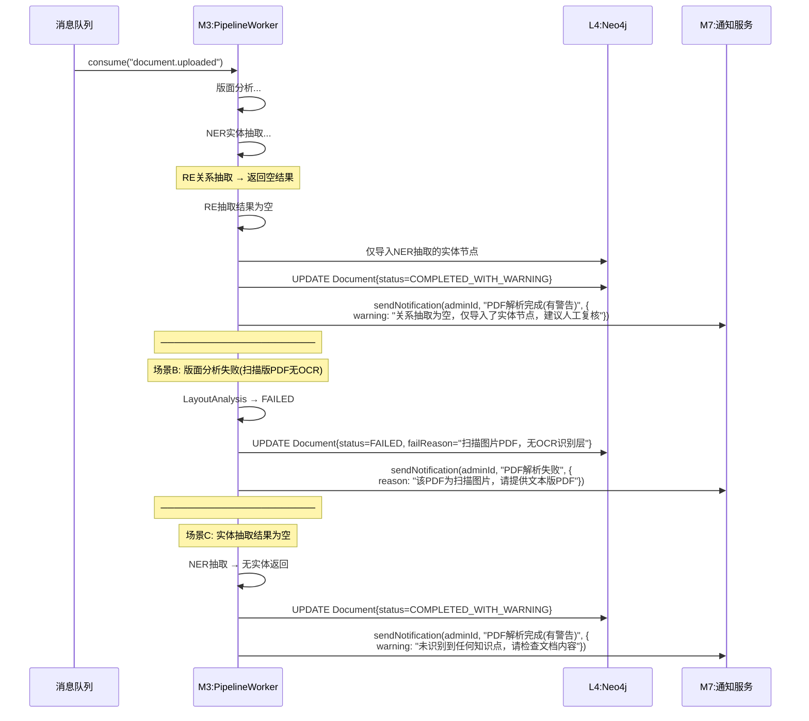
```mermaid
sequenceDiagram
    participant MQ as 消息队列
    participant Pipeline as M3:PipelineWorker
    participant DB as L4:Neo4j
    participant M7 as M7:通知服务

    MQ->>Pipeline: consume("document.uploaded")

    Pipeline->>Pipeline: 版面分析...
    Pipeline->>Pipeline: NER实体抽取...

    Note over Pipeline: RE关系抽取 → 返回空结果
    Pipeline->>Pipeline: RE抽取结果为空

    Pipeline->>DB: 仅导入NER抽取的实体节点
    Pipeline->>DB: UPDATE Document{status=COMPLETED_WITH_WARNING}

    Pipeline->>M7: sendNotification(adminId, "PDF解析完成(有警告)", {<br/>warning: "关系抽取为空，仅导入了实体节点，建议人工复核"})

    Note over Pipeline: ───────────────────────

    Note over Pipeline: 场景B: 版面分析失败(扫描版PDF无OCR)
    Pipeline->>Pipeline: LayoutAnalysis → FAILED
    Pipeline->>DB: UPDATE Document{status=FAILED, failReason="扫描图片PDF，无OCR识别层"}

    Pipeline->>M7: sendNotification(adminId, "PDF解析失败", {<br/>reason: "该PDF为扫描图片，请提供文本版PDF"})

    Note over Pipeline: ───────────────────────

    Note over Pipeline: 场景C: 实体抽取结果为空
    Pipeline->>Pipeline: NER抽取 → 无实体返回
    Pipeline->>DB: UPDATE Document{status=COMPLETED_WITH_WARNING}
    Pipeline->>M7: sendNotification(adminId, "PDF解析完成(有警告)", {<br/>warning: "未识别到任何知识点，请检查文档内容"})
```

---

## 四、S3 · 成绩CSV导入触发权重更新 (UC-02 + UC-07)

### 4.1 场景描述

管理员导入期末考试成绩 CSV，系统逐行校验→匹配学生/知识点→创建考试事件节点→触发权重引擎调整掌握关系。**关键特征：前置依赖链传播——一个知识点权重变化可能触发其前置依赖知识点权重的连带调整。**

```
管理员 → P1管理后台 → M3(事件导入) → M1(学生匹配) → M2(知识点匹配) → M4(权重引擎+前置链传播)
```

### 4.2 主成功流程

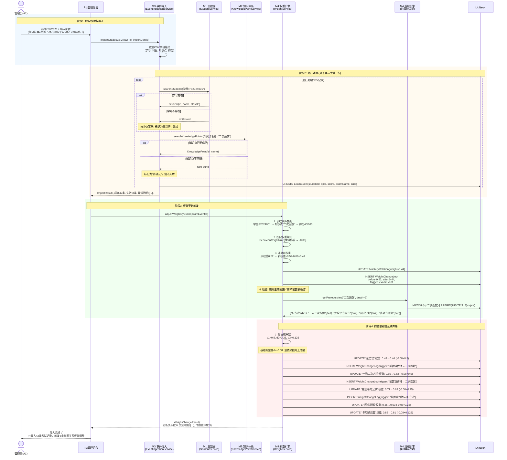
```mermaid
sequenceDiagram
    actor A as 管理员(A1)
    participant P1 as P1:管理后台
    participant M3Event as M3:事件导入<br/>(EventIngestionService)
    participant M1 as M1:主数据<br/>(StudentService)
    participant M2 as M2:知识体系<br/>(KnowledgePointService)
    participant M4Weight as M4:权重引擎<br/>(WeightService)
    participant M4Prereq as M4:剪枝引擎<br/>(前置链追溯)
    participant DB as L4:Neo4j

    rect rgb(240, 248, 255)
        Note over A,M3Event: 阶段1: CSV校验与导入
        A->>P1: 选择CSV文件 + 导入配置<br/>(得分粒度=每题, 分配规则=平均分配, 冲突=跳过)
        P1->>M3Event: importGradesCSV(csvFile, importConfig)
        M3Event->>M3Event: 校验CSV字段格式<br/>(学号, 科目, 知识点, 得分)
    end

    rect rgb(255, 250, 240)
        Note over M3Event,DB: 阶段2: 逐行处理 (以下展示关键一行)
        loop 逐行处理CSV记录
            M3Event->>M1: searchStudents(学号="S2024001")
            alt 学号存在
                M1-->>M3Event: Student{id, name, classId}
            else 学号不存在
                M1-->>M3Event: NotFound
                Note over M3Event: 按冲突策略: 标记为异常行，跳过
            end

            M3Event->>M2: searchKnowledgePoints(知识点名称="二次函数")
            alt 知识点匹配成功
                M2-->>M3Event: KnowledgePoint{id, name}
            else 知识点不匹配
                M2-->>M3Event: NotFound
                Note over M3Event: 标记为"待确认"，暂不入库
            end

            M3Event->>DB: CREATE ExamEvent{studentId, kpId, score, examName, date}
        end
        M3Event-->>P1: ImportResult{成功:42条, 失败:3条, 异常明细:[...]}
    end

    rect rgb(240, 255, 240)
        Note over P1,M4Weight: 阶段3: 权重更新触发
        P1->>M4Weight: adjustWeightByEvent(examEventId)

        M4Weight->>M4Weight: 1. 读取事件数据<br/>学生S2024001 → 知识点"二次函数" → 得分45/100
        M4Weight->>M4Weight: 2. 匹配权重规则<br/>BehaviorWeightRule{错误作答 → -0.08}
        M4Weight->>M4Weight: 3. 计算新权重<br/>原权重0.52 → 新权重=0.52-0.08=0.44

        M4Weight->>DB: UPDATE MasteryRelation{weight=0.44}
        M4Weight->>DB: INSERT WeightChangeLog{<br/>before:0.52, after:0.44,<br/>trigger: examEvent#128, source: SYSTEM}

        Note over M4Weight: 4. 检查: 规则生效范围="影响前置依赖链"
        M4Weight->>M4Prereq: getPrerequisites("二次函数", depth=3)
        M4Prereq->>DB: MATCH (kp:二次函数)-[:PREREQUISITE*1..3]->(pre)
        M4Prereq-->>M4Weight: ["配方法"(d=1), "一元二次方程"(d=1), "完全平方公式"(d=2), "因式分解"(d=2), "多项式运算"(d=3)]
    end

    rect rgb(255, 240, 240)
        Note over M4Weight,DB: 阶段4: 前置依赖链衰减传播
        M4Weight->>M4Weight: 计算衰减系数<br/>d1=0.5, d2=0.25, d3=0.125
        Note over M4Weight: 基础调整量Δ=-0.08, 沿依赖链向上传播

        M4Weight->>DB: UPDATE "配方法"权重: 0.48→0.46 (-0.08×0.5)
        M4Weight->>DB: INSERT WeightChangeLog{trigger: "前置链传播←二次函数"}

        M4Weight->>DB: UPDATE "一元二次方程"权重: 0.65→0.63 (-0.08×0.5)
        M4Weight->>DB: INSERT WeightChangeLog{trigger: "前置链传播←二次函数"}

        M4Weight->>DB: UPDATE "完全平方公式"权重: 0.71→0.69 (-0.08×0.25)
        M4Weight->>DB: INSERT WeightChangeLog{trigger: "前置链传播←配方法"}

        M4Weight->>DB: UPDATE "因式分解"权重: 0.55→0.53 (-0.08×0.25)

        M4Weight->>DB: UPDATE "多项式运算"权重: 0.82→0.81 (-0.08×0.125)
    end

    M4Weight-->>P1: WeightChangeResult{<br/>更新关系数:6, 变更明细:[...], 传播链深度:3}
    P1-->>A: 导入完成 ✓<br/>共导入42条考试记录，触发6条掌握关系权重调整
```

### 4.3 多得分分配策略对比

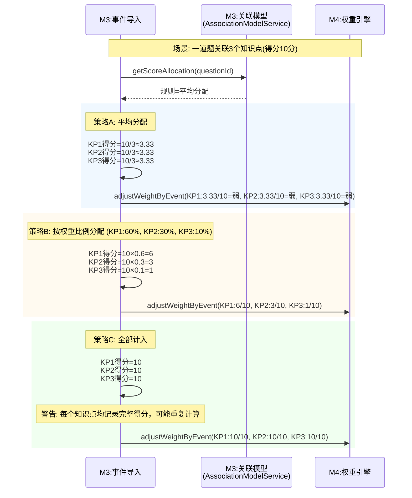
```mermaid
sequenceDiagram
    participant M3Event as M3:事件导入
    participant M3Model as M3:关联模型<br/>(AssociationModelService)
    participant M4Weight as M4:权重引擎

    Note over M3Event,M4Weight: 场景: 一道题关联3个知识点(得分10分)

    M3Event->>M3Model: getScoreAllocation(questionId)
    M3Model-->>M3Event: 规则=平均分配

    rect rgb(240, 248, 255)
        Note over M3Event: 策略A: 平均分配
        M3Event->>M3Event: KP1得分=10/3≈3.33<br/>KP2得分=10/3≈3.33<br/>KP3得分=10/3≈3.33
        M3Event->>M4Weight: adjustWeightByEvent(KP1:3.33/10=弱, KP2:3.33/10=弱, KP3:3.33/10=弱)
    end

    rect rgb(255, 250, 240)
        Note over M3Event: 策略B: 按权重比例分配 (KP1:60%, KP2:30%, KP3:10%)
        M3Event->>M3Event: KP1得分=10×0.6=6<br/>KP2得分=10×0.3=3<br/>KP3得分=10×0.1=1
        M3Event->>M4Weight: adjustWeightByEvent(KP1:6/10, KP2:3/10, KP3:1/10)
    end

    rect rgb(240, 255, 240)
        Note over M3Event: 策略C: 全部计入
        M3Event->>M3Event: KP1得分=10<br/>KP2得分=10<br/>KP3得分=10
        Note over M3Event: 警告: 每个知识点均记录完整得分，可能重复计算
        M3Event->>M4Weight: adjustWeightByEvent(KP1:10/10, KP2:10/10, KP3:10/10)
    end
```

---

## 五、S4 · 学生自助薄弱点查询 (UC-21)

### 5.1 场景描述

学生登录后查看自己的学习状态——掌握雷达图、薄弱知识点列表、与班级平均的隐私保护对比。**关键特征：权限自校验（只能看自己）、班级对比隐去他人具体数据。**

```
学生 → P3学生自助端 → M6应用服务(编排) → M1(自授权) → M4(批量权重) → 隐私班级对比
```

### 5.2 主成功流程

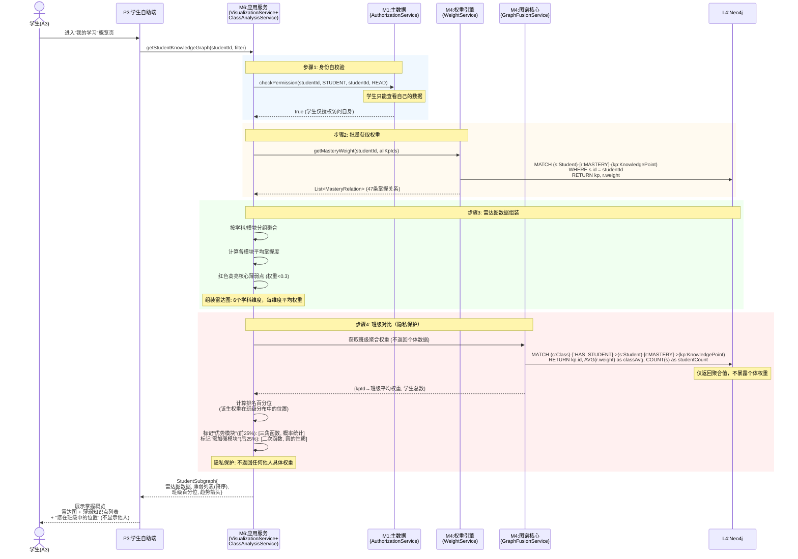
```mermaid
sequenceDiagram
    actor S as 学生(A3)
    participant P3 as P3:学生自助端
    participant M6 as M6:应用服务<br/>(VisualizationService+<br/>ClassAnalysisService)
    participant M1 as M1:主数据<br/>(AuthorizationService)
    participant M4Weight as M4:权重引擎<br/>(WeightService)
    participant M4Graph as M4:图谱核心<br/>(GraphFusionService)
    participant DB as L4:Neo4j

    S->>P3: 进入"我的学习"概览页
    P3->>M6: getStudentKnowledgeGraph(studentId, filter)

    rect rgb(240, 248, 255)
        Note over M6,M1: 步骤1: 身份自校验
        M6->>M1: checkPermission(studentId, STUDENT, studentId, READ)
        Note over M1: 学生只能查看自己的数据
        M1-->>M6: true (学生仅授权访问自身)
    end

    rect rgb(255, 250, 240)
        Note over M6,M4Weight: 步骤2: 批量获取权重
        M6->>M4Weight: getMasteryWeight(studentId, allKpIds)
        M4Weight->>DB: MATCH (s:Student)-[r:MASTERY]-(kp:KnowledgePoint)<br/>WHERE s.id = studentId<br/>RETURN kp, r.weight
        M4Weight-->>M6: List<MasteryRelation> (47条掌握关系)
    end

    rect rgb(240, 255, 240)
        Note over M6,DB: 步骤3: 雷达图数据组装
        M6->>M6: 按学科/模块分组聚合
        M6->>M6: 计算各模块平均掌握度
        M6->>M6: 红色高亮核心薄弱点 (权重<0.3)
        Note over M6: 组装雷达图: 6个学科维度，每维度平均权重
    end

    rect rgb(255, 240, 240)
        Note over M6,M4Graph: 步骤4: 班级对比（隐私保护）
        M6->>M4Graph: 获取班级聚合权重 (不返回个体数据)
        M4Graph->>DB: MATCH (c:Class)-[:HAS_STUDENT]->(s:Student)-[r:MASTERY]->(kp:KnowledgePoint)<br/>RETURN kp.id, AVG(r.weight) as classAvg, COUNT(s) as studentCount
        Note over DB: 仅返回聚合值，不暴露个体权重
        M4Graph-->>M6: {kpId→班级平均权重, 学生总数}

        M6->>M6: 计算排名百分位<br/>(该生权重在班级分布中的位置)
        M6->>M6: 标记"优势模块"(前25%): [三角函数, 概率统计]<br/>标记"需加强模块"(后25%): [二次函数, 圆的性质]
        Note over M6: 隐私保护: 不返回任何他人具体权重
    end

    M6-->>P3: StudentSubgraph{<br/>雷达图数据, 薄弱列表(降序),<br/>班级百分位, 趋势箭头}
    P3-->>S: 展示掌握概览<br/>雷达图 + 薄弱知识点列表<br/>+ "您在班级中的位置" (不显示他人)
```

### 5.3 薄弱列表展示详情

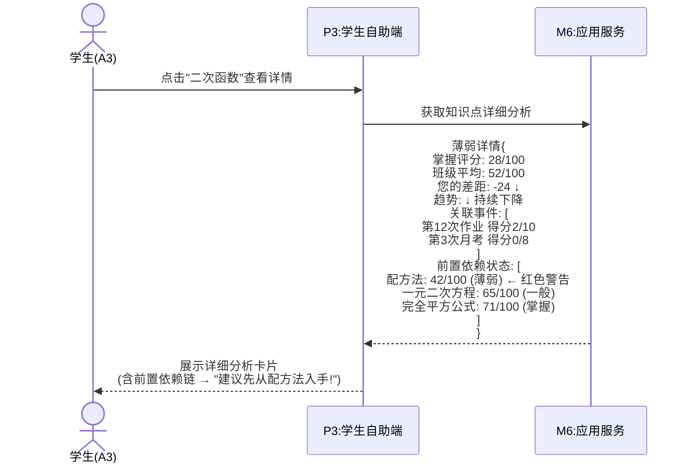
```mermaid
sequenceDiagram
    actor S as 学生(A3)
    participant P3 as P3:学生自助端
    participant M6 as M6:应用服务

    S->>P3: 点击"二次函数"查看详情
    P3->>M6: 获取知识点详细分析

    M6-->>P3: 薄弱详情{<br/>掌握评分: 28/100<br/>班级平均: 52/100<br/>您的差距: -24 ↓<br/>趋势: ↓ 持续下降<br/>关联事件: [<br/>第12次作业 得分2/10<br/>第3次月考 得分0/8<br/>] <br/>前置依赖状态: [<br/>配方法: 42/100 (薄弱) ← 红色警告<br/>一元二次方程: 65/100 (一般)<br/>完全平方公式: 71/100 (掌握)<br/>] <br/>}

    P3-->>S: 展示详细分析卡片<br/>(含前置依赖链 → "建议先从配方法入手!")
```

---

## 六、S5 · 实体对齐审核与合并 (UC-04)

### 6.1 场景描述

不同来源的数据中存在疑似相同的知识点（如"二次函数" vs "一元二次函数"），系统自动生成候选匹配对，管理员逐条或批量审核，合并后副实体的关系迁移至主实体。**关键特征：影响面预估、操作可回滚。**

```
管理员 → P1管理后台 → M2(实体对齐审核) → M4(图谱关系更新)
```

### 6.2 主成功流程（单条确认合并）

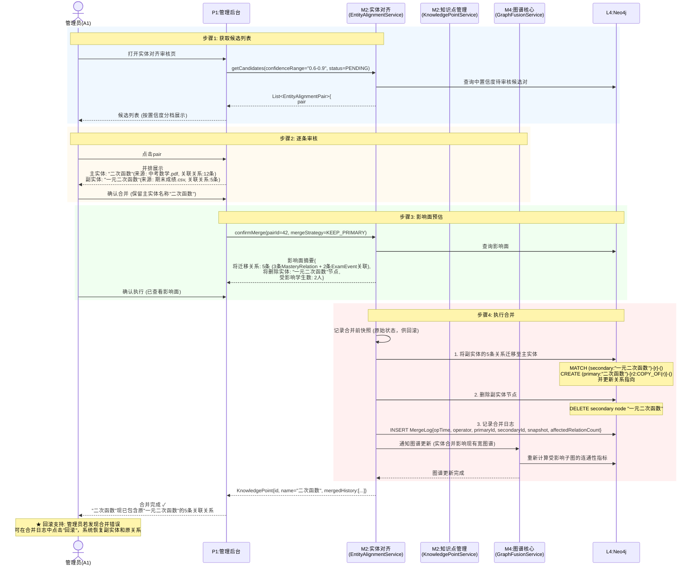
```mermaid
sequenceDiagram
    actor A as 管理员(A1)
    participant P1 as P1:管理后台
    participant M2Align as M2:实体对齐<br/>(EntityAlignmentService)
    participant M2KP as M2:知识点管理<br/>(KnowledgePointService)
    participant M4Graph as M4:图谱核心<br/>(GraphFusionService)
    participant DB as L4:Neo4j

    rect rgb(240, 248, 255)
        Note over A,M2Align: 步骤1: 获取候选列表
        A->>P1: 打开实体对齐审核页
        P1->>M2Align: getCandidates(confidenceRange="0.6-0.9", status=PENDING)
        M2Align->>DB: 查询中置信度待审核候选对
        M2Align-->>P1: List<EntityAlignmentPair>{<br/>pair#42: "二次函数"(PDF) vs "一元二次函数"(CSV) 置信度=0.82}
        P1-->>A: 候选列表 (按置信度分档展示)
    end

    rect rgb(255, 250, 240)
        Note over A,M4Graph: 步骤2: 逐条审核
        A->>P1: 点击pair#42查看详情
        P1-->>A: 并排展示<br/>主实体: "二次函数"(来源: 中考数学.pdf, 关联关系:12条)<br/>副实体: "一元二次函数"(来源: 期末成绩.csv, 关联关系:5条)

        A->>P1: 确认合并 (保留主实体名称"二次函数")
    end

    rect rgb(240, 255, 240)
        Note over P1,DB: 步骤3: 影响面预估
        P1->>M2Align: confirmMerge(pairId=42, mergeStrategy=KEEP_PRIMARY)

        M2Align->>DB: 查询影响面
        M2Align-->>P1: 影响面摘要{<br/>将迁移关系: 5条 (3条MasteryRelation + 2条ExamEvent关联),<br/>将删除实体: "一元二次函数"节点,<br/>受影响学生数: 2人}

        A->>P1: 确认执行 (已查看影响面)
    end

    rect rgb(255, 240, 240)
        Note over M2Align,DB: 步骤4: 执行合并
        M2Align->>M2Align: 记录合并前快照 (原始状态，供回滚)

        M2Align->>DB: 1. 将副实体的5条关系迁移至主实体
        Note over DB: MATCH (secondary:"一元二次函数")-[r]-()<br/>CREATE (primary:"二次函数")-[r2:COPY_OF(r)]-()<br/>并更新关系指向

        M2Align->>DB: 2. 删除副实体节点
        Note over DB: DELETE secondary node "一元二次函数"

        M2Align->>DB: 3. 记录合并日志 <br/>INSERT MergeLog{opTime, operator, primaryId, secondaryId, snapshot, affectedRelationCount}

        M2Align->>M4Graph: 通知图谱更新 (实体合并影响现有宽图谱)
        M4Graph->>DB: 重新计算受影响子图的连通性指标
        M4Graph-->>M2Align: 图谱更新完成
    end

    M2Align-->>P1: KnowledgePoint{id, name="二次函数", mergedHistory:[...]}
    P1-->>A: 合并完成 ✓<br/>"二次函数"现已包含原"一元二次函数"的5条关联关系

    Note over A: ★ 回滚支持: 管理员若发现合并错误<br/>可在合并日志中点击"回滚"，系统恢复副实体和原关系
```

### 6.3 批量合并 + 回滚流程

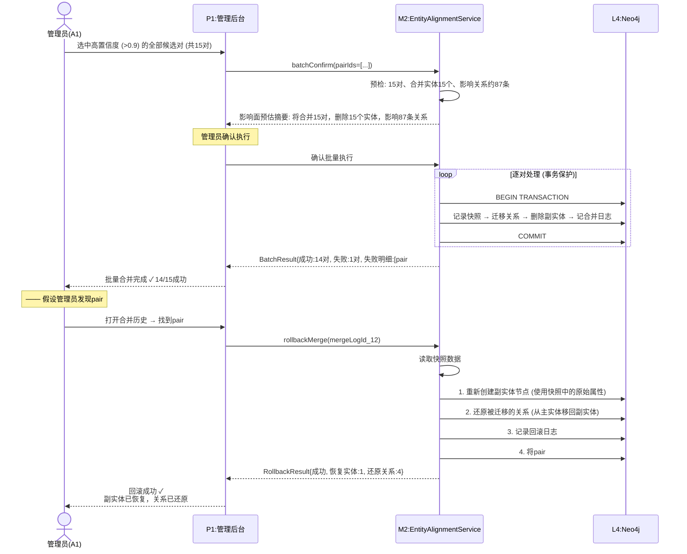
```mermaid
sequenceDiagram
    actor A as 管理员(A1)
    participant P1 as P1:管理后台
    participant M2Align as M2:EntityAlignmentService
    participant DB as L4:Neo4j

    A->>P1: 选中高置信度 (>0.9) 的全部候选对 (共15对)
    P1->>M2Align: batchConfirm(pairIds=[...])

    M2Align->>M2Align: 预检: 15对、合并实体15个、影响关系约87条
    M2Align-->>P1: 影响面预估摘要: 将合并15对，删除15个实体，影响87条关系
    Note over P1: 管理员确认执行

    P1->>M2Align: 确认批量执行

    loop 逐对处理 (事务保护)
        M2Align->>DB: BEGIN TRANSACTION
        M2Align->>DB: 记录快照 → 迁移关系 → 删除副实体 → 记合并日志
        M2Align->>DB: COMMIT
    end

    M2Align-->>P1: BatchResult{成功:14对, 失败:1对, 失败明细:[pair#37: 主实体已被删除]}

    P1-->>A: 批量合并完成 ✓ 14/15成功

    Note over A: ─── 假设管理员发现pair#12合并错误 ───

    A->>P1: 打开合并历史 → 找到pair#12 → 点击"回滚"
    P1->>M2Align: rollbackMerge(mergeLogId_12)

    M2Align->>M2Align: 读取快照数据
    M2Align->>DB: 1. 重新创建副实体节点 (使用快照中的原始属性)
    M2Align->>DB: 2. 还原被迁移的关系 (从主实体移回副实体)
    M2Align->>DB: 3. 记录回滚日志
    M2Align->>DB: 4. 将pair#12状态重置为PENDING

    M2Align-->>P1: RollbackResult{成功, 恢复实体:1, 还原关系:4}
    P1-->>A: 回滚成功 ✓<br/>副实体已恢复，关系已还原
```

---

## 七、S6 · 运营看板数据聚合 (UC-28)

### 7.1 场景描述

运营人员查看运营统计看板，系统从 M8（运营分析引擎）聚合四大维度的运营数据，通过 M6.IOperationsDashboardService 编排，遵循 P5→M6(L2)→M8(L3)→M1/M2/M3/M4(L3) 的正确分层调用路径。

```
运营人员 → P5运营看板 → M6应用服务(IOperationsDashboardService) → M8运营分析 → M1/M2/M3/M4
```

### 7.2 主成功流程

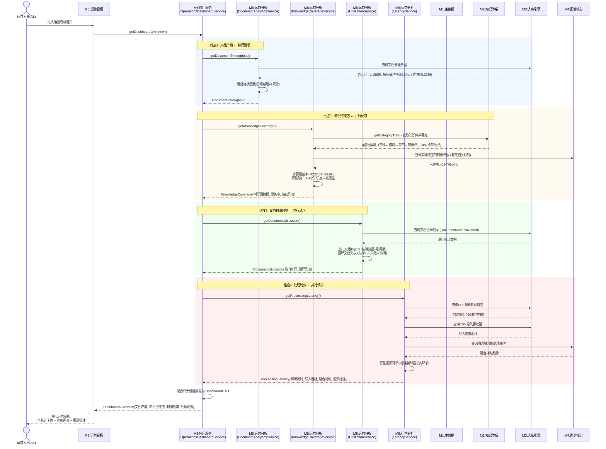
```mermaid
sequenceDiagram
    actor O as 运营人员(A5)
    participant P5 as P5:运营看板
    participant M6Dash as M6:应用服务<br/>(OperationsDashboardService)
    participant M8Doc as M8:运营分析<br/>(DocumentAnalyticsService)
    participant M8Cover as M8:运营分析<br/>(KnowledgeCoverageService)
    participant M8Util as M8:运营分析<br/>(UtilizationService)
    participant M8Latency as M8:运营分析<br/>(LatencyService)
    participant M1 as M1:主数据
    participant M2 as M2:知识体系
    participant M3 as M3:入库引擎
    participant M4 as M4:图谱核心

    O->>P5: 进入运营看板首页

    P5->>M6Dash: getDashboardOverview()

    rect rgb(240, 248, 255)
        Note over M6Dash,M8Doc: 维度1: 文档产能 ← 并行请求
        M6Dash->>M8Doc: getDocumentThroughput()
        M8Doc->>M3: 查询文档处理数据
        M3-->>M8Doc: {累计上传:156份, 解析成功率:94.2%, 月均增量:23份}
        M8Doc->>M8Doc: 堆叠柱状图数据(月新增vs累计)
        M8Doc-->>M6Dash: DocumentThroughput{...}
    end

    rect rgb(255, 250, 240)
        Note over M6Dash,M2: 维度2: 知识点覆盖 ← 并行请求
        M6Dash->>M8Cover: getKnowledgeCoverage()
        M8Cover->>M2: getCategoryTree() 获取知识体系基准
        M2-->>M8Cover: 全部分类树 (学科→模块→章节→知识点, 共487个知识点)
        M8Cover->>M4: 查询实际覆盖的知识点数 (有文档关联的)
        M4-->>M8Cover: 已覆盖:423个知识点
        M8Cover->>M8Cover: 计算覆盖率=423/487=86.9%<br/>识别缺口: 64个知识点未被覆盖
        M8Cover-->>M6Dash: KnowledgeCoverage{树形图数据, 覆盖率, 缺口列表}
    end

    rect rgb(240, 255, 240)
        Note over M6Dash,M8Util: 维度3: 文档利用效率 ← 并行请求
        M6Dash->>M8Util: getDocumentUtilization()
        M8Util->>M3: 查询文档访问记录 (DocumentAccessRecord)
        M3-->>M8Util: 访问统计数据
        M8Util->>M8Util: 热门文档Top10 (按浏览量+引用数)<br/>僵尸文档列表 (入库>90天无人访问)
        M8Util-->>M6Dash: DocumentUtilization{热门排行, 僵尸列表}
    end

    rect rgb(255, 240, 240)
        Note over M6Dash,M8Latency: 维度4: 处理时效 ← 并行请求
        M6Dash->>M8Latency: getProcessingLatency()
        M8Latency->>M3: 查询PDF解析耗时趋势
        M3-->>M8Latency: PDF解析P95耗时曲线
        M8Latency->>M3: 查询CSV导入吞吐量
        M3-->>M8Latency: 导入速率曲线
        M8Latency->>M4: 查询图谱融合批处理耗时
        M4-->>M8Latency: 融合耗时趋势
        M8Latency->>M8Latency: 识别瓶颈环节 (标注耗时最长的环节)
        M8Latency-->>M6Dash: ProcessingLatency{解析耗时, 导入吞吐, 融合耗时, 瓶颈标注}
    end

    M6Dash->>M6Dash: 聚合四大维度数据为 DashboardDTO
    M6Dash-->>P5: DashboardOverview{文档产能, 知识点覆盖, 利用效率, 处理时效}
    P5-->>O: 展示运营看板<br/>4个统计卡片 + 趋势图表 + 瓶颈标注
```

---

## 八、S7 · LLM调用降级与熔断 (横切关注点)

### 8.1 场景描述

展示 M5.LLMGateway 的完整降级路径：从首选模型逐级降至备用模型，到断路器熔断的完整容错策略。该流程可被任意需要 LLM 的用例（UC-10/UC-16/UC-22）触发。

### 8.2 完整降级链

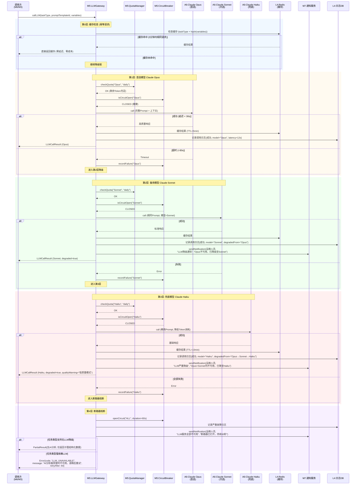
```mermaid
sequenceDiagram
    participant Caller as 调用方<br/>(M6/M3)
    participant Gateway as M5:LLMGateway
    participant Quota as M5:QuotaManager
    participant Circuit as M5:CircuitBreaker
    participant Opus as A6:Claude Opus<br/>(首选)
    participant Sonnet as A6:Claude Sonnet<br/>(次选)
    participant Haiku as A6:Claude Haiku<br/>(兜底)
    participant Cache as L4:Redis<br/>(缓存)
    participant M7 as M7:通知服务
    participant LogDB as L4:日志DB

    Caller->>Gateway: callLLM(taskType, promptTemplateId, variables)

    rect rgb(240, 248, 255)
        Note over Gateway: 第0层: 缓存检查 (幂等请求)
        Gateway->>Cache: 检查缓存 (taskType + hash(variables))
        alt 缓存命中 (5分钟内相同请求)
            Cache-->>Gateway: 缓存结果
            Gateway-->>Caller: 直接返回缓存 (零延迟、零成本)
        else 缓存未命中
            Note over Gateway: 继续降级链
        end
    end

    rect rgb(255, 250, 240)
        Note over Gateway,Opus: 第1层: 首选模型 Claude Opus
        Gateway->>Quota: checkQuota("Opus", "daily")
        Quota-->>Gateway: OK (剩余Token充足)

        Gateway->>Circuit: isCircuitOpen("Opus")
        Circuit-->>Gateway: CLOSED (健康)

        Gateway->>Opus: call (完整Prompt + 上下文)
        alt 成功 (延迟 < 30s)
            Opus-->>Gateway: 高质量响应
            Gateway->>Cache: 缓存结果 (TTL=5min)
            Gateway->>LogDB: 记录调用日志{成功, model="Opus", latency=12s}
            Gateway-->>Caller: LLMCallResult (Opus)
        else 超时 (>30s)
            Opus-->>Gateway: Timeout
            Gateway->>Circuit: recordFailure("Opus")
            Note over Gateway: 进入第2层降级
        end
    end

    rect rgb(240, 255, 240)
        Note over Gateway,Sonnet: 第2层: 备用模型 Claude Sonnet
        Gateway->>Quota: checkQuota("Sonnet", "daily")
        Quota-->>Gateway: OK

        Gateway->>Circuit: isCircuitOpen("Sonnet")
        Circuit-->>Gateway: CLOSED

        Gateway->>Sonnet: call (相同Prompt, 模型=Sonnet)
        alt 成功
            Sonnet-->>Gateway: 标准响应
            Gateway->>Cache: 缓存结果
            Gateway->>LogDB: 记录调用日志{成功, model="Sonnet", degradedFrom="Opus"}

            Gateway->>M7: sendNotification(运维人员,<br/>"LLM降级通知", "Opus不可用，已降级至Sonnet")

            Gateway-->>Caller: LLMCallResult (Sonnet, degraded=true)
        else 失败
            Sonnet-->>Gateway: Error
            Gateway->>Circuit: recordFailure("Sonnet")
            Note over Gateway: 进入第3层
        end
    end

    rect rgb(255, 240, 240)
        Note over Gateway,Haiku: 第3层: 兜底模型 Claude Haiku
        Gateway->>Quota: checkQuota("Haiku", "daily")
        Quota-->>Gateway: OK

        Gateway->>Circuit: isCircuitOpen("Haiku")
        Circuit-->>Gateway: CLOSED

        Gateway->>Haiku: call (精简Prompt, 降低Token消耗)
        alt 成功
            Haiku-->>Gateway: 基础响应
            Gateway->>Cache: 缓存结果 (TTL=10min)
            Gateway->>LogDB: 记录调用日志{成功, model="Haiku", degradedFrom="Opus→Sonnet→Haiku"}

            Gateway->>M7: sendNotification(运维人员,<br/>"LLM严重降级", "Opus+Sonnet均不可用，已降至Haiku")

            Gateway-->>Caller: LLMCallResult (Haiku, degraded=true, qualityWarning="低质量模式")
        else 全部失败
            Haiku-->>Gateway: Error
            Gateway->>Circuit: recordFailure("Haiku")
            Note over Gateway: 进入断路器熔断
        end
    end

    rect rgb(248, 240, 255)
        Note over Gateway: 第4层: 断路器熔断
        Gateway->>Circuit: openCircuit("ALL", duration=60s)
        Gateway->>LogDB: 记录严重故障日志
        Gateway->>M7: sendNotification(运维人员,<br/>"LLM服务全部不可用", "断路器已打开，持续60秒")

        alt 任务类型支持无LLM降级
            Gateway-->>Caller: PartialResult{无AI分析, 仅返回子图结构化数据}
        else 任务类型强依赖LLM
            Gateway-->>Caller: Error{code: "LLM_UNAVAILABLE",<br/>message: "AI分析服务暂时不可用，请稍后重试",<br/>retryAfter: 60}
        end
    end
```

### 8.3 配额消耗通知阈值

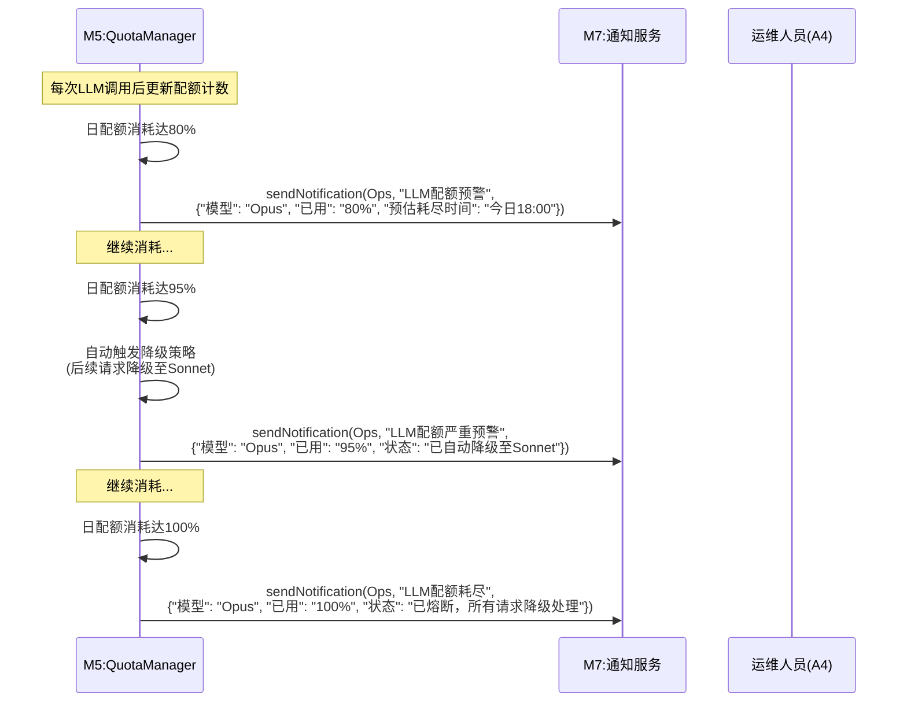
```mermaid
sequenceDiagram
    participant M5Quota as M5:QuotaManager
    participant M7 as M7:通知服务
    participant Ops as 运维人员(A4)

    Note over M5Quota: 每次LLM调用后更新配额计数

    M5Quota->>M5Quota: 日配额消耗达80%
    M5Quota->>M7: sendNotification(Ops, "LLM配额预警",<br/>{"模型": "Opus", "已用": "80%", "预估耗尽时间": "今日18:00"})

    Note over M5Quota: 继续消耗...

    M5Quota->>M5Quota: 日配额消耗达95%
    M5Quota->>M5Quota: 自动触发降级策略<br/>(后续请求降级至Sonnet)
    M5Quota->>M7: sendNotification(Ops, "LLM配额严重预警",<br/>{"模型": "Opus", "已用": "95%", "状态": "已自动降级至Sonnet"})

    Note over M5Quota: 继续消耗...

    M5Quota->>M5Quota: 日配额消耗达100%
    M5Quota->>M7: sendNotification(Ops, "LLM配额耗尽",<br/>{"模型": "Opus", "已用": "100%", "状态": "已熔断，所有请求降级处理"})
```

---

## 九、场景对比矩阵

### 9.1 交互模式对比

| 维度 | S1 归因查询 | S2 PDF上传 | S3 成绩导入 | S4 弱 点查询 | S5 实体对齐 | S6 运营看板 | S7 LLM降级 |
|------|-----------|-----------|-----------|------------|-----------|-----------|-----------|
| **交互模式** | 同步+可选下钻 | 异步流水线 | 同步批处理 | 同步查询 | 同步操作 | 同步聚合 | 同步+降级 |
| **用户感知延迟** | <15秒 | 秒级(上传) → 分钟级(处理) | <30秒(千行) | <3秒 | <1秒 | <5秒 | — |
| **用户等待模型** | 等待+结果展示 | 立即返回+通知 | 进度条+结果摘要 | 即时渲染 | 即时操作 | 即时渲染 | — |
| **是否可中断** | 否 | 否(已提交消息) | 否(事务保护) | 否 | 否(事务保护) | 否 | 是(断路器) |
| **失败补偿** | 降级模型+降级响应 | 异步重试+人工介入 | 成功行已写入 | 返回空数据集 | 回滚到快照 | 降级展示 | 级联降级 |
| **幂等性** | 天然幂等(读) | 消息去重 | 按eventId去重 | 天然幂等(读) | 需幂等设计 | 天然幂等(读) | 缓存保质 |
| **并发风险** | 无(只读) | 队列保证顺序 | 同一学生权重串行 | 无(只读) | 同对加锁 | 无(只读) | 配额原子操作 |

### 9.2 分层调用路径验证

| 场景 | L1 入口 | L2 编排 | L3 领域 | L4 基础设施 | 横切 M7 |
|------|--------|---------|---------|-----------|--------|
| S1 归因查询 | P2 教师工作台 | M6 编排 | M1(权限)→M4(剪枝)→M5(LLM) | Neo4j, Redis | — |
| S2 PDF上传 | P1 管理后台 | — | M3(流水线)→M2(匹配)→M4(融合) | Neo4j, MinIO, MQ | 通知 |
| S3 成绩导入 | P1 管理后台 | — | M3(事件)→M1(匹配)→M2(匹配)→M4(权重) | Neo4j | — |
| S4 弱 点查询 | P3 学生自助端 | M6 编排 | M1(自授权)→M4(权重+聚合) | Neo4j | — |
| S5 实体对齐 | P1 管理后台 | — | M2(对齐)→M4(图谱更新) | Neo4j | — |
| S6 运营看板 | P5 运营看板 | M6 IOpsDashboard | M8→M1/M2/M3/M4 | Neo4j | — |
| S7 LLM降级 | — | — | M5(网关+配额+熔断) | Redis(缓存), 日志DB | 告警通知 |

> **验证结论**：所有场景均遵循 L1→L2→L3→L4 分层依赖规则。管理类用例（S2/S3/S5）通过 P1→M3/M2/M4 直接操作领域层，不经过 M6 编排，这符合逻辑视图 §6.3 中对管理类用例的特殊说明。

### 9.3 覆盖度验证

| 验证项 | S1 | S2 | S3 | S4 | S5 | S6 | S7 | 覆盖率 |
|--------|----|----|----|----|----|----|----|--------|
| **5类参与者** | ✓ | ✓ | ✓ | ✓ | ✓ | ✓ | — | 6/5 (超限) |
| **8个模块** | M1/M4/M5/M6 | M2/M3/M4/M7 | M1/M2/M3/M4 | M1/M4/M6 | M2/M4 | M1/M2/M3/M4/M6/M8 | M5/M7 | 8/8 ✓ |
| **4层架构** | ✓ | ✓ | ✓ | ✓ | ✓ | ✓ | ✓ | 7/7 ✓ |
| **同步模式** | ✓ | — | ✓ | ✓ | ✓ | ✓ | ✓ | 6/7 |
| **异步模式** | — | ✓ | — | — | — | — | — | 1/7 |
| **失败处理** | 降级+熔断 | 步骤重试+标记 | 跳过+记录 | 空数据降级 | 回滚+日志 | 降级展示 | 全降级链 | 7/7 ✓ |
| **隐私/安全** | 权限拒绝 | — | — | 自校验+隐私 | — | — | — | 2/7 |

---

## 十、通用交互模式提炼

### 10.1 模式A：标准同步读流程

适用于 S1(归因查询)、S4(弱 点查询)、S6(运营看板)。

```
用户 → 界面 → M6编排 → M1权限 → M4/M5查询 → 组装DTO → 界面 → 用户
                    ↓ 403
                 权限拒绝
```

### 10.2 模式B：标准同步写流程

适用于 S3(成绩导入)、S5(实体对齐)。

```
用户 → 界面 → 领域层 → 事务边界内操作 → 副作用触发(M4权重更新/M4图谱更新) → 结果摘要 → 用户
                                         ↓ 失败
                                      回滚+补偿
```

### 10.3 模式C：异步处理流水线

适用于 S2(PDF上传)。

```
用户 → 界面 → 同步校验+提交 → 返回受理凭证 → 用户离开
                    ↓
            消息队列 → Worker消费 → Pipeline执行(分步) → 成功/失败通知(M7) → 用户
```

### 10.4 模式D：降级与熔断

适用于所有 LLM 依赖场景（S1、S7）。

```
调用方 → Gateway → 缓存检查 → 模型路由 → 首选模型
                                        ↓ 超时/失败
                                     备用模型
                                        ↓ 超时/失败
                                     兜底模型
                                        ↓ 超时/失败
                                     断路器熔断 → 降级响应 / 错误
```

---

## 十一、与用例视图的双向追溯

| 本文时序图 | 用例视图 §6.4 | 用例编号 | 用例详述 §5 |
|-----------|-------------|---------|-----------|
| S1 教师查询学生归因分析 | 时序图场景1 | UC-10 | §5 UC-10 详述 |
| S2 PDF上传与图谱构建 | 时序图场景2 | UC-01 | §5 UC-01 详述 |
| S3 成绩CSV导入触发权重更新 | 时序图场景3 | UC-02 + UC-07 | §5 UC-02 详述 |
| S4 学生自助薄弱点查询 | 时序图场景4 | UC-21 | §5 UC-21 详述 |
| S5 实体对齐审核与合并 | 时序图场景5 | UC-04 | §5 UC-04 详述 |
| S6 运营看板数据聚合 | — | UC-28 | §5 UC-28 详述 |
| S7 LLM调用降级与熔断 | — | 横切 (UC-10/16/22) | — |

> S6 和 S7 为本文档补充的扩展场景。S6 展示运营看板的完整分层调用路径，S7 展示所有 LLM 依赖用例的通用降级熔断机制。

---

## 附录A：Mermaid 渲染说明

本文档中的时序图使用 **Mermaid** 语法编写，可通过以下方式渲染：

- **VSCode**：安装 `Markdown Preview Mermaid Support` 插件
- **GitHub/GitLab**：原生支持 Mermaid 渲染
- **在线工具**：[Mermaid Live Editor](https://mermaid.live/)
- **命令行**：`npx @mermaid-js/mermaid-cli mmdc -i input.md -o output.svg`

---

> **文档说明**：本文档基于 [logical-view.md](logical-view.md)（v1.1）、[user-stories-simplify.md](user-stories-simplify.md)（v3.0）、[use-case-view.md](use-case-view.md)（v1.0）和 [基于图谱技术的 AI 上下文处理与精准问答系统.md](../基于图谱技术的%20AI%20上下文处理与精准问答系统.md) 设计。时序图中的接口调用、模块依赖、异常处理均与逻辑视图 §3 的接口定义保持一致。