# GraphNexus 逻辑视图 — 类图设计

> 版本：v2.0 | 日期：2026-06-10
>
> 基于功能文档 v2.4-mvp 与用户故事 28 个 Story，匹配五层开发架构与物理部署拓扑。
> v2.0 新增：知识图谱节点与边的抽象层设计，严格区分图存储（Neo4j 属性图）与关系存储（MySQL 表）。

---

## 一、设计思路

GraphNexus 的数据分为两类存储：

| 存储 | 技术 | 内容 | UML 表示 |
|:--|:--|:--|:--|
| **图存储** | Neo4j | 宽图谱的节点（顶点）与边（关系） | `<<Node>>` / `<<Edge>>` 构造型 |
| **关系存储** | MySQL | 配置、规则、日志、RBAC、统计等 | 常规 `<<Entity>>` 类 |

本文档的核心设计原则：

1. **图节点** 均继承自抽象基类 `GraphNode`，对应 Neo4j 中带 Label 的顶点
2. **图边** 均继承自抽象基类 `GraphEdge`，对应 Neo4j 中带 Type 的有向关系
3. **配置/日志/RBAC 类** 为常规 MySQL 实体，与图存储无继承关系
4. 节点与边的属性要求"小而精确"，仅保留实现 28 个 Story 所必需的字段

---

## 二、包结构总览

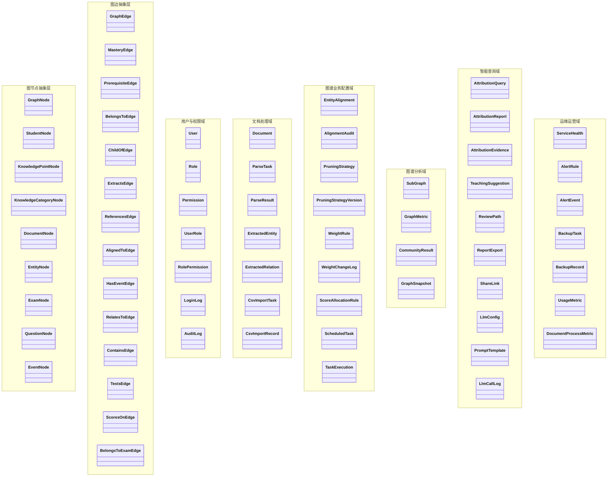

---

## 三、知识图谱节点与边抽象层（核心）

> 本节是类图设计的核心：将 Neo4j 属性图模型抽象为 `GraphNode` / `GraphEdge` 继承树，所有图操作（构建、查询、剪枝、融合）均以此抽象层为契约。

### 3.1 图节点继承体系

```mermaid
classDiagram
class GraphNode {
    <<abstract>> <<Node>>
    +String id
    +Set~String~ labels
    +Map~String,Object~ properties
    +LocalDateTime createdAt
    +LocalDateTime updatedAt
    +getLabel() String
    +getProperty(String key) Object
    +setProperty(String key, Object val) void
    +hasLabel(String label) boolean
}

class StudentNode {
    <<Node>> "label: Student"
    +String studentNo
    +String name
    +String className
    +String grade
    +Integer enrollYear
    +String status
    +archive() void
    +changeClass(String c) void
}

class KnowledgePointNode {
    <<Node>> "label: KnowledgePoint"
    +String name
    +String normalizedName
    +String description
    +String subject
    +String source
    +String status
    +Float pageRank
    +Float degreeCentrality
    +merge(KnowledgePointNode t) void
    +deprecate() void
}

class KnowledgeCategoryNode {
    <<Node>> "label: KnowledgeCategory"
    +String name
    +String subject
    +Integer level
    +Integer sortOrder
    +getSubTree() List~KnowledgeCategoryNode~
    +checkIntegrity() IntegrityReport
}

class DocumentNode {
    <<Node>> "label: Document"
    +String name
    +String fileName
    +String subject
    +Long fileSize
    +String minioPath
    +String status
    +String failReason
    +Integer pageCount
    +Integer entityCount
    +Integer relationCount
    +Float avgConfidence
    +markFailed(String reason) void
    +getCoverage() CoverageReport
}

class EntityNode {
    <<Node>> "label: Entity"
    +String name
    +String entityType
    +Float confidence
    +Integer pageNumber
    +String description
    +String normalizedName
    +Long alignedKpId
    +isAligned() boolean
}

class ExamNode {
    <<Node>> "label: Exam"
    +String name
    +String subject
    +String grade
    +LocalDate examDate
    +String examType
    +Integer totalScore
    +String granularity
    +getQuestions() List~QuestionNode~
}

class QuestionNode {
    <<Node>> "label: Question"
    +Integer sectionNumber
    +Integer questionNumber
    +Integer maxScore
    +String questionType
    +Integer sortOrder
    +mapKnowledgePoints(List~Long~ kpIds) void
}

class EventNode {
    <<Node>> "label: Event"
    +String eventType
    +Float rawScore
    +Float allocatedScore
    +LocalDateTime eventTime
    +String sourceFile
    +Integer sourceRow
    +String description
    +calculateAllocatedScore() float
    +triggerWeightUpdate() void
}

GraphNode <|-- StudentNode
GraphNode <|-- KnowledgePointNode
GraphNode <|-- KnowledgeCategoryNode
GraphNode <|-- DocumentNode
GraphNode <|-- EntityNode
GraphNode <|-- ExamNode
GraphNode <|-- QuestionNode
GraphNode <|-- EventNode
```

### 3.2 图边继承体系

```mermaid
classDiagram
class GraphEdge {
    <<abstract>> <<Edge>>
    +String id
    +String type
    +String sourceNodeId
    +String targetNodeId
    +Map~String,Object~ properties
    +LocalDateTime createdAt
    +getType() String
    +getProperty(String key) Object
    +setProperty(String key, Object val) void
}

class MasteryEdge {
    <<Edge>> "type: MASTERS"
    "Student → KnowledgePoint"
    +Float weight
    +Float confidence
    +Integer eventCount
    +LocalDateTime lastEventAt
    +LocalDateTime lastUpdatedAt
    +adjustWeight(float delta, String trigger) void
    +applyDecay(DecayRule rule) void
}

class PrerequisiteEdge {
    <<Edge>> "type: PREREQUISITE_OF"
    "KnowledgePoint → KnowledgePoint"
    +Float strength
    +String description
    +detectCycle() boolean
}

class BelongsToEdge {
    <<Edge>> "type: BELONGS_TO"
    "KnowledgePoint → KnowledgeCategory"
}

class ChildOfEdge {
    <<Edge>> "type: CHILD_OF"
    "KnowledgeCategory → KnowledgeCategory"
    +Integer sortOrder
}

class ExtractsEdge {
    <<Edge>> "type: EXTRACTS"
    "Document → Entity"
    +Float confidence
}

class ReferencesEdge {
    <<Edge>> "type: REFERENCES/DERIVES/CONTAINS"
    "Entity → Entity"
    +String relationSubType
    +Float confidence
    +String context
}

class AlignedToEdge {
    <<Edge>> "type: ALIGNED_TO"
    "Entity → KnowledgePoint"
    +Float confidence
    +String alignmentMethod
}

class HasEventEdge {
    <<Edge>> "type: HAS_EVENT"
    "Student → Event"
}

class RelatesToEdge {
    <<Edge>> "type: RELATES_TO"
    "Event → KnowledgePoint"
    +Float score
    +Float maxScore
    +Float weightDelta
}

class ContainsEdge {
    <<Edge>> "type: CONTAINS"
    "Exam → Question"
    +Integer sortOrder
}

class TestsEdge {
    <<Edge>> "type: TESTS"
    "Question → KnowledgePoint"
    +Float weightRatio
}

class ScoresOnEdge {
    <<Edge>> "type: SCORES_ON"
    "Event → Question"
    +Float score
    +Float maxScore
}

class BelongsToExamEdge {
    <<Edge>> "type: BELONGS_TO_EXAM"
    "Event → Exam"
}

GraphEdge <|-- MasteryEdge
GraphEdge <|-- PrerequisiteEdge
GraphEdge <|-- BelongsToEdge
GraphEdge <|-- ChildOfEdge
GraphEdge <|-- ExtractsEdge
GraphEdge <|-- ReferencesEdge
GraphEdge <|-- AlignedToEdge
GraphEdge <|-- HasEventEdge
GraphEdge <|-- RelatesToEdge
GraphEdge <|-- ContainsEdge
GraphEdge <|-- TestsEdge
GraphEdge <|-- ScoresOnEdge
GraphEdge <|-- BelongsToExamEdge
```

### 3.3 宽图谱拓扑结构

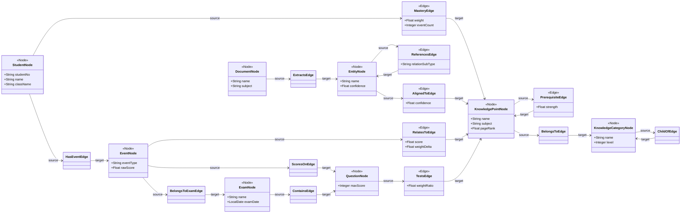

### 3.4 Neo4j 属性图模型映射表

#### 节点映射

| 图节点类 | Neo4j Label | 主键属性 | 核心业务属性 |
|:--|:--|:--|:--|
| `StudentNode` | `:Student` | `studentNo` | `name, className, grade, enrollYear, status` |
| `KnowledgePointNode` | `:KnowledgePoint` | `normalizedName` | `name, description, subject, source, status, pageRank, degreeCentrality` |
| `KnowledgeCategoryNode` | `:KnowledgeCategory` | `name + subject` | `level, sortOrder` |
| `DocumentNode` | `:Document` | `minioPath` | `name, fileName, subject, fileSize, status, pageCount` |
| `EntityNode` | `:Entity` | `name + pageNumber + docId` | `entityType, confidence, description, normalizedName` |
| `ExamNode` | `:Exam` | `name + subject + examDate` | `grade, examType, totalScore, granularity` |
| `QuestionNode` | `:Question` | `examId + questionNumber` | `sectionNumber, maxScore, questionType, sortOrder` |
| `EventNode` | `:Event` | `eventTime + sourceRow` | `eventType, rawScore, allocatedScore, sourceFile, description` |

#### 边映射

| 图边类 | Neo4j Type | 方向 | 核心属性 |
|:--|:--|:--|:--|
| `MasteryEdge` | `MASTERS` | `(Student)→(KnowledgePoint)` | `weight, confidence, eventCount, lastEventAt` |
| `PrerequisiteEdge` | `PREREQUISITE_OF` | `(KnowledgePoint)→(KnowledgePoint)` | `strength, description` |
| `BelongsToEdge` | `BELONGS_TO` | `(KnowledgePoint)→(KnowledgeCategory)` | — |
| `ChildOfEdge` | `CHILD_OF` | `(KnowledgeCategory)→(KnowledgeCategory)` | `sortOrder` |
| `ExtractsEdge` | `EXTRACTS` | `(Document)→(Entity)` | `confidence` |
| `ReferencesEdge` | `REFERENCES` / `DERIVES` / `CONTAINS` | `(Entity)→(Entity)` | `relationSubType, confidence` |
| `AlignedToEdge` | `ALIGNED_TO` | `(Entity)→(KnowledgePoint)` | `confidence, alignmentMethod` |
| `HasEventEdge` | `HAS_EVENT` | `(Student)→(Event)` | — |
| `RelatesToEdge` | `RELATES_TO` | `(Event)→(KnowledgePoint)` | `score, maxScore, weightDelta` |
| `ContainsEdge` | `CONTAINS` | `(Exam)→(Question)` | `sortOrder` |
| `TestsEdge` | `TESTS` | `(Question)→(KnowledgePoint)` | `weightRatio` |
| `ScoresOnEdge` | `SCORES_ON` | `(Event)→(Question)` | `score, maxScore` |
| `BelongsToExamEdge` | `BELONGS_TO_EXAM` | `(Event)→(Exam)` | — |

---

## 四、用户与权限域（MySQL）

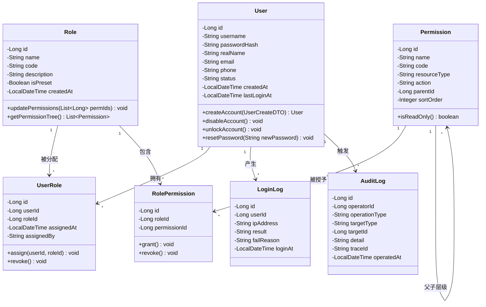

---

## 五、文档处理域

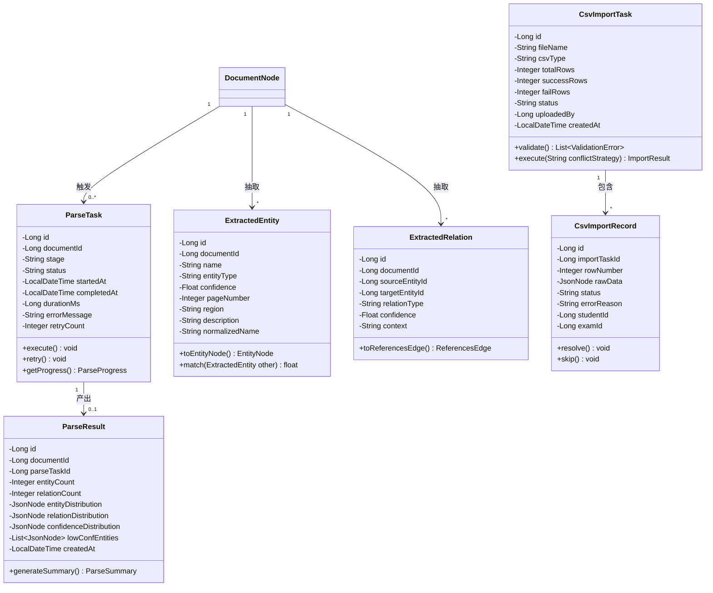

> **注意：** `DocumentNode` 为图节点（Neo4j 存储），其属性定义见 §3.1；此处仅展示处理流水线关联。
> `ExtractedEntity` / `ExtractedRelation` 为解析中间产物（MySQL），最终分别转化为 `EntityNode` / `ReferencesEdge` 导入 Neo4j。

---

## 六、图谱业务配置域（MySQL）

> 本节包含实体对齐、剪枝策略、权重规则等图谱相关的配置与管理实体，均存储于 MySQL。

### 6.1 实体对齐

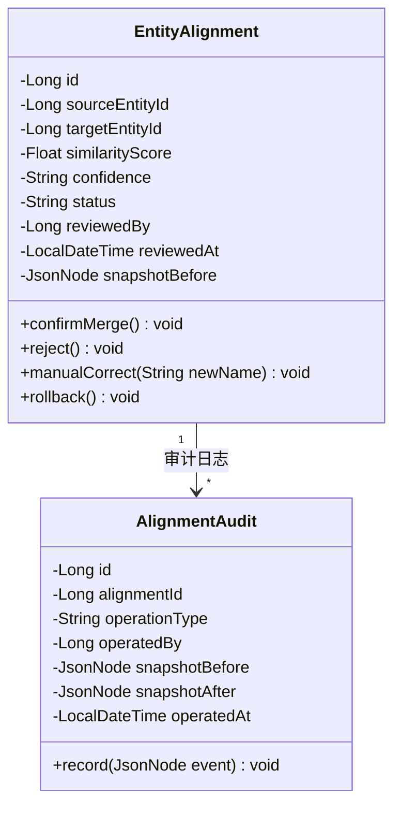

### 6.2 剪枝策略与权重规则

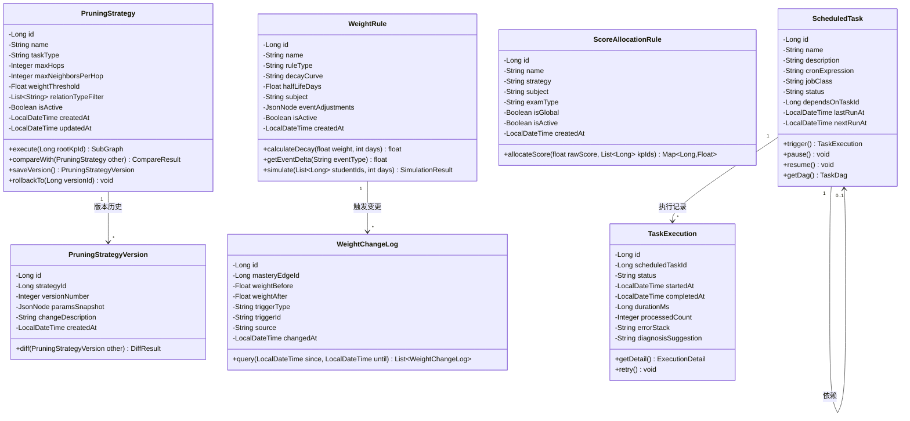

---

## 七、图谱分析域

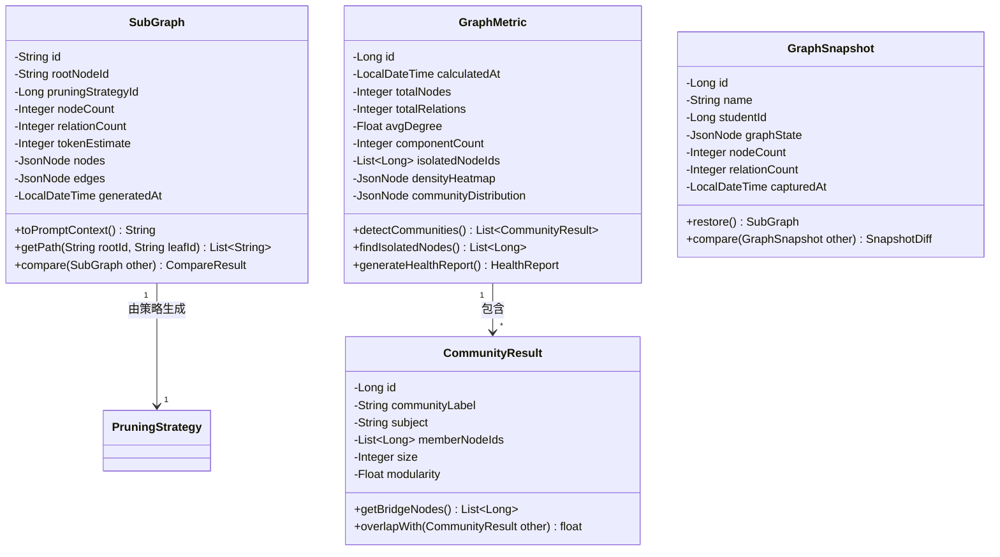

---

## 八、智能查询域

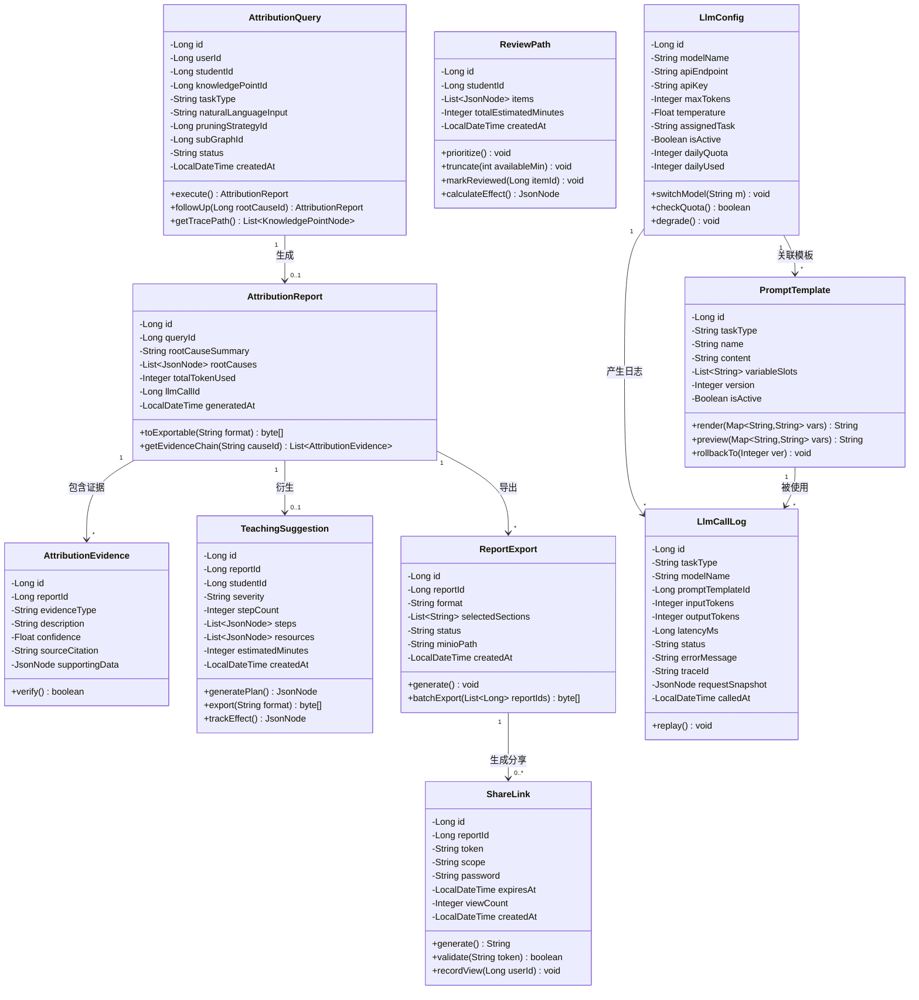

---

## 九、运维运营域

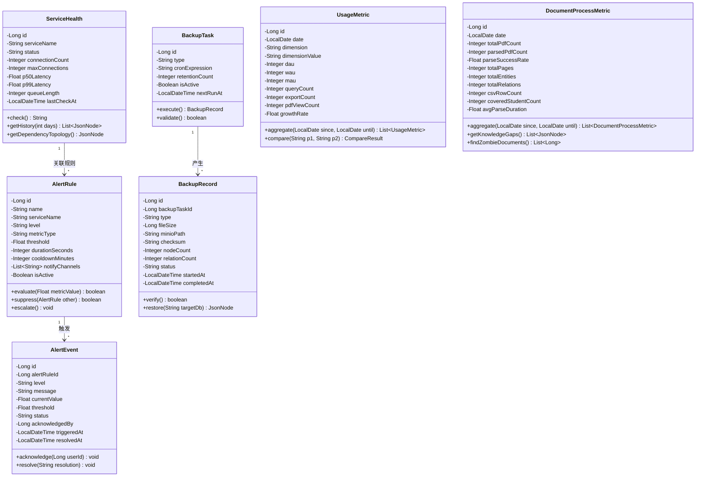

---

## 十、跨域关系总览

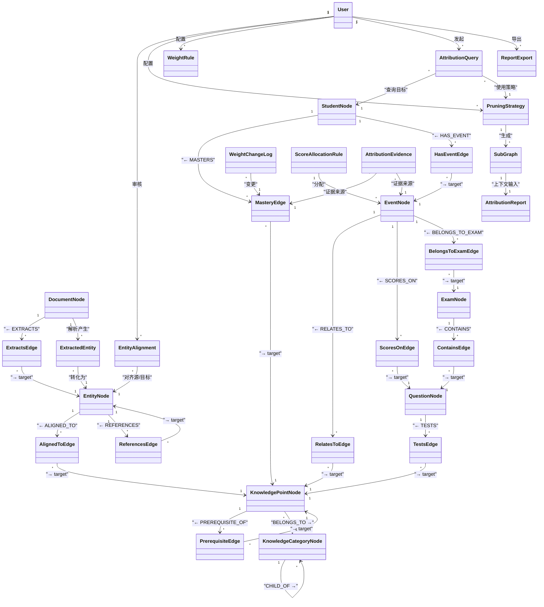

---

## 十一、枚举与值对象

| 枚举 | 取值 | 所属域 |
|:--|:--|:--|
| `NodeLabel` | Student / KnowledgePoint / KnowledgeCategory / Document / Entity / Exam / Question / Event | 图节点 |
| `EdgeType` | MASTERS / PREREQUISITE_OF / BELONGS_TO / CHILD_OF / EXTRACTS / REFERENCES / DERIVES / CONTAINS / ALIGNED_TO / HAS_EVENT / RELATES_TO / TESTS / SCORES_ON / BELONGS_TO_EXAM | 图边 |
| `UserStatus` | ACTIVE / DISABLED / LOCKED / ARCHIVED | 用户 |
| `DocStatus` | UPLOADED / PARSING / PARSED / FAILED | 文档 |
| `TaskType` | ATTRIBUTION / REVIEW_RECOMMEND / CLASS_OVERVIEW | 剪枝策略 |
| `EntityType` | CONCEPT / FORMULA / THEOREM / DEFINITION | 抽取实体 |
| `StudentStatus` | ACTIVE / SUSPENDED / TRANSFERRED / GRADUATED | 学生 |
| `KpStatus` | ACTIVE / DEPRECATED / MERGED | 知识点 |
| `DecayCurve` | EXPONENTIAL / LINEAR / STEP | 权重衰减 |
| `AlignmentConfidence` | HIGH / MEDIUM / LOW | 实体对齐 |
| `ScoreGranularity` | TOTAL_ONLY / PER_QUESTION / PER_KNOWLEDGE_POINT | 得分粒度 |
| `ScoreAllocationStrategy` | AVERAGE / WEIGHTED / FULL | 得分分配 |
| `Severity` | MILD / MODERATE / SEVERE | 薄弱程度 |
| `ExportFormat` | PDF / HTML / MARKDOWN | 报告导出 |
| `ShareScope` | SCHOOL_TEACHERS / SPECIFIC_PARENT / PUBLIC | 分享范围 |
| `AlertLevel` | P0_CRITICAL / P1_WARNING / P2_INFO | 告警级别 |
| `BackupType` | FULL / INCREMENTAL | 备份类型 |
| `CallStatus` | SUCCESS / FAILED / TIMEOUT | LLM 调用 |

---

## 十二、统计摘要

| 包 | 类数量 | 核心类型 | 存储 |
|:--|:--:|:--|:--|
| 图节点抽象层 | 9 (1抽象+8实体) | GraphNode → 8 × Node | **Neo4j** |
| 图边抽象层 | 14 (1抽象+13实体) | GraphEdge → 13 × Edge | **Neo4j** |
| 用户与权限域 | 7 | User / Role / Permission | MySQL |
| 文档处理域 | 7 | DocumentNode(图) + ParseTask/CsvImport(MySQL) | Neo4j + MySQL |
| 图谱业务配置域 | 9 | EntityAlignment / PruningStrategy / WeightRule / ScheduledTask | MySQL |
| 图谱分析域 | 4 | SubGraph / GraphMetric / CommunityResult / GraphSnapshot | MySQL + Redis |
| 智能查询域 | 11 | AttributionQuery / Report / LlmConfig / PromptTemplate | MySQL + Redis |
| 运维运营域 | 7 | ServiceHealth / AlertRule / BackupTask / UsageMetric | MySQL |
| **合计** | **68** | | Neo4j: 22 <<Node>>/<<Edge>>, MySQL: 44 |

---

## 十三、与开发架构图的映射

| 开发架构层 | 对应类 |
|:--|:--|
| **网关层（认证/鉴权）** | `User` / `Role` / `Permission` / `UserRole` / `RolePermission` |
| **应用层-文档处理** | `DocumentNode`(图) + `ParseTask` / `ParseResult` / `ExtractedEntity` / `CsvImportTask` |
| **应用层-图处理** | 全部 `GraphNode`/`GraphEdge` 子类 + `WeightRule` / `WeightChangeLog` / `ScheduledTask` |
| **应用层-图分析** | `PruningStrategy` / `EntityAlignment` / `SubGraph` / `GraphMetric` / `CommunityResult` |
| **应用层-智能查询** | `AttributionQuery` / `AttributionReport` / `TeachingSuggestion` / `ReviewPath` / `ReportExport` |
| **应用层-基础数据** | `User`/`Role`/`Permission` + 运维运营域全部 |
| **应用层-LLM 网关** | `LlmConfig` / `PromptTemplate` / `LlmCallLog` |
| **基础设施层** | 类图中不体现（Neo4j / MySQL / Redis / MinIO / RabbitMQ 为外部组件） |
| **横向切面** | `AuditLog` / `LoginLog` / `LlmCallLog` / `WeightChangeLog` / `AlertEvent` / `BackupRecord` |

---

## 十四、与物理部署图的兼容性

| 部署组件 | 类图映射 | 说明 |
|:--|:--|:--|
| **Neo4j :7687** | 全部 `GraphNode`/`GraphEdge` 子类 | Spring Data Neo4j 映射，Cypher 查询 |
| **MySQL :3306** | 全部配置/日志/RBAC/统计类 | JPA/Hibernate 持久化 |
| **MinIO :9000** | `DocumentNode.minioPath` / `BackupRecord.minioPath` / `ReportExport.minioPath` | 对象存储路径 |
| **Redis :6379** | `LlmConfig.dailyUsed` / `SubGraph` 缓存 / Session | 配额计数 + 热点缓存 |
| **RabbitMQ :5672** | `ParseTask` / `WeightChangeLog` / `TaskExecution` 异步消费 | 领域事件驱动 |
| **外部 LLM API** | `LlmConfig.apiEndpoint` / `LlmCallLog` | HTTPS 出站调用 |
| **Nginx :80** | 无类图映射 | 反向代理，不参与业务逻辑建模 |

---

> 下一步：可基于此节点/边抽象层进行 Cypher 查询模板设计、剪枝算法伪代码、或全链路时序图（PDF 上传→实体抽取→图节点/边导入→宽图谱融合→归因查询）。
