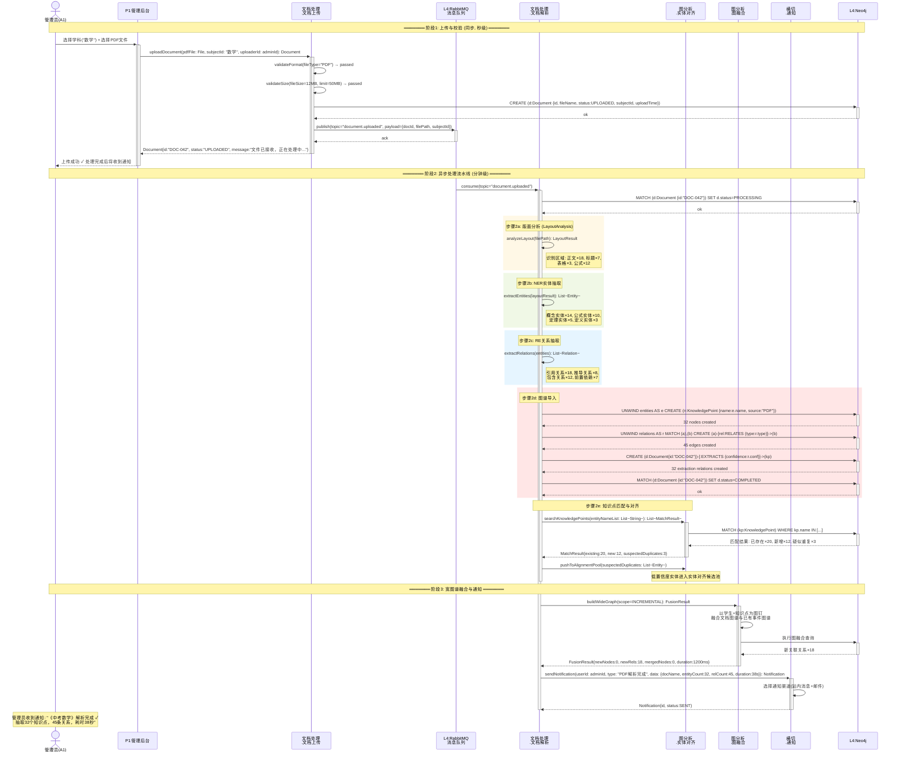
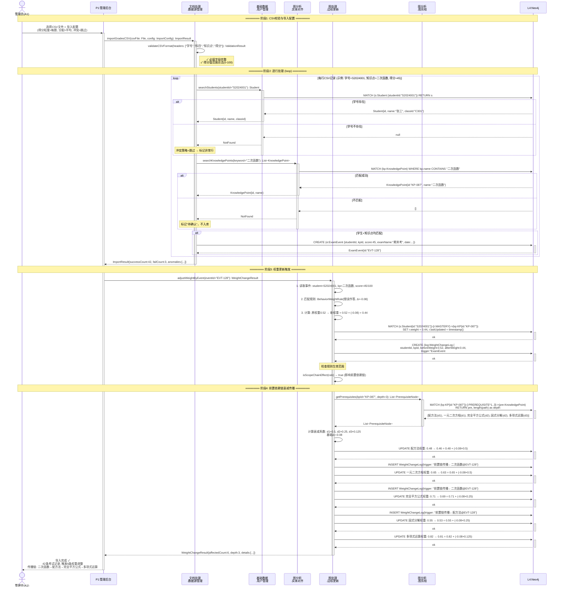
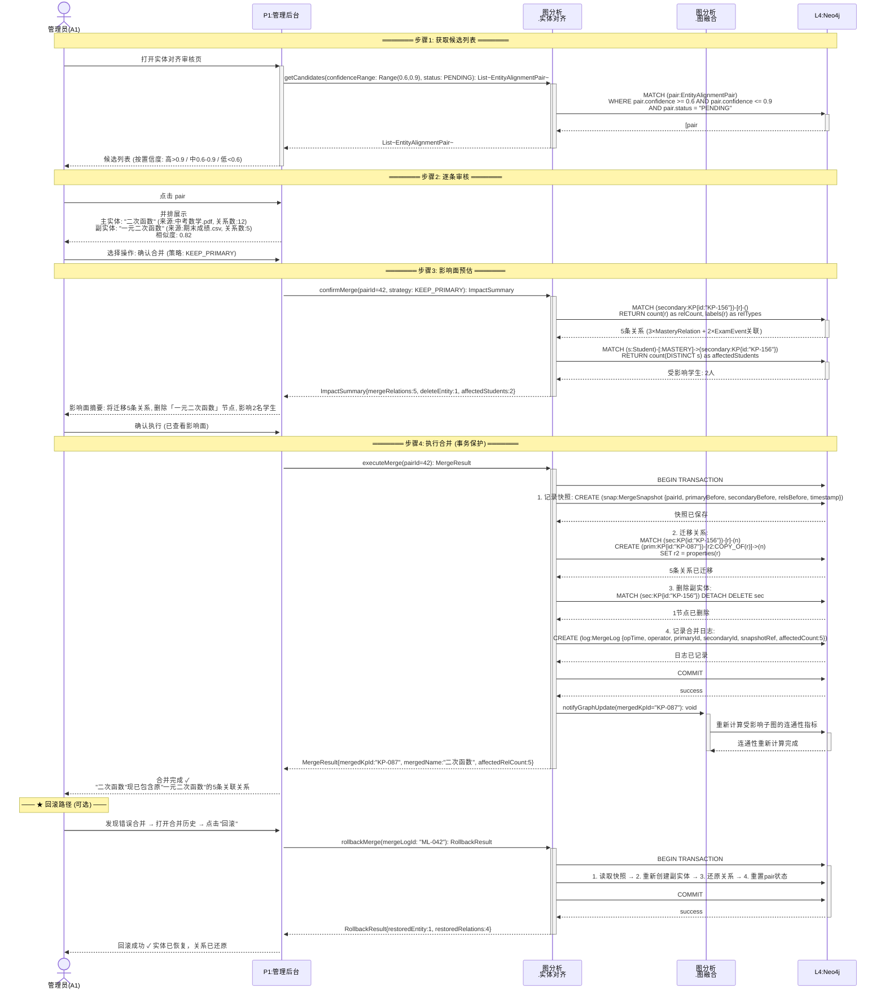

# GraphNexus 进程视图 — 时序图设计文档

> 基于图谱技术的 AI 上下文处理与精准问答系统
>
> 版本：v2.0 | 创建日期：2026-06-09
>
> 本文档严格遵循 UML 时序图 6 步设计方法论，为 GraphNexus 系统 MVP 核心场景绘制精确的进程级时序图。

---

## 一、设计方法论概述

每幅时序图遵循以下 6 步结构化流程：

```
步骤1: 设置交互语境     →  系统、类、用例、脚本
步骤2: 设置交互场景     →  对象在交互中扮演的角色
步骤3: 为对象设置生命线  →  每个对象的生命周期线
步骤4: 设置消息         →  按时间顺序的消息、参数、返回值
步骤5: 设置激活期       →  控制焦点（activation box）标注执行区间
步骤6: 设置约束与条件    →  时间约束、循环、条件分支、状态不变式
```

---

## 二、系统架构参与者映射

> 本视图采用 [dev-view.md](../dev-view/dev-view.md) 的五层架构模块命名，参与者严格对应开发视图中的应用层业务能力区域。
> 部署拓扑与 [physical-view.md](../physical-view/physical-view.md) 保持一致。

### 2.1 分层架构总览

```
┌──────────────────────────────────────────────────────────────────────────────────┐
│                          GraphNexus 五层 + 横切面架构                              │
│                                                                                  │
│  L0 用户层     管理员(A1)   教师(A2)   学生(A3)   运维人员(A4)   运营人员(A5)      │
│       │            │           │           │             │                        │
│  L1 网关层      Nginx :80 (反向代理)                                              │
│                 认证 (JWT)  +  鉴权 (RBAC + DataScope)                            │
│       ┌──────────┴──────────────────────────────────────────────────┐           │
│       ▼                                                              │           │
│  L2 应用层 ─── 按业务能力分为 5 个区域 (来自 dev-view §2.3) ───        │           │
│       │                                                              │           │
│       │  ┌─ 文档处理 ────┐ ┌─ 图处理 ────┐ ┌─ 图分析 ───┐ ┌─ 智能查询 ─┐        │
│       │  │ 文档上传       │ │ 图构建       │ │ 图融合      │ │ 上下文组装  │        │
│       │  │ 文档解析       │ │ 图查询       │ │ 图剪枝      │ │ 智能对话    │        │
│       │  │ 文档管理       │ │ 图管理       │ │ 图谱度量    │ │ 配置管理    │        │
│       │  │ 数据源管理     │ │ 边权更新     │ │ 实体对齐    │ │ 报告导出    │        │
│       │  └───────────────┘ └──────────────┘ └─────────────┘ └────────────┘        │
│       │                                                                          │
│       │  ┌─ 基础数据 ──────────────────────────────────────────────────────┐     │
│       │  │ 用户管理  │ 角色管理  │ 运维管理  │ 运营管理  │ LLM网关(Doubao/Deepseek/..) │
│       │  └─────────────────────────────────────────────────────────────────┘     │
│       │                                                              │           │
│  L3 基础设施    Neo4j    MySQL    Redis    MinIO    RabbitMQ    外部LLM API(HTTPS) │
│                                     │                                             │
│  ═══════════════════════════════════╪═════════════════════════════════════════    │
│  横切层面  日志 │ 备份 │ 监控 │ 定时任务 │ 通知 (纵向贯穿 L0~L3)                   │
└──────────────────────────────────────────────────────────────────────────────────┘

依赖方向：用户层 → 网关层 → 应用层(智能查询→图分析→图处理→文档处理) → 基础设施层
         横向切面纵向贯穿所有层级
```

### 2.2 dev-view 模块与进程视图参与者映射

> 下表展示进程视图时序图中的参与者如何与开发视图应用层模块对应。

| dev-view 应用层区域 | 子模块 | 进程视图参与者 | 典型场景 |
|:--|:--|:--|:--|
| **文档处理** | 文档上传 | `文档处理.文档上传` (原 M3.DocumentIngestionService) | S1 阶段1 |
| | 文档解析 | `文档处理.文档解析` (原 M3.PipelineWorker) | S1 阶段2 |
| | 文档管理 | `文档处理.文档管理` | S1 |
| | 数据源管理 | `文档处理.数据源管理` (原 M3.EventIngestionService) | S2 阶段1-2 |
| **图处理** | 图构建 | `图处理.图构建` | S1 阶段2d |
| | 图查询 | `图处理.图查询` | — |
| | 图管理 | `图处理.图管理` | — |
| | 边权更新 | `图处理.边权更新` (原 M4.WeightService) | S2 阶段3-4 |
| **图分析** | 图融合 | `图分析.图融合` (原 M4.GraphFusionService) | S1 阶段3, S3 |
| | 图剪枝 | `图分析.图剪枝` (原 M4.PruningService) | S4 步骤3 |
| | 图谱度量 | `图分析.图谱度量` | S3 步骤4 |
| | 实体对齐 | `图分析.实体对齐` (原 M2.EntityAlignmentService, M2.KnowledgePointService) | S3, S1 步骤2e |
| **智能查询** | 上下文组装 | `智能查询.上下文组装` (原 M5.ContextBuilderService) | S4 步骤4 |
| | 智能对话 | `智能查询.智能对话` (原 M6.AttributionQueryService) | S4 步骤1,5 |
| | 配置管理 | `智能查询.配置管理` (原 M5.QuotaManager, M5.CircuitBreaker) | S5 |
| | 报告导出 | `智能查询.报告导出` | — |
| **基础数据** | 用户管理 | `基础数据.用户管理` (原 M1.StudentService) | S2 步骤2 |
| | 角色管理 | `基础数据.角色管理` (原 M1.AuthorizationService) | S4 步骤2 |
| | 运维管理 | `横切.运维管理` (原 M7) | — |
| | 运营管理 | `基础数据.运营管理` (原 M8) | — |
| | LLM网关 | `基础数据.LLM网关` (原 M5.LLMGatewayService) | S4 步骤5, S5 |
| **横切层面** | 通知 | `横切.通知` (原 M7.NotificationService) | S1 阶段3, S5 |
| | 日志 | `横切.日志` | S5 |
| | 备份/监控/定时任务 | `横切.*` | — |
| **基础设施** | — | `L4.Neo4j`, `L4.RabbitMQ`, `L4.Redis`, `L4.MySQL`, `L4.MinIO` | 全场景 |

> **命名规范**：时序图中的参与者使用 `业务区域.子模块` 格式（如 `文档处理.文档解析`），对应 dev-view 应用层的功能分解。原先的 M1-M8 逻辑视图模块编号不再直接出现在参与者标签中。

---

## 三、MVP 核心场景总览

| # | 场景 | 用例 | Story | 优先级 | 交互模式 | 进程数 |
|---|------|------|-------|--------|---------|--------|
| **S1** | PDF上传与图谱构建 | UC-01 | 1.1 | P0 | 异步流水线 | 7 |
| **S2** | 成绩CSV导入触发权重更新 | UC-02+07 | 1.2+1.5 | P0 | 同步批处理 | 8 |
| **S3** | 实体对齐审核与合并 | UC-04 | 1.3 | P0 | 同步操作 | 5 |
| **S4** | 单学生薄弱点归因查询 | UC-10 | 2.1 | P0 | 同步编排 | 7 |
| **S5** | LLM降级与熔断 | 横切 | — | P0 | 级联降级链 | 9 |

---

## 四、S1 · PDF上传与图谱构建 (UC-01, Story 1.1)

### 步骤1：设置交互语境

| 维度 | 说明 |
|------|------|
| **所属系统** | GraphNexus — 基于图谱技术的 AI 上下文处理与精准问答系统 |
| **所属用例** | UC-01: 教辅 PDF 上传与图谱构建 |
| **用例脚本** | **主成功脚本**：管理员上传 PDF → 异步解析 → 宽图谱融合 → 通知完成；**异常脚本**：版面分析失败 / NER为空 / RE为空 |
| **涉及类/服务** | P1管理后台、文档处理.文档上传(原M3.DocumentIngestionService)、文档处理.文档解析(原M3.PipelineWorker: 版面分析→NER→RE→导入)、图分析.实体对齐(原M2.KnowledgePointService)、图分析.图融合(原M4.GraphFusionService)、横切.通知(原M7.NotificationService)、L4.Neo4j、L4.RabbitMQ |
| **前置条件** | 管理员已登录；学科分类已存在于 M2 中 |
| **后置条件(成功)** | PDF 解析完成，知识点和关系写入 Neo4j，管理员收到完成通知 |
| **后置条件(失败)** | Document 标记为 FAILED/COMPLETED_WITH_WARNING，管理员收到异常通知 |

### 步骤2：设置交互场景 — 对象角色

| 对象 | 角色定位 | 职责 |
|------|---------|------|
| **管理员(A1)** | 主动参与者（L0 用户层） | 选择学科、上传 PDF、接收处理结果通知 |
| **P1管理后台** | 边界对象（L0→L1 网关→L2） | 接收用户输入、展示上传结果 |
| **文档处理.文档上传** | 控制对象（L2 应用层·文档处理） | 文件校验、创建 Document 实体、发布消息 |
| **L4.RabbitMQ** | 基础设施（L3 基础设施层） | 解耦上传同步操作与异步处理 |
| **文档处理.文档解析** | 控制对象（L2 应用层·文档处理） | 执行四步流水线：版面分析→NER→RE→图谱导入 |
| **图分析.实体对齐** | 实体对象（L2 应用层·图分析） | 知识点名称匹配、低置信度实体推送对齐池 |
| **图分析.图融合** | 实体对象（L2 应用层·图分析） | 增量融合宽图谱 |
| **横切.通知** | 横切对象 | 发送处理完成/失败通知 |
| **L4.Neo4j** | 持久化对象（L3 基础设施层） | 图谱数据存储 |

### 步骤3：设置生命线

```
管理员    P1       文档处理    MQ       文档处理    图分析     图分析     横切       Neo4j
  │        │        .文档上传     │        .文档解析    .实体对齐    .图融合     .通知        │
  │        │         │        │         │         │         │         │         │
  ║        ║         ║        ║         ║         ║         ║         ║         ║
  ▼        ▼         ▼        ▼         ▼         ▼         ▼         ▼         ▼
```

每个对象从头到尾贯穿一条纵向虚线生命线。

### 步骤4 + 步骤5：设置消息与激活期



### 步骤6：设置约束与条件

| 约束类型 | 内容 |
|---------|------|
| **时间约束** | P95 单份 10-20 页 PDF 处理耗时 < 60s；上传阶段 < 2s 返回；MQ 消息确认 < 500ms |
| **循环约束** | NER/RE 抽取为单次执行（非循环），每份 PDF 仅处理一次（消息去重 key=docId） |
| **条件分支** | 版面分析失败→标记 FAILED→通知管理员提供文本版；RE为空→标记 COMPLETED_WITH_WARNING→仅导入实体节点；NER为空→标记 COMPLETED_WITH_WARNING→通知管理员检查文档 |
| **状态不变式** | Document.status ∈ {UPLOADED, PROCESSING, COMPLETED, COMPLETED_WITH_WARNING, FAILED} |
| **并发约束** | 同一 docId 的消息在处理中去重；PipelineWorker 支持并行消费 |

---

## 五、S2 · 成绩CSV导入触发权重更新 (UC-02 + UC-07, Story 1.2 + 1.5)

### 步骤1：设置交互语境

| 维度 | 说明 |
|------|------|
| **所属系统** | GraphNexus |
| **所属用例** | UC-02: 学生主数据维护与成绩导入 + UC-07: 权重更新规则配置 |
| **用例脚本** | **主成功脚本**：CSV 校验 → 逐行匹配学生/知识点 → 创建 ExamEvent → 权重引擎调整 → 前置依赖链衰减传播；**异常脚本**：学号不存在(按策略跳过/创建)、知识点不匹配(标记待确认) |
| **涉及类/服务** | P1管理后台、文档处理.数据源管理(原M3.EventIngestionService)、基础数据.用户管理(原M1.StudentService)、图分析.实体对齐(原M2.KnowledgePointService)、图处理.边权更新(原M4.WeightService)、图分析.图剪枝(原M4.PruningService: 前置链追溯)、L4.Neo4j |
| **前置条件** | 管理员已登录；学生主数据(M1)和知识体系(M2)已存在；权重更新规则(UC-07)已配置 |
| **后置条件(成功)** | ExamEvent 写入 Neo4j，MasteryRelation 权重更新，WeightChangeLog 记录 |
| **后置条件(失败)** | 异常行记录明细，成功行已写入 |

### 步骤2：设置交互场景 — 对象角色

| 对象 | 角色定位 | 职责 |
|------|---------|------|
| **管理员(A1)** | 主动参与者（L0 用户层） | 上传 CSV、配置导入参数 |
| **P1管理后台** | 边界对象（L0→L1 网关→L2） | 文件上传界面、导入配置选择、结果摘要展示 |
| **文档处理.数据源管理** | 控制对象（L2 应用层·文档处理） | CSV 校验、行级处理编排、事件节点创建 |
| **基础数据.用户管理** | 实体对象（L2 应用层·基础数据） | 学号查询匹配 |
| **图分析.实体对齐** | 实体对象（L2 应用层·图分析） | 知识点名称查询匹配 |
| **图处理.边权更新** | 控制对象（L2 应用层·图处理） | 规则匹配、权重计算、日志记录 |
| **图分析.图剪枝** | 实体对象（L2 应用层·图分析） | 前置依赖链查询(深度BFS) |
| **L4.Neo4j** | 持久化对象（L3 基础设施层） | ExamEvent创建、MasteryRelation更新、WeightChangeLog写入 |

### 步骤3：设置生命线

```
管理员    P1       文档处理    基础数据    图分析      图处理      图分析     Neo4j
  │        │        .数据源管理    .用户管理    .实体对齐    .边权更新    .图剪枝      │
  │        │         │        │        │        │         │         │
  ║        ║         ║        ║        ║        ║         ║         ║
  ▼        ▼         ▼        ▼        ▼        ▼         ▼         ▼
```

### 步骤4 + 步骤5：设置消息与激活期



### 步骤6：设置约束与条件

| 约束类型 | 内容 |
|---------|------|
| **时间约束** | 千行CSV导入 < 30s；单行处理 < 100ms；前置链DB查询 < 500ms |
| **循环约束** | loop: 逐行处理 CSV 记录（行数 = N，N ∈ [1, 10000]） |
| **条件分支** | 学号不存在∧策略=跳过→标记异常行；学号不存在∧策略=创建→自动创建Student→继续；知识点不匹配→标记待确认→不入库 |
| **状态不变式** | MasteryRelation.weight ∈ [0.0, 1.0]；WeightChangeLog 与 MasteryRelation 更新一一对应 |
| **并发约束** | 同一 studentId+kpId 的权重更新需串行（乐观锁 version 字段） |
| **事务约束** | 每行 CSV 处理为独立事务（失败不回滚已成功行）；日志写入与权重更新在同一事务内 |

---

## 六、S3 · 实体对齐审核与合并 (UC-04, Story 1.3)

### 步骤1：设置交互语境

| 维度 | 说明 |
|------|------|
| **所属系统** | GraphNexus |
| **所属用例** | UC-04: 实体对齐审核与管理 |
| **用例脚本** | **主成功脚本**：查看候选列表→并排展示→确认合并(影响面预估)→执行合并(迁移关系+删除副实体+记日志)→通知图谱更新；**异常脚本**：批量合并中某对失败(事务保护)、合并错误(回滚) |
| **涉及类/服务** | P1管理后台、图分析.实体对齐(原M2.EntityAlignmentService + M2.KnowledgePointService)、图分析.图融合(原M4.GraphFusionService)、L4.Neo4j |
| **前置条件** | 管理员已登录；系统中存在来源不同的疑似相同实体 |
| **后置条件(成功)** | 副实体删除，关系迁移至主实体，操作日志记录（支持回滚） |
| **后置条件(失败)** | 操作回滚，实体状态不变 |

### 步骤2：设置交互场景 — 对象角色

| 对象 | 角色定位 | 职责 |
|------|---------|------|
| **管理员(A1)** | 主动参与者（L0 用户层） | 逐条审核、确认合并/驳回、批量操作、错误回滚 |
| **P1管理后台** | 边界对象（L0→L1 网关→L2） | 候选列表展示、并排实体信息展示、影响面展示 |
| **图分析.实体对齐** | 控制对象（L2 应用层·图分析） | 候选对管理、合并执行、快照记录、回滚 |
| **图分析.图融合** | 实体对象（L2 应用层·图分析） | 合并后图谱连通性重算 |
| **L4.Neo4j** | 持久化对象（L3 基础设施层） | 关系迁移、实体删除、日志写入 |

### 步骤3：设置生命线

```
管理员    P1       图分析      图分析     Neo4j
  │        │        .实体对齐    .图融合      │
  │        │         │        │         │
  ║        ║         ║        ║         ║
  ▼        ▼         ▼        ▼         ▼
```

### 步骤4 + 步骤5：设置消息与激活期



### 步骤6：设置约束与条件

| 约束类型 | 内容 |
|---------|------|
| **时间约束** | 候选列表查询 < 500ms；影响面预估 < 200ms；合并事务 < 1s |
| **条件分支** | 操作选择: 确认合并(KEEP_PRIMARY/KEEP_SECONDARY/CUSTOM) / 驳回(加入白名单) / 跳过(暂存)；批量操作: 按置信度区间/实体类型/来源批量选中 |
| **状态不变式** | EntityAlignmentPair.status ∈ {PENDING, MERGED, REJECTED}；合并后关系总数 = 原主实体关系数 + 原副实体关系数；回滚后状态恢复至合并前 |
| **并发约束** | 同一 pairId 的合并操作需加分布式锁（避免重复合并） |
| **事务约束** | 合并为单事务（快照+迁移+删除+日志 原子提交）；回滚为单事务（快照恢复） |

---

## 七、S4 · 单学生薄弱点归因查询 (UC-10, Story 2.1)

### 步骤1：设置交互语境

| 维度 | 说明 |
|------|------|
| **所属系统** | GraphNexus |
| **所属用例** | UC-10: 单学生薄弱点归因查询 |
| **用例脚本** | **主成功脚本**：教师输入查询→权限校验→任务驱动剪枝→上下文构建→LLM调用→结构化报告；**异常脚本**：权限拒绝(403)、剪枝子图为空、LLM不可用(降级)、超时(重试) |
| **涉及类/服务** | P2教师工作台、Nginx(L1网关)、智能查询.智能对话(原M6.AttributionQueryService)、基础数据.角色管理(原M1.AuthorizationService: L2细粒度DataScope)、图分析.图剪枝(原M4.PruningService)、智能查询.上下文组装(原M5.ContextBuilderService)、基础数据.LLM网关(原M5.LLMGatewayService: 支持Claude/Doubao/Deepseek多模型路由)、A6.LLM Service(外部) |
| **前置条件** | 宽图谱已融合；剪枝策略+权重规则已配置；LLM服务可用（至少一个Provider在线） |
| **后置条件(成功)** | 返回结构化归因报告(根因+证据链+置信度) |
| **后置条件(失败)** | 返回错误提示(权限/数据不足/LLM不可用) |

### 步骤2：设置交互场景 — 对象角色

| 对象 | 角色定位 | 职责 |
|------|---------|------|
| **教师(A2)** | 主动参与者（L0 用户层） | 输入查询(自然语言/结构化)、查看报告、交互下钻 |
| **P2教师工作台** | 边界对象（L0→L1 网关→L2） | 查询输入(自动补全)、报告展示(追溯路径可视化) |
| **智能查询.智能对话** | 控制对象（L2 应用层·智能查询） | 意图识别、编排调用下层服务、组装DTO |
| **基础数据.角色管理** | 实体对象（L2 应用层·基础数据） | 教师-班级权限校验（L1网关粗粒度+此处细粒度DataScope） |
| **图分析.图剪枝** | 实体对象（L2 应用层·图分析） | 任务驱动剪枝(加载策略→BFS→截断→过滤) |
| **智能查询.上下文组装** | 控制对象（L2 应用层·智能查询） | 子图序列化、Token预算控制、多源信息融合 |
| **基础数据.LLM网关** | 控制对象（L2 应用层·基础数据） | 模型路由（Claude/Doubao/Deepseek）、配额检查、降级策略、调用日志 |
| **A6.LLM Service** | 外部系统 | 外部LLM API（Claude/Doubao/Deepseek等多Provider） |

### 步骤3：设置生命线

```
教师     P2       智能查询    基础数据    图分析      智能查询    基础数据    A6.LLM
 │        │        .智能对话    .角色管理    .图剪枝      .上下文组装   .LLM网关     │
 │        │         │        │        │        │         │         │
 ║        ║         ║        ║        ║        ║         ║         ║
 ▼        ▼         ▼        ▼        ▼        ▼         ▼         ▼
```

### 步骤4 + 步骤5：设置消息与激活期

```mermaid
sequenceDiagram
    actor T as 教师(A2)
    participant P2 as P2:教师工作台
    participant Dialog as 智能查询<br/>.智能对话
    participant RoleMgr as 基础数据<br/>.角色管理
    participant Prune as 图分析<br/>.图剪枝
    participant CtxBuild as 智能查询<br/>.上下文组装
    participant LLMGW as 基础数据<br/>.LLM网关
    participant A6 as A6:LLM Service<br/>(Claude/Doubao/Deepseek)

    Note over T,A6: ═══════ 步骤1: 查询输入 ═══════

    T->>+P2: 输入查询 "学生A 为什么二次函数薄弱"
    Note right of P2: 自然语言解析 →<br/>studentId="S2024001",<br/>kpId="KP-087",<br/>taskType="归因分析"

    P2->>+Dialog: queryAttribution(query: AttributionQuery{studentId, kpId, taskType}): AttributionReport
    activate Dialog

    Note over T,A6: ═══════ 步骤2: 权限校验 ═══════

    Dialog->>+RoleMgr: checkPermission(userId: teacherId, resourceType: STUDENT, resourceId: "S2024001", action: READ): Boolean
    activate RoleMgr
    RoleMgr->>RoleMgr: 查询 teacherId 任教班级 → 校验 studentId 是否在该班级
    alt 权限通过
        RoleMgr-->>-Dialog: true
    else 权限拒绝
        RoleMgr-->>Dialog: false
        Dialog-->>P2: HTTP 403 Forbidden {message:"无权访问该学生数据"}
        deactivate Dialog
        P2-->>T: 权限不足提示
    end
    deactivate RoleMgr

    Note over T,A6: ═══════ 步骤3: 任务驱动剪枝 ═══════

    Dialog->>+Prune: prune(targetNodeId: "S2024001", taskType: ATTRIBUTION): Subgraph
    activate Prune
    Prune->>Prune: loadStrategy(taskType: ATTRIBUTION)
    Note right of Prune: 策略参数:<br/>maxHops=3, maxNeighbors=5,<br/>weightThreshold=0.3,<br/>relationFilter=[MASTERY, PREREQUISITE, SAME_AS]

    Prune->>Prune: BFS expand(hops=3, maxNeighbors=5)
    Prune->>Prune: filter(weight≥0.3) AND filter(relationType ∈ whitelist)

    Prune-->>-Dialog: Subgraph{nodes:23, edges:35, strategyVersion:v2.1, generationTime:850ms}
    deactivate Prune

    Note over T,A6: ═══════ 步骤4: 上下文构建 ═══════

    Dialog->>+CtxBuild: buildContext(subgraph: Subgraph, taskType: ATTRIBUTION, extraInfo: {historyTrend, docRefs}): LLMContext
    activate CtxBuild
    CtxBuild->>CtxBuild: serializeToJSON(subgraph) → 图谱→结构化文本
    CtxBuild->>CtxBuild: estimateTokenCount() → 预估 6800 tokens
    CtxBuild->>CtxBuild: trimToBudget(maxTokens=8000) → 裁剪至 6200 tokens
    CtxBuild->>CtxBuild: mergeHistoryTrend(studentId, kpId) → 附加权重变化时间线
    CtxBuild->>CtxBuild: mergeDocReferences(kpIds) → 附加教辅引用
    CtxBuild-->>-Dialog: LLMContext{serializedText, tokenCount:7200, metadata:{...}}
    deactivate CtxBuild

    Note over T,A6: ═══════ 步骤5: LLM调用 ═══════

    Dialog->>+LLMGW: callLLM(request: LLMCallRequest{taskType, promptTemplateId, variables, context}): LLMCallResult
    activate LLMGW

    LLMGW->>LLMGW: 1. loadPromptTemplate(taskType: ATTRIBUTION)
    LLMGW->>LLMGW: 2. fillVariables("{{student_name}}"="张三", "{{kp_name}}"="二次函数", "{{subgraph}}"=>context)
    LLMGW->>LLMGW: 3. routeModel(taskType) → "Claude Opus"

    LLMGW->>+A6: POST /v1/messages<br/>{model:"claude-opus-4-8", messages:[{role:"user", content: renderedPrompt}]}
    activate A6

    alt LLM调用成功 (延迟 30s内)
        A6-->>-LLMGW: {content: "归因分析文本...", usage: {input_tokens:7200, output_tokens:1800}}
        LLMGW->>LLMGW: 4. logCall(success, model="Opus", tokens=9000, latency=12s)
        LLMGW-->>-Dialog: LLMCallResult{text:"归因分析文本", model:"Opus", tokenUsed:9000, latency:12s}
    else LLM超时 (超过30s)
        A6-->>LLMGW: Timeout Error
        LLMGW->>LLMGW: degradeTo("Sonnet")
        LLMGW->>+A6: POST /v1/messages (模型=Sonnet)
        A6-->>-LLMGW: {content: "归因分析文本...", usage: {...}}
        LLMGW->>LLMGW: 4. logCall(degraded, model="Sonnet", degradedFrom="Opus")
        LLMGW-->>Dialog: LLMCallResult{text, model:"Sonnet", degraded:true, tokenUsed:8500, latency:20s}
    end
    deactivate LLMGW

    Note over T,A6: ═══════ 步骤6: 结构化响应 ═══════

    Dialog->>Dialog: parseLLMResponse(text) → 结构化提取
    Note right of Dialog: 解析: 根因列表×3, 证据链×5,<br/>追溯路径, 置信度标注

    Dialog-->>-P2: AttributionReport{<br/>rootCauses: [{cause:"配方法薄弱", impact:0.78, confidence:HIGH}, ...],<br/>evidenceChain: [{dimension:"前置知识", data:"配方法权重0.42", source:"权重引擎"}, ...],<br/>tracePath: [二次函数→配方法→完全平方公式→因式分解],<br/>docRefs: ["第3次月考第8题得分0", "第12次作业得分2/10"]}
    deactivate Dialog

    P2-->>T: 展示归因报告<br/>(根因降序 + 多维证据链 + 追溯路径可视化)

    Note over T,A6: ─── ★ 交互式下钻 (可选) ───

    T->>+P2: 点击根因节点"配方法"
    P2->>+Dialog: drillDown(reportId, targetKpId="配方法"): AttributionReport
    activate Dialog
    Dialog->>Prune: prune(沿前置依赖链上溯1跳, kpId="配方法")
    Dialog->>LLMGW: callLLM(更深层链式分析Prompt)
    LLMGW->>A6: LLM下钻请求
    A6-->>LLMGW: 下钻分析结果
    Dialog-->>-P2: 深层链式归因报告
    deactivate Dialog
    P2-->>T: 展示"配方法为什么也薄弱 → 完全平方公式未掌握"
```

### 步骤6：设置约束与条件

| 约束类型 | 内容 |
|---------|------|
| **时间约束** | 端到端 P95 < 15s；权限校验 < 50ms；剪枝 < 2s；LLM调用 < 30s (超时重试1次)；LLM降级总超时 < 60s |
| **条件分支** | checkPermission=false→403；subgraph.isEmpty→提示数据不足；LLM超时→降级模型；全部模型不可用→断路器返回错误 |
| **循环约束** | 下钻为可选操作，每次上溯1跳（非循环） |
| **状态不变式** | AttributionReport 必须包含 ≥1 条根因；证据链中每条证据必须有来源引用 |
| **并发约束** | 查询为只读操作，无并发冲突 |
| **安全约束** | 教师只能查询任教班级的学生；学生ID不暴露于查询日志中 |

---

## 八、S5 · LLM调用降级与熔断 (横切关注点)

### 步骤1：设置交互语境

| 维度 | 说明 |
|------|------|
| **所属系统** | GraphNexus |
| **所属用例** | 横切关注点 — 所有依赖 LLM 的用例（UC-10/UC-16/UC-22） |
| **用例脚本** | **降级脚本**：Opus配额不足→降级Sonnet；Opus超时→降级Sonnet→Sonnet失败→降级Haiku→全部失败→断路器熔断 |
| **涉及类/服务** | 基础数据.LLM网关(原M5.LLMGatewayService)、智能查询.配置管理(原M5.QuotaManager + M5.CircuitBreaker)、L4.Redis(缓存)、横切.通知(原M7.NotificationService)、A6.LLM Service(Claude/Doubao/Deepseek等多Provider) |
| **前置条件** | 调用方(M6/M3)已调用 callLLM；模型配置和配额策略已设置 |
| **后置条件(成功)** | 返回 LLM 响应（可能来自降级模型） |
| **后置条件(失败)** | 断路器熔断，返回错误/降级响应 |

### 步骤2：设置交互场景 — 对象角色

| 对象 | 角色定位 | 职责 |
|------|---------|------|
| **调用方(智能查询/文档处理)** | 请求发起者 | 发起 LLM 调用请求 |
| **基础数据.LLM网关** | 控制对象（L2 应用层·基础数据） | 降级链编排、模型路由 |
| **L4.Redis** | 缓存对象（L3 基础设施层） | 幂等请求去重缓存(TTL 5min) |
| **智能查询.配置管理(Quota)** | 控制对象（L2 应用层·智能查询） | 配额检查、消耗计数 |
| **智能查询.配置管理(Circuit)** | 控制对象（L2 应用层·智能查询） | 故障计数、断路器状态管理 |
| **A6.LLM Service** | 外部系统 | 外部LLM API（Claude/Doubao/Deepseek等多Provider，按模型能力分层路由） |
| **横切.通知** | 横切对象 | 告警通知发送 |
| **L4.日志DB(MySQL)** | 持久化对象（L3 基础设施层） | 调用日志记录 |

### 步骤3：设置生命线

```
调用方    LLM网关   Redis   配置管理   配置管理   Opus   Sonnet Haiku   横切     日志DB
  │        │       │       │       │      │      │      │      │      │
  ║        ║       ║       ║       ║      ║      ║      ║      ║      ║
  ▼        ▼       ▼       ▼       ▼      ▼      ▼      ▼      ▼      ▼
```

### 步骤4 + 步骤5：设置消息与激活期

```mermaid
sequenceDiagram
    participant Caller as 调用方<br/>(智能查询/文档处理)
    participant GW as 基础数据<br/>.LLM网关
    participant Cache as L4:Redis<br/>(缓存)
    participant Quota as 智能查询<br/>.配置管理
    participant CB as 智能查询<br/>.配置管理
    participant Opus as A6:Claude Opus<br/>(首选)
    participant Sonnet as A6:Claude Sonnet<br/>(次选)
    participant Haiku as A6:Claude Haiku<br/>(兜底)
    participant Notif as 横切<br/>.通知
    participant LogDB as L4:MySQL<br/>(日志DB)

    Caller->>+GW: callLLM(taskType, promptTemplateId, variables): LLMCallResult
    activate GW

    rect rgb(248, 248, 248)
        Note over GW,Cache: ══ 第0层: 幂等缓存检查 ══
        GW->>+Cache: GET(cacheKey: taskType + hash(variables)): String?
        alt 缓存命中 (5分钟内相同请求)
            Cache-->>GW: cachedResult
            GW-->>Caller: LLMCallResult{cached, latency:0ms, cost:0}
            deactivate GW
            Note over GW: 提前返回，跳过后续所有步骤
        else 缓存未命中
            Cache-->>-GW: null
        end
    end

    rect rgb(255, 248, 230)
        Note over GW,Opus: ══ 第1层: 首选模型 Claude Opus ══
        GW->>+Quota: checkQuota(model:"Opus", period:"daily"): QuotaStatus
        Quota-->>-GW: QuotaStatus{remaining:45%, limit:1000000}

        GW->>+CB: isCircuitOpen(model:"Opus"): Boolean
        CB-->>-GW: false (CLOSED)

        GW->>+Opus: POST /v1/messages {model:"opus", messages:[{role:"user", content:renderedPrompt}]}
        activate Opus

        alt 成功 (latency 30s内)
            Opus-->>-GW: {content:"分析结果...", usage:{input:7200, output:1800}}
            deactivate Opus
            GW->>+Cache: SET(cacheKey, result, TTL=300s)
            Cache-->>-GW: ok
            GW->>+LogDB: INSERT Log{success, model:"Opus", latency:12s, tokens:9000}
            LogDB-->>-GW: ok
            GW-->>-Caller: LLMCallResult{model:Opus, text, latency:12s}
            deactivate GW
        else 超时 (latency 超过30s)
            Opus-->>GW: Timeout Error
            deactivate Opus
            GW->>+CB: recordFailure(model:"Opus"): void
            CB-->>-GW: failureCount=1
            Note over GW: Opus超时 → 进入第2层降级
        end
    end

    rect rgb(230, 245, 255)
        Note over GW,Sonnet: ══ 第2层: 降级 Claude Sonnet ══
        GW->>+Quota: checkQuota(model:"Sonnet", period:"daily"): QuotaStatus
        Quota-->>-GW: QuotaStatus{remaining:80%}

        GW->>+CB: isCircuitOpen(model:"Sonnet"): Boolean
        CB-->>-GW: false (CLOSED)

        GW->>+Sonnet: POST /v1/messages {model:"sonnet", messages:[{role:"user", content:renderedPrompt}]}
        activate Sonnet

        alt 成功
            Sonnet-->>-GW: {content:"分析结果...", usage:{input:7200, output:1500}}
            deactivate Sonnet
            GW->>+Cache: SET(cacheKey, result, TTL=300s)
            Cache-->>-GW: ok
            GW->>+LogDB: INSERT Log{degraded, model:"Sonnet", degradedFrom:"Opus"}
            LogDB-->>-GW: ok
            GW->>+Notif: sendNotification(opsStaff, "LLM降级通知", "Opus不可用，已降级至Sonnet")
            Notif-->>-GW: notification sent
            GW-->>-Caller: LLMCallResult{model:Sonnet, degraded:true, text}
            deactivate GW
        else 失败 (503 Service Unavailable)
            Sonnet-->>GW: 503 Error
            deactivate Sonnet
            GW->>+CB: recordFailure(model:"Sonnet"): void
            CB-->>-GW: failureCount=1
            Note over GW: Sonnet不可用 → 进入第3层降级
        end
    end

    rect rgb(255, 230, 230)
        Note over GW,Haiku: ══ 第3层: 兜底 Claude Haiku ══
        GW->>+Quota: checkQuota(model:"Haiku", period:"daily"): QuotaStatus
        Quota-->>-GW: QuotaStatus{remaining:92%}

        GW->>+CB: isCircuitOpen(model:"Haiku"): Boolean
        CB-->>-GW: false (CLOSED)

        GW->>GW: 精简Prompt (移除冗余示例，压缩上下文)
        GW->>+Haiku: POST /v1/messages {model:"haiku", messages:[{role:"user", content:trimmedPrompt}]}
        activate Haiku

        alt 成功
            Haiku-->>-GW: {content:"基础分析...", usage:{input:4500, output:800}}
            deactivate Haiku
            GW->>+Cache: SET(cacheKey, result, TTL=600s)
            Cache-->>-GW: ok
            GW->>+LogDB: INSERT Log{degraded, model:"Haiku", degradedFrom:"Opus→Sonnet→Haiku"}
            LogDB-->>-GW: ok
            GW->>+Notif: sendNotification(opsStaff, "LLM严重降级", "Opus+Sonnet不可用，已降至Haiku")
            Notif-->>-GW: notification sent
            GW-->>-Caller: LLMCallResult{model:Haiku, degraded:true, qualityWarning:"低质量模式"}
            deactivate GW
        else 全部失败
            Haiku-->>GW: Timeout Error
            deactivate Haiku
            GW->>+CB: recordFailure(model:"Haiku"): void
            CB-->>-GW: failureCount=1
            Note over GW: 全链路失败 → 断路器熔断
        end
    end

    rect rgb(248, 230, 255)
        Note over GW: ══ 第4层: 断路器熔断 ══
        GW->>+CB: openCircuit(scope:"ALL", duration:60s): void
        CB-->>-GW: Circuit OPENED (60s)

        GW->>+LogDB: INSERT Log{critical, "LLM全链路不可用", "断路器打开60s"}
        LogDB-->>-GW: ok

        GW->>+Notif: sendNotification(opsStaff, "LLM服务全部不可用", "断路器打开，持续60秒")
        Notif-->>-GW: notification sent

        alt 任务支持无LLM降级
            GW-->>-Caller: PartialResult{noAIAnalysis, subgraphData only}
            Note over Caller: 返回剪枝子图结构<br/>(教师可自行解读基本数据)
        else 任务强依赖LLM
            GW-->>-Caller: Error{code:"LLM_UNAVAILABLE", retryAfter:60}
        end
        deactivate GW
    end
```

### 步骤6：设置约束与条件

| 约束类型 | 内容 |
|---------|------|
| **时间约束** | 每层超时 30s；断路器持续 60s；缓存 TTL 5min(成功)/10min(兜底)；总降级链 < 120s |
| **条件分支** | 缓存命中→直接返回(零延迟)；配额不足→跳过该模型→降级；连续3次失败→CircuitBreaker OPEN |
| **循环约束** | 无循环（线性降级链，每层最多尝试1次）；重试仅在第1层 Opus（+1次） |
| **状态不变式** | CircuitBreaker: CLOSED(失败<3)→OPEN(熔断60s)→HALF_OPEN(试探1次)→CLOSED或OPEN |
| **并发约束** | 配额计数使用 Redis INCR（原子操作）；CircuitBreaker 状态读为无锁 |
| **幂等约束** | 缓存 key = taskType + hash(variables)，相同请求5分钟内返回缓存结果 |

---

## 九、场景对比矩阵

### 9.1 进程特征对比

| 维度 | S1 PDF上传 | S2 CSV导入 | S3 实体对齐 | S4 归因查询 | S5 LLM降级 |
|------|----------|----------|-----------|----------|----------|
| **进程数** | 7 | 8 | 5 | 7 | 9 |
| **交互模式** | 异步流水线 | 同步批处理 | 同步事务 | 同步编排 | 级联降级 |
| **用户等待** | 秒级返回 | < 30s | < 1s | < 15s | 透明 |
| **通信方式** | MQ(异步) | HTTP(同步) | HTTP(同步) | HTTP(同步) | HTTP(同步) |
| **事务边界** | 消息消费→DB | 单行独立事务 | 单对事务 | 无(只读) | 无 |
| **故障补偿** | MQ重试 | 成功行保留 | 快照回滚 | 降级模型 | 断路器 |
| **幂等性** | docId去重 | eventId去重 | pairId锁 | 天然幂等 | 缓存去重 |
| **瓶颈资源** | Pipeline Worker | Neo4j写入 | Neo4j事务 | LLM API | LLM API |

### 9.2 MVP 需求覆盖验证

| MVP Story | 用例 | 时序图 | 覆盖度 |
|-----------|------|--------|--------|
| Story 1.1: PDF上传 | UC-01 | S1 | ✅ 全流程覆盖 |
| Story 1.2: 学生+成绩导入 | UC-02 | S2 | ✅ 含前置链传播 |
| Story 1.3: 实体对齐审核 | UC-04 | S3 | ✅ 含回滚路径 |
| Story 1.4: 剪枝策略配置 | UC-06 | S4(剪枝加载) | ✅ 策略加载在S4中体现 |
| Story 1.5: 权重规则配置 | UC-07 | S2(规则匹配) | ✅ 规则匹配+传播在S2中体现 |
| Story 2.1: 归因查询 | UC-10 | S4 + S5 | ✅ 核心价值场景 + 降级 |

---

## 十、通用交互模式总结

### 模式A：同步编排读 (S4)

```
用户→界面→M6(编排)→M1(权限)→M4(查询)→M5(LLM)→界面→用户
                                 ↓失败
                            降级链(S5)
```

### 模式B：同步批处理写 (S2, S3)

```
用户→界面→领域层→loop(逐行/逐对处理)[事务]→副作用(M4权重/图谱)→结果→用户
                                               ↓失败
                                          回滚+异常明细
```

### 模式C：异步流水线 (S1)

```
用户→界面→同步校验→发布消息→返回受理→用户离开
                       ↓
              Worker消费→Pipeline分步→M4融合→M7通知→用户
```

### 模式D：级联降级链 (S5)

```
调用方→Gateway→Redis(缓存)→配额→断路器→Opus(首选)
                                        ↓超时
                                     Sonnet(次选)
                                        ↓503
                                     Haiku(兜底)
                                        ↓超时
                                    断路器熔断(60s)→降级响应/Error
```

---

> **文档说明**：本文档基于 [基于图谱技术的 AI 上下文处理与精准问答系统.md](../../基于图谱技术的%20AI%20上下文处理与精准问答系统.md)、[user-stories-mvp.md](../../user-stories/user-stories-mvp.md) 以及 [logical-view.md](../../logical-view.md) (v1.1) 中的接口定义设计。每幅时序图的消息签名、模块归属、异常处理均与逻辑视图 §3 接口定义保持严格一致。Mermaid 图可在 VSCode/GitHub/GitLab/[Mermaid Live](https://mermaid.live/) 中渲染。
