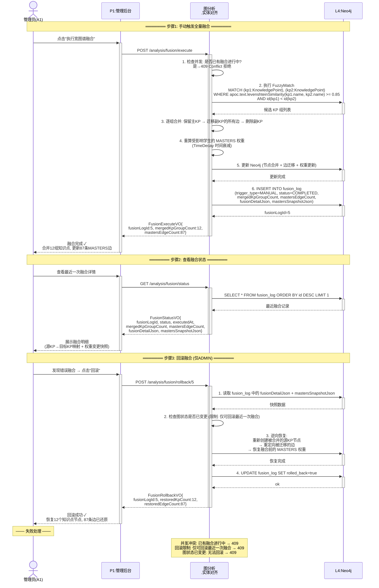
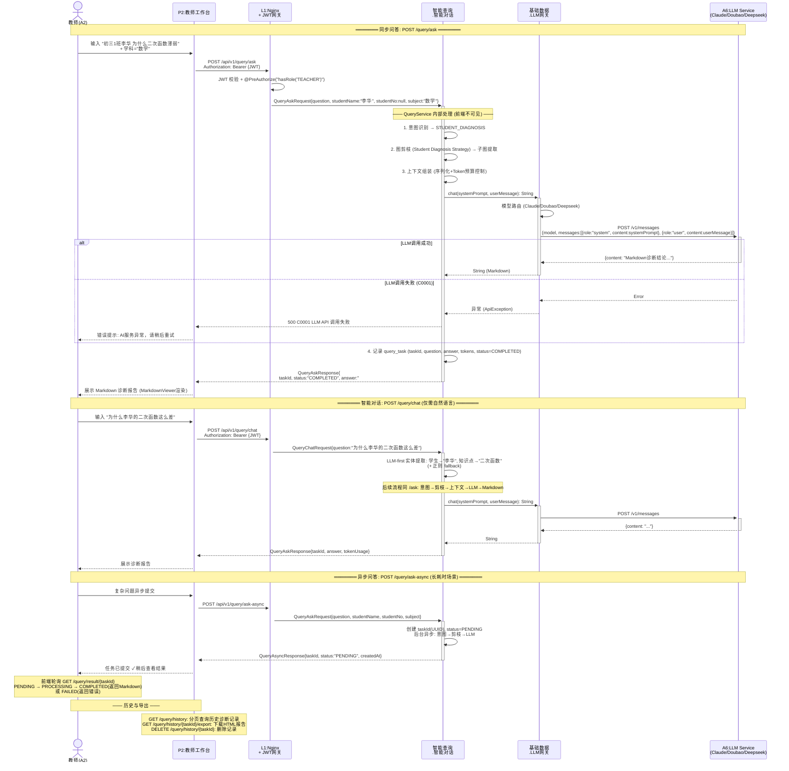

# GraphNexus 进程视图 — 时序图设计文档

> 基于图谱技术的 AI 上下文处理与精准问答系统
>
> 版本：v2.0 | 创建日期：2026-06-09
>
> 本文档严格遵循 UML 时序图 6 步设计方法论，为 GraphNexus 系统 MVP 核心场景绘制精确的进程级时序图。

---

## 一、设计方法论概述

每幅时序图遵循以下 6 步结构化流程：

```
步骤1: 设置交互语境     →  系统、类、用例、脚本
步骤2: 设置交互场景     →  对象在交互中扮演的角色
步骤3: 为对象设置生命线  →  每个对象的生命周期线
步骤4: 设置消息         →  按时间顺序的消息、参数、返回值
步骤5: 设置激活期       →  控制焦点（activation box）标注执行区间
步骤6: 设置约束与条件    →  时间约束、循环、条件分支、状态不变式
```

---

## 二、系统架构参与者映射

> 本视图采用 [dev-view.md](../dev-view/dev-view.md) 的五层架构模块命名，参与者严格对应开发视图中的应用层业务能力区域。
> 部署拓扑与 [physical-view.md](../physical-view/physical-view.md) 保持一致。

### 2.1 分层架构总览

```
┌──────────────────────────────────────────────────────────────────────────────────┐
│                          GraphNexus 五层 + 横切面架构                              │
│                                                                                  │
│  L0 用户层     管理员(A1)   教师(A2)   学生(A3)   运维人员(A4)   运营人员(A5)      │
│       │            │           │           │             │                        │
│  L1 网关层      Nginx :80 (反向代理)                                              │
│                 认证 (JWT)  +  鉴权 (RBAC + DataScope)                            │
│       ┌──────────┴──────────────────────────────────────────────────┐           │
│       ▼                                                              │           │
│  L2 应用层 ─── 按业务能力分为 5 个区域 (来自 dev-view §2.3) ───        │           │
│       │                                                              │           │
│       │  ┌─ 文档处理 ────┐ ┌─ 图处理 ────┐ ┌─ 图分析 ───┐ ┌─ 智能查询 ─┐        │
│       │  │ 文档上传       │ │ 图构建       │ │ 图融合      │ │ 上下文组装  │        │
│       │  │ 文档解析       │ │ 图查询       │ │ 图剪枝      │ │ 智能对话    │        │
│       │  │ 文档管理       │ │ 图管理       │ │ 图谱度量    │ │ 配置管理    │        │
│       │  │ 数据源管理     │ │ 边权更新     │ │ 实体对齐    │ │ 报告导出    │        │
│       │  └───────────────┘ └──────────────┘ └─────────────┘ └────────────┘        │
│       │                                                                          │
│       │  ┌─ 基础数据 ──────────────────────────────────────────────────────┐     │
│       │  │ 用户管理  │ 角色管理  │ 运维管理  │ 运营管理  │ LLM网关(Doubao/Deepseek/..) │
│       │  └─────────────────────────────────────────────────────────────────┘     │
│       │                                                              │           │
│  L3 基础设施    Neo4j    MySQL    Redis    MinIO    RabbitMQ    外部LLM API(HTTPS) │
│                                     │                                             │
│  ═══════════════════════════════════╪═════════════════════════════════════════    │
│  横切层面  日志 │ 备份 │ 监控 │ 定时任务 │ 通知 (纵向贯穿 L0~L3)                   │
└──────────────────────────────────────────────────────────────────────────────────┘

依赖方向：用户层 → 网关层 → 应用层(智能查询→图分析→图处理→文档处理) → 基础设施层
         横向切面纵向贯穿所有层级
```

### 2.2 dev-view 模块与进程视图参与者映射

> 下表展示进程视图时序图中的参与者如何与开发视图应用层模块对应。

| dev-view 应用层区域 | 子模块 | 进程视图参与者 | 典型场景 |
|:--|:--|:--|:--|
| **文档处理** | 文档上传 | `文档处理.文档上传` (原 M3.DocumentIngestionService) | S1 阶段1 |
| | 文档解析 | `文档处理.文档解析` (原 M3.PipelineWorker) | S1 阶段2 |
| | 文档管理 | `文档处理.文档管理` | S1 |
| | 数据源管理 | `文档处理.数据源管理` (原 M3.EventIngestionService) | S2 阶段1-2 |
| **图处理** | 图构建 | `图处理.图构建` | S1 阶段2d |
| | 图查询 | `图处理.图查询` | — |
| | 图管理 | `图处理.图管理` | — |
| | 边权更新 | `图处理.边权更新` (原 M4.WeightService) | S2 阶段3-4 |
| **图分析** | 图融合 | `图分析.图融合` (原 M4.GraphFusionService) | S1 阶段3, S3 |
| | 图剪枝 | `图分析.图剪枝` (原 M4.PruningService) | S4 步骤3 |
| | 图谱度量 | `图分析.图谱度量` | S3 步骤4 |
| | 实体对齐 | `图分析.实体对齐` (原 M2.EntityAlignmentService, M2.KnowledgePointService) | S3, S1 步骤2e |
| **智能查询** | 上下文组装 | `智能查询.上下文组装` (原 M5.ContextBuilderService) | S4 步骤4 |
| | 智能对话 | `智能查询.智能对话` (原 M6.AttributionQueryService) | S4 步骤1,5 |
| | 配置管理 | `智能查询.配置管理` (原 M5.QuotaManager, M5.CircuitBreaker) | S5 |
| | 报告导出 | `智能查询.报告导出` | — |
| **基础数据** | 用户管理 | `基础数据.用户管理` (原 M1.StudentService) | S2 步骤2 |
| | 角色管理 | `基础数据.角色管理` (原 M1.AuthorizationService) | S4 步骤2 |
| | 运维管理 | `横切.运维管理` (原 M7) | — |
| | 运营管理 | `基础数据.运营管理` (原 M8) | — |
| | LLM网关 | `基础数据.LLM网关` (原 M5.LLMGatewayService) | S4 步骤5, S5 |
| **横切层面** | 通知 | `横切.通知` (原 M7.NotificationService) | S1 阶段3, S5 |
| | 日志 | `横切.日志` | S5 |
| | 备份/监控/定时任务 | `横切.*` | — |
| **基础设施** | — | `L4.Neo4j`, `L4.RabbitMQ`, `L4.Redis`, `L4.MySQL`, `L4.MinIO` | 全场景 |

> **命名规范**：时序图中的参与者使用 `业务区域.子模块` 格式（如 `文档处理.文档解析`），对应 dev-view 应用层的功能分解。原先的 M1-M8 逻辑视图模块编号不再直接出现在参与者标签中。

---

## 三、MVP 核心场景总览

| # | 场景 | 用例 | Story | 优先级 | 交互模式 | 进程数 |
|---|------|------|-------|--------|---------|--------|
| **S1** | PDF上传与图谱构建 | UC-01 | 1.1 | P0 | 手动3步流程 | 5 |
| **S2** | 成绩CSV导入 | UC-02 | 1.2 | P1 | 同步上传→MySQL | 3 |
| **S3** | 宽图谱全量融合 | UC-04 | 1.3 | P1 | 同步融合+回滚 | 3 |
| **S4** | 单学生薄弱点归因查询 | UC-10 | 2.1 | P0 | 同步/异步QA | 4 |
| **S5** | LLM降级与熔断 | 横切 | — | P1 | LlmGateway内部 | 7 |

---

## 四、S1 · PDF上传与图谱构建 (UC-01, Story 1.1)

### 步骤1：设置交互语境

| 维度 | 说明 |
|------|------|
| **所属系统** | GraphNexus — 基于图谱技术的 AI 上下文处理与精准问答系统 |
| **所属用例** | UC-01: 教辅 PDF 上传与图谱构建 |
| **用例脚本** | **主成功脚本**：管理员上传 PDF → 异步解析 → 宽图谱融合 → 通知完成；**异常脚本**：版面分析失败 / NER为空 / RE为空 |
| **涉及类/服务** | P1管理后台、文档处理.文档上传(原TextbookController: POST /upload → status=UPLOADED)、文档处理.文档解析(原TextbookController: POST /parse/{id}, ADMIN only, MinerU优先→PDFBox兜底→文本入库; 解析后自动触发两阶段图谱构建→融合)、文档处理.图构建(原ConstructionController: POST /extract/{id}, 手动知识图谱抽取)、L4.Neo4j、L4.MinIO |
| **前置条件** | 管理员已登录；学科分类已存在于 M2 中 |
| **后置条件(成功)** | PDF 解析完成，知识点和关系写入 Neo4j，管理员收到完成通知 |
| **后置条件(失败)** | Document 标记为 FAILED/COMPLETED_WITH_WARNING，管理员收到异常通知 |

### 步骤2：设置交互场景 — 对象角色

| 对象 | 角色定位 | 职责 |
|------|---------|------|
| **管理员(A1)** | 主动参与者（L0 用户层） | 选择学科→上传PDF→触发解析→触发图谱抽取 |
| **P1管理后台** | 边界对象（L0→L1 网关→L2） | 文件上传界面、解析按钮、抽取按钮 |
| **文档处理.文档上传** | 控制对象（L2 应用层·文档处理） | `POST /file/textbooks/upload`: 文件校验(PDF/TXT)、MinIO存储、创建DB记录(status=UPLOADED) |
| **文档处理.文档解析** | 控制对象（L2 应用层·文档处理） | `POST /file/textbooks/parse/{id}`(仅ADMIN): MinerU优先→PDFBox兜底→文本提取入库→**自动触发两阶段图谱构建→融合** |
| **文档处理.图构建** | 控制对象（L2 应用层·文档处理） | `POST /graph/construction/extract/{id}`: 手动NER/RE抽取→Neo4j节点+关系写入 |
| **L4.MinIO** | 持久化对象（L3 基础设施层） | PDF/TXT文件对象存储 |
| **L4.Neo4j** | 持久化对象（L3 基础设施层） | 知识图谱节点+关系存储 |

### 步骤3：设置生命线

```
管理员    P1       文档处理    MinIO     文档处理    文档处理    Neo4j
  │        │        .文档上传     │        .文档解析    .图构建      │
  │        │         │        │         │         │         │
  ║        ║         ║        ║         ║         ║         ║
  ▼        ▼         ▼        ▼         ▼         ▼         ▼
```

每个对象从头到尾贯穿一条纵向虚线生命线。

### 步骤4 + 步骤5：设置消息与激活期

```mermaid
sequenceDiagram
    actor A as 管理员(A1)
    participant P1 as P1:管理后台
    participant DocUp as 文档处理<br/>.文档上传
    participant MinIO as L4:MinIO<br/>(文件存储)
    participant DocParse as 文档处理<br/>.文档解析
    participant GraphExtract as 文档处理<br/>.图构建
    participant DB as L4:Neo4j

    Note over A,DB: ═══════ 步骤1: 上传文件 (同步) ═══════

    A->>+P1: 选择学科("数学") + 选择PDF文件
    P1->>+DocUp: POST /file/textbooks/upload<br/>(file: MultipartFile, subject: "数学")
    activate DocUp

    DocUp->>DocUp: validateFormat(PDF/TXT) + validateSize
    DocUp->>+MinIO: putObject(bucket, filePath, fileStream)
    MinIO-->>-DocUp: stored (objectKey)

    DocUp->>+DB: INSERT INTO textbook (fileName, filePath, subject, status=UPLOADED, ...)
    DB-->>-DocUp: textbookId=42

    DocUp-->>-P1: TextbookVO{id:42, status:"UPLOADED", fileName, filePath}
    deactivate DocUp
    P1-->>-A: 上传成功 ✓ 文件已存储，等待解析

    Note over A,DB: ═══════ 步骤2: 触发解析 (ADMIN only, 同步) ═══════

    A->>+P1: 点击"解析"按钮 (仅ADMIN可见)
    P1->>+DocParse: POST /file/textbooks/parse/42
    activate DocParse

    DocParse->>+MinIO: getObject(bucket, filePath)
    MinIO-->>-DocParse: fileStream

    DocParse->>DocParse: 文本提取: MinerU(优先) → PDFBox(兜底)<br/>→ 提取文本内容 + 页数

    DocParse->>+DB: UPDATE textbook SET content=extractedText, pages=N, status=PARSED
    DB-->>-DocParse: ok

    Note over DocParse,DB: 解析成功后自动触发两阶段图谱构建→融合<br/>(内部调用 ConstructionService, 前端无需额外调用)

    DocParse->>DocParse: 内部自动: 图谱构建(EntityNode+RelationEdge→Neo4j)<br/>→ 图谱融合(KP节点合并+MASTERS边重算)

    DocParse-->>-P1: TextbookParseResultVO{textContent, pageCount, status:"PARSED"}
    deactivate DocParse
    P1-->>-A: 解析完成 ✓ 文本+图谱已入库

    Note over A,DB: ═══════ 步骤3: 手动图谱重抽取 (可选) ═══════

    A->>+P1: 点击"重新抽取图谱"
    P1->>+GraphExtract: POST /graph/construction/extract/42
    activate GraphExtract

    GraphExtract->>GraphExtract: NER实体抽取 (KnowledgePoint节点)
    GraphExtract->>GraphExtract: RE关系抽取 (引用/推导/包含/前置依赖边)

    GraphExtract->>+DB: CREATE (n:KnowledgePoint {...}) / CREATE (e)-[:RELATES]->(n)
    DB-->>-GraphExtract: 节点+N, 边+M created

    GraphExtract->>+DB: CREATE (doc:Document)-[:EXTRACTS]->(kp)
    DB-->>-GraphExtract: extraction relations created

    GraphExtract-->>-P1: ExtractionResultVO{entityCount, relationCount}
    deactivate GraphExtract
    P1-->>-A: 图谱重抽取完成 ✓ N个节点, M条关系

    ### 步骤6：设置约束与条件

| 约束类型 | 内容 |
|---------|------|
| **时间约束** | 上传 P95 < 2s 返回；解析（含内置图谱构建）< 60s（取决于文件大小）；手动重抽取 < 30s |
| **角色约束** | 上传需要 TEACHER 角色；解析（`/parse/{id}`）仅限 ADMIN 角色 |
| **状态流转** | UPLOADED → (parse) → PARSING → PARSED / PARSE_FAILED；手动重抽取不改变 status |
| **条件分支** | 解析失败→status=PARSE_FAILED, 错误信息返回前端；文件非 PDF/TXT→400 拒绝上传 |
| **并发约束** | 重复上传内容相同的文件（同 subject + 同 MD5）→ 409 冲突 |
| **并发约束** | 同一 docId 的消息在处理中去重；PipelineWorker 支持并行消费 |

---

## 五、S2 · 成绩CSV导入 (UC-02, Story 1.2)

### 步骤1：设置交互语境

| 维度 | 说明 |
|------|------|
| **所属系统** | GraphNexus |
| **所属用例** | UC-02: 学生主数据维护与成绩导入 + UC-07: 权重更新规则配置 |
| **用例脚本** | **主成功脚本**：CSV 校验 → 逐行匹配学生/知识点 → 创建 ExamEvent → 权重引擎调整 → 前置依赖链衰减传播；**异常脚本**：学号不存在(按策略跳过/创建)、知识点不匹配(标记待确认) |
| **涉及类/服务** | P1管理后台、文档处理.数据源管理(原GradeController: POST /file/grades/upload → 双行表头CSV/Excel解析→MySQL写入)、L4.MySQL |
| **前置条件** | 管理员已登录（@PreAuthorize("hasRole('TEACHER')")）；CSV/Excel 文件格式符合双行表头规范 |
| **后置条件(成功)** | 成绩数据写入 MySQL（grade_record 表），返回成功/失败计数 |
| **后置条件(失败)** | 文件格式错误→400；考试编号重复→409；异常明细返回 |

### 步骤2：设置交互场景 — 对象角色

| 对象 | 角色定位 | 职责 |
|------|---------|------|
| **管理员(A1)** | 主动参与者（L0 用户层） | 选择学科 + 上传CSV/Excel文件 |
| **P1管理后台** | 边界对象（L0→L1 网关→L2） | 文件上传界面、返回上传结果摘要 |
| **文档处理.数据源管理** | 控制对象（L2 应用层·文档处理） | `POST /file/grades/upload`: CSV/Excel双行表头解析→校验字段→逐行写入MySQL |
| **L4.MySQL** | 持久化对象（L3 基础设施层） | grade_record 表存储（examNo, studentNo, name, className, subject, score...） |

> **注意**：当前实现中，成绩上传仅完成 MySQL 写入。Neo4j EventNode 异步创建、MasteryRelation 权重更新、前置依赖链衰减传播等为设计文档规划的后续功能，尚未在成绩上传 API 中直接体现。系统预留了 `POST /graph/construction/extract/{id}` 等图谱构建接口用于后续集成。

### 步骤3：设置生命线

```
管理员    P1       文档处理     L4
  │        │        .数据源管理    .MySQL
  │        │         │        │
  ║        ║         ║        ║
  ▼        ▼         ▼        ▼
```

### 步骤4 + 步骤5：设置消息与激活期

```mermaid
sequenceDiagram
    actor A as 管理员(A1)
    participant P1 as P1:管理后台
    participant GradeUp as 文档处理<br/>.数据源管理
    participant MySQL as L4:MySQL

    Note over A,MySQL: ═══════ 成绩 CSV/Excel 上传 ═══════

    A->>+P1: 选择学科("数学") + 选择CSV文件
    P1->>+GradeUp: POST /file/grades/upload<br/>(file: MultipartFile, subject: "数学")
    activate GradeUp

    GradeUp->>GradeUp: validateFormat(CSV/Excel) → passed
    Note right of GradeUp: 双行表头格式校验<br/>examinee_No, examinee_name,<br/>class_name, knowledge_point, score...

    GradeUp->>GradeUp: 逐行解析 + 字段校验

    loop 逐行写入
        GradeUp->>+MySQL: INSERT INTO grade_record<br/>(examNo, name, studentNo, subject, kpName, score, ...)
        MySQL-->>-GradeUp: ok
    end

    GradeUp-->>-P1: GradeUploadResultVO{<br/>successCount:42, failCount:3,<br/>examNo:"E20200041", subject:"数学"}
    deactivate GradeUp
    P1-->>-A: 上传完成 ✓<br/>42条导入成功, 3条失败<br/>考试编号: E20200041

    Note over A,MySQL: ─── 后续查询与删除 ───

    A->>+P1: 查看成绩列表
    P1->>+GradeUp: GET /file/grades?examNo=E20200041&studentNo=S001...
    GradeUp->>+MySQL: SELECT FROM grade_record WHERE ...
    MySQL-->>-GradeUp: rows
    GradeUp-->>-P1: PageResult~GradeRecordVO~
    deactivate GradeUp
    P1-->>-A: 成绩列表展示

    A->>+P1: 删除某场考试全部成绩
    P1->>+GradeUp: DELETE /file/grades/exam/E20200041
    GradeUp->>+MySQL: DELETE FROM grade_record WHERE examNo=...
    MySQL-->>-GradeUp: deletedCount=42
    GradeUp-->>-P1: DeleteResultVO{examNo, deletedCount:42}
    deactivate GradeUp
    P1-->>-A: 删除完成 ✓ 42条记录已清除
```

### 步骤6：设置约束与条件

| 约束类型 | 内容 |
|---------|------|
| **时间约束** | 千行CSV上传 < 10s；逐行 INSERT 无事务回滚 |
| **角色约束** | 上传需要 TEACHER 角色（@PreAuthorize("hasRole('TEACHER')")） |
| **条件分支** | 考试编号重复→409 Conflict；文件格式错误→400；字段校验失败→标记异常行但不中断 |
| **并发约束** | 无分布式锁；同一 examNo 重复上传→409 |

> **设计预留**：时序图原稿中的 Neo4j EventNode 创建、MasteryRelation 权重引擎调整、前置依赖链衰减传播（d1×0.5, d2×0.25, d3×0.125）为架构设计中的完整版功能，当前 MVP 实现阶段尚未在成绩上传 API 中直接体现。

---

## 六、S3 · 宽图谱全量融合 (UC-04, Story 1.3)

### 步骤1：设置交互语境

| 维度 | 说明 |
|------|------|
| **所属系统** | GraphNexus |
| **所属用例** | UC-04: 实体对齐审核与管理 |
| **用例脚本** | **主成功脚本**：查看候选列表→并排展示→确认合并(影响面预估)→执行合并(迁移关系+删除副实体+记日志)→通知图谱更新；**异常脚本**：批量合并中某对失败(事务保护)、合并错误(回滚) |
| **涉及类/服务** | P1管理后台、图分析.实体对齐(原FusionController: POST /analysis/fusion/execute → FuzzyMatch全量融合, GET /analysis/fusion/status, POST /analysis/fusion/rollback/{id})、L4.Neo4j |
| **前置条件** | 管理员已登录（@PreAuthorize("hasAnyRole('ADMIN','OPS_STAFF')")）；Neo4j 中存在需要融合的 KnowledgePoint 节点 |
| **后置条件(成功)** | 同名/相似 KP 合并（FuzzyMatch 阈值 0.85），MASTERS 边权重重算，融合日志持久化到 fusion_log 表 |
| **后置条件(失败)** | 融合冲突（409: 已有融合进行中）→拒绝并发；图状态已变更→无法回滚（409） |

### 步骤2：设置交互场景 — 对象角色

| 对象 | 角色定位 | 职责 |
|------|---------|------|
| **管理员(A1)** | 主动参与者（L0 用户层） | 手动触发全量融合、查看融合状态、回滚错误融合 |
| **P1管理后台** | 边界对象（L0→L1 网关→L2） | 融合操作按钮、状态展示、回滚确认 |
| **图分析.实体对齐** | 控制对象（L2 应用层·图分析） | `POST /fusion/execute`: 全自动 FuzzyMatch(阈值0.85) → KP合并 + MASTERS重算 → fusion_log 持久化; `GET /fusion/status`: 查询最近融合明细; `POST /fusion/rollback/{id}`: (仅ADMIN) 逆向恢复图状态 |
| **L4.Neo4j** | 持久化对象（L3 基础设施层） | 知识图谱节点合并、边迁移、权重更新 |

> **注意**：当前实现为全自动全量融合（FuzzyMatch 阈值 0.85），不同于设计文档中规划的人工逐对审核模型（getCandidates/confirmMerge/rejectPair）。融合结果通过 fusion_log 表持久化，支持基于日志的整次回滚。

### 步骤3：设置生命线

```
管理员    P1       图分析     Neo4j
  │        │        .实体对齐    │
  │        │         │        │
  ║        ║         ║        ║
  ▼        ▼         ▼        ▼
```

### 步骤4 + 步骤5：设置消息与激活期



### 步骤6：设置约束与条件

| 约束类型 | 内容 |
|---------|------|
| **时间约束** | 全量融合 < 30s（取决于 KP 节点数）；状态查询 < 200ms |
| **角色约束** | execute/status: ADMIN + OPS_STAFF；rollback: 仅 ADMIN |
| **并发约束** | 融合同一时间仅允许一个操作（409 拒绝并发）；FuzzyMatch 阈值 0.85 |
| **回滚限制** | 仅可回滚最近一次融合；回滚后图状态有变更则无法再次回滚；不支持跨多次融合的部分回滚 |
| **状态不变式** | fusion_log 记录完整 fusionDetail + mastersSnapshot；回滚后图状态恢复至融合前 |

---

## 七、S4 · 单学生薄弱点归因查询 (UC-10, Story 2.1)

### 步骤1：设置交互语境

| 维度 | 说明 |
|------|------|
| **所属系统** | GraphNexus |
| **所属用例** | UC-10: 单学生薄弱点归因查询 |
| **用例脚本** | **主成功脚本**：教师输入查询→权限校验→任务驱动剪枝→上下文构建→LLM调用→结构化报告；**异常脚本**：权限拒绝(403)、剪枝子图为空、LLM不可用(降级)、超时(重试) |
| **涉及类/服务** | P2教师工作台、Nginx(L1网关: JWT认证)、智能查询.智能对话(原QueryController: POST /query/ask → @PreAuthorize("hasRole('TEACHER')")→QueryService内部: 意图识别(STUDENT_DIAGNOSIS)→图剪枝(Student Diagnosis Strategy)→LLM 分析生成→返回 Markdown) | POST /query/chat → LLM-first 实体提取+正则fallback → 同上 | POST /query/ask-async → 立即返回taskId→轮询GET /query/result/{taskId} |
| **前置条件** | 教师已登录（JWT Token 有效 + TEACHER 角色）；问题不可为空；宽图谱中已存在相关学生和知识点数据 |
| **后置条件(成功)** | 返回 Markdown 格式诊断结论 + token 用量（QueryAskResponse） |
| **后置条件(失败)** | A0002 参数校验失败 / A0019 无法识别查询意图 / A0020 多个同名Student需学号精确指定 / C0001 LLM API 调用失败 |

### 步骤2：设置交互场景 — 对象角色

| 对象 | 角色定位 | 职责 |
|------|---------|------|
| **教师(A2)** | 主动参与者（L0 用户层） | 输入自然语言问题 + 学生信息(姓名/学号/学科)、查看 Markdown 诊断结论 |
| **P2教师工作台** | 边界对象（L0→L1 网关→L2） | 问题输入框、历史记录面板、报告展示(MarkdownViewer)、导出按钮 |
| **L1网关(Nginx+JWT)** | 网关对象（L1） | JWT Token 校验 + @PreAuthorize("hasRole('TEACHER')") RBAC |
| **智能查询.智能对话** | 控制对象（L2 应用层·智能查询） | QueryService 内部封装: 意图识别(STUDENT_DIAGNOSIS)→图剪枝→上下文组装→LLM调用→Markdown生成（前端不可见内部步骤） |
| **基础数据.LLM网关** | 控制对象（L2 应用层·基础数据） | LlmGateway.chat(systemPrompt, userMessage) — Claude/Doubao/Deepseek 多模型路由 |
| **A6.LLM Service** | 外部系统 | 外部LLM API（Claude/Doubao/Deepseek等多Provider） |

> **注意**：当前实现中，QueryService 将意图识别、图剪枝、上下文组装、LLM 调用全部封装为内部步骤。前端仅通过 `/query/ask`、`/query/chat`、`/query/ask-async` 三个 API 端点交互，无需（也无法）分别调用 prune/buildContext/callLLM。RBAC 由 Spring Security @PreAuthorize 在 Controller 层完成，而非显式的基础数据.角色管理服务调用。

### 步骤3：设置生命线

```
教师     P2       Nginx     智能查询    基础数据    A6
  │        │        │        .智能对话    .LLM网关     │
  │        │        │         │         │         │
  ║        ║        ║         ║         ║         ║
  ▼        ▼        ▼         ▼         ▼         ▼
```

### 步骤4 + 步骤5：设置消息与激活期



### 步骤6：设置约束与条件

| 约束类型 | 内容 |
|---------|------|
| **时间约束** | 同步 ask/chat: P95 < 30s（含 LLM 等待）；异步 ask-async: taskId 返回 < 100ms，前端轮询间隔 1-2s |
| **角色约束** | @PreAuthorize("hasRole('TEACHER')") — 仅教师可调用全部 query 端点 |
| **条件分支** | chat: LLM-first 实体提取 → 正则 fallback；参数缺失→A0002；意图无法识别→A0019；同名 Student 冲突→A0020 |
| **状态流转** | 异步: PENDING → PROCESSING → COMPLETED / FAILED |
| **并发约束** | 查询为只读操作，无并发冲突；同一 taskId 幂等查询 |

---

## 八、S5 · LLM调用降级与熔断 (横切关注点)

### 步骤1：设置交互语境

| 维度 | 说明 |
|------|------|
| **所属系统** | GraphNexus |
| **所属用例** | 横切关注点 — 所有依赖 LLM 的用例（UC-10/UC-16/UC-22） |
| **用例脚本** | **降级脚本**：Opus配额不足→降级Sonnet；Opus超时→降级Sonnet→Sonnet失败→降级Haiku→全部失败→断路器熔断 |
| **涉及类/服务** | 基础数据.LLM网关(原LlmGateway: chat(systemPrompt, userMessage) → String，内部含多Provider路由与降级)、A6.LLM Service(Claude/Doubao/Deepseek) |

> **注意**：当前实现中 LlmGateway 接口暴露为单一 `chat(systemPrompt, userMessage)` 方法。S5 时序图中展示的多层降级链（缓存→配额→断路器→多模型级联）为 LlmGateway 内部设计行为，API 层面不可见。当前实现通过 LlmController 提供调试接口：`POST /llm/ping`（连通性测试）和 `POST /llm/debug`（自定义 Prompt 调试），仅 ADMIN/OPS_STAFF 可访问。
| **前置条件** | 调用方(M6/M3)已调用 callLLM；模型配置和配额策略已设置 |
| **后置条件(成功)** | 返回 LLM 响应（可能来自降级模型） |
| **后置条件(失败)** | 断路器熔断，返回错误/降级响应 |

### 步骤2：设置交互场景 — 对象角色

| 对象 | 角色定位 | 职责 |
|------|---------|------|
| **调用方(智能查询/文档处理)** | 请求发起者 | 调用 LlmGateway.chat(systemPrompt, userMessage) |
| **基础数据.LLM网关** | 控制对象（L2 应用层·基础数据） | `chat()` 接口; 内部: 多Provider路由(Claude/Doubao/Deepseek) + 降级 + 配额 + 断路器 |
| **A6.LLM Service** | 外部系统 | 外部LLM API（Claude/Doubao/Deepseek等多Provider） |
| **L4.日志(MySQL)** | 持久化对象（L3 基础设施层） | LLM 调用日志记录 |

> **注意**：以下 S5 时序图展示 LlmGateway 内部设计的完整降级熔断逻辑（缓存→配额→断路器→多模型级联）。当前 API 层面 `LlmGateway.chat()` 已封装这些步骤，外部调用方不可见内部降级细节。

### 步骤3：设置生命线

```
调用方    LLM网关   Redis   配置管理   配置管理   Opus   Sonnet Haiku   横切     日志DB
  │        │       │       │       │      │      │      │      │      │
  ║        ║       ║       ║       ║      ║      ║      ║      ║      ║
  ▼        ▼       ▼       ▼       ▼      ▼      ▼      ▼      ▼      ▼
```

### 步骤4 + 步骤5：设置消息与激活期

```mermaid
sequenceDiagram
    participant Caller as 调用方<br/>(智能查询/文档处理)
    participant GW as 基础数据<br/>.LLM网关
    participant Cache as L4:Redis<br/>(缓存)
    participant Quota as 智能查询<br/>.配置管理
    participant CB as 智能查询<br/>.配置管理
    participant Opus as A6:Claude Opus<br/>(首选)
    participant Sonnet as A6:Claude Sonnet<br/>(次选)
    participant Haiku as A6:Claude Haiku<br/>(兜底)
    participant Notif as 横切<br/>.通知
    participant LogDB as L4:MySQL<br/>(日志DB)

    Caller->>+GW: callLLM(taskType, promptTemplateId, variables): LLMCallResult
    activate GW

    rect rgb(248, 248, 248)
        Note over GW,Cache: ══ 第0层: 幂等缓存检查 ══
        GW->>+Cache: GET(cacheKey: taskType + hash(variables)): String?
        alt 缓存命中 (5分钟内相同请求)
            Cache-->>GW: cachedResult
            GW-->>Caller: LLMCallResult{cached, latency:0ms, cost:0}
            deactivate GW
            Note over GW: 提前返回，跳过后续所有步骤
        else 缓存未命中
            Cache-->>-GW: null
        end
    end

    rect rgb(255, 248, 230)
        Note over GW,Opus: ══ 第1层: 首选模型 Claude Opus ══
        GW->>+Quota: checkQuota(model:"Opus", period:"daily"): QuotaStatus
        Quota-->>-GW: QuotaStatus{remaining:45%, limit:1000000}

        GW->>+CB: isCircuitOpen(model:"Opus"): Boolean
        CB-->>-GW: false (CLOSED)

        GW->>+Opus: POST /v1/messages {model:"opus", messages:[{role:"user", content:renderedPrompt}]}
        activate Opus

        alt 成功 (latency 30s内)
            Opus-->>-GW: {content:"分析结果...", usage:{input:7200, output:1800}}
            deactivate Opus
            GW->>+Cache: SET(cacheKey, result, TTL=300s)
            Cache-->>-GW: ok
            GW->>+LogDB: INSERT Log{success, model:"Opus", latency:12s, tokens:9000}
            LogDB-->>-GW: ok
            GW-->>-Caller: LLMCallResult{model:Opus, text, latency:12s}
            deactivate GW
        else 超时 (latency 超过30s)
            Opus-->>GW: Timeout Error
            deactivate Opus
            GW->>+CB: recordFailure(model:"Opus"): void
            CB-->>-GW: failureCount=1
            Note over GW: Opus超时 → 进入第2层降级
        end
    end

    rect rgb(230, 245, 255)
        Note over GW,Sonnet: ══ 第2层: 降级 Claude Sonnet ══
        GW->>+Quota: checkQuota(model:"Sonnet", period:"daily"): QuotaStatus
        Quota-->>-GW: QuotaStatus{remaining:80%}

        GW->>+CB: isCircuitOpen(model:"Sonnet"): Boolean
        CB-->>-GW: false (CLOSED)

        GW->>+Sonnet: POST /v1/messages {model:"sonnet", messages:[{role:"user", content:renderedPrompt}]}
        activate Sonnet

        alt 成功
            Sonnet-->>-GW: {content:"分析结果...", usage:{input:7200, output:1500}}
            deactivate Sonnet
            GW->>+Cache: SET(cacheKey, result, TTL=300s)
            Cache-->>-GW: ok
            GW->>+LogDB: INSERT Log{degraded, model:"Sonnet", degradedFrom:"Opus"}
            LogDB-->>-GW: ok
            GW->>+Notif: sendNotification(opsStaff, "LLM降级通知", "Opus不可用，已降级至Sonnet")
            Notif-->>-GW: notification sent
            GW-->>-Caller: LLMCallResult{model:Sonnet, degraded:true, text}
            deactivate GW
        else 失败 (503 Service Unavailable)
            Sonnet-->>GW: 503 Error
            deactivate Sonnet
            GW->>+CB: recordFailure(model:"Sonnet"): void
            CB-->>-GW: failureCount=1
            Note over GW: Sonnet不可用 → 进入第3层降级
        end
    end

    rect rgb(255, 230, 230)
        Note over GW,Haiku: ══ 第3层: 兜底 Claude Haiku ══
        GW->>+Quota: checkQuota(model:"Haiku", period:"daily"): QuotaStatus
        Quota-->>-GW: QuotaStatus{remaining:92%}

        GW->>+CB: isCircuitOpen(model:"Haiku"): Boolean
        CB-->>-GW: false (CLOSED)

        GW->>GW: 精简Prompt (移除冗余示例，压缩上下文)
        GW->>+Haiku: POST /v1/messages {model:"haiku", messages:[{role:"user", content:trimmedPrompt}]}
        activate Haiku

        alt 成功
            Haiku-->>-GW: {content:"基础分析...", usage:{input:4500, output:800}}
            deactivate Haiku
            GW->>+Cache: SET(cacheKey, result, TTL=600s)
            Cache-->>-GW: ok
            GW->>+LogDB: INSERT Log{degraded, model:"Haiku", degradedFrom:"Opus→Sonnet→Haiku"}
            LogDB-->>-GW: ok
            GW->>+Notif: sendNotification(opsStaff, "LLM严重降级", "Opus+Sonnet不可用，已降至Haiku")
            Notif-->>-GW: notification sent
            GW-->>-Caller: LLMCallResult{model:Haiku, degraded:true, qualityWarning:"低质量模式"}
            deactivate GW
        else 全部失败
            Haiku-->>GW: Timeout Error
            deactivate Haiku
            GW->>+CB: recordFailure(model:"Haiku"): void
            CB-->>-GW: failureCount=1
            Note over GW: 全链路失败 → 断路器熔断
        end
    end

    rect rgb(248, 230, 255)
        Note over GW: ══ 第4层: 断路器熔断 ══
        GW->>+CB: openCircuit(scope:"ALL", duration:60s): void
        CB-->>-GW: Circuit OPENED (60s)

        GW->>+LogDB: INSERT Log{critical, "LLM全链路不可用", "断路器打开60s"}
        LogDB-->>-GW: ok

        GW->>+Notif: sendNotification(opsStaff, "LLM服务全部不可用", "断路器打开，持续60秒")
        Notif-->>-GW: notification sent

        alt 任务支持无LLM降级
            GW-->>-Caller: PartialResult{noAIAnalysis, subgraphData only}
            Note over Caller: 返回剪枝子图结构<br/>(教师可自行解读基本数据)
        else 任务强依赖LLM
            GW-->>-Caller: Error{code:"LLM_UNAVAILABLE", retryAfter:60}
        end
        deactivate GW
    end
```

### 步骤6：设置约束与条件

| 约束类型 | 内容 |
|---------|------|
| **时间约束** | 每层超时 30s；断路器持续 60s；缓存 TTL 5min(成功)/10min(兜底)；总降级链 < 120s |
| **条件分支** | 缓存命中→直接返回(零延迟)；配额不足→跳过该模型→降级；连续3次失败→CircuitBreaker OPEN |
| **循环约束** | 无循环（线性降级链，每层最多尝试1次）；重试仅在第1层 Opus（+1次） |
| **状态不变式** | CircuitBreaker: CLOSED(失败<3)→OPEN(熔断60s)→HALF_OPEN(试探1次)→CLOSED或OPEN |
| **并发约束** | 配额计数使用 Redis INCR（原子操作）；CircuitBreaker 状态读为无锁 |
| **幂等约束** | 缓存 key = taskType + hash(variables)，相同请求5分钟内返回缓存结果 |

---

## 九、场景对比矩阵

### 9.1 进程特征对比

| 维度 | S1 PDF上传 | S2 CSV导入 | S3 宽图谱融合 | S4 归因查询 | S5 LLM降级 |
|------|----------|----------|-----------|----------|----------|
| **进程数** | 5 | 3 | 3 | 4 | 7 |
| **交互模式** | 手动3步流程 | 同步上传→MySQL | 同步融合+回滚 | 同步/异步QA | 内部降级链 |
| **用户等待** | 秒级(上传) → 分钟级(解析) | < 10s | < 30s | < 30s (同步) | 透明 |
| **通信方式** | HTTP(同步) | HTTP(同步) | HTTP(同步) | HTTP(同步) | HTTP(同步) |
| **事务边界** | 单API调用 | 逐行INSERT | 全量融合事务 | 无(只读) | 无 |
| **故障补偿** | 状态标记(PARSE_FAILED) | 异常行跳过 | 融合日志回滚 | 错误码+LLM降级 | 断路器 |
| **幂等性** | 同MD5冲突(409) | examNo去重 | 融合并发锁(409) | 天然幂等 | 内部缓存(设计) |
| **瓶颈资源** | MinerU解析 | MySQL写入 | Neo4j FuzzyMatch | LLM API | LLM API |

### 9.2 MVP 需求覆盖验证

| MVP Story | 用例 | 时序图 | 覆盖度 |
|-----------|------|--------|--------|
| Story 1.1: PDF上传 | UC-01 | S1 | ✅ 手动3步流程覆盖 |
| Story 1.2: 学生+成绩导入 | UC-02 | S2 | ⚠️ MVP版: CSV→MySQL（权重链预留） |
| Story 1.3: 实体对齐 | UC-04 | S3 | ⚠️ MVP版: 自动融合+回滚（逐对审核预留） |
| Story 1.4: 剪枝策略配置 | UC-06 | S4(内部) | ✅ QueryService内部剪枝 |
| Story 1.5: 权重规则配置 | UC-07 | — | 🔲 MVP阶段未在API层体现 |
| Story 2.1: 归因查询 | UC-10 | S4 | ✅ 核心场景 /query/ask+chat

---

## 十、通用交互模式总结

### 模式A：同步编排读 (S4)

```
用户→界面→M6(编排)→M1(权限)→M4(查询)→M5(LLM)→界面→用户
                                 ↓失败
                            降级链(S5)
```

### 模式B：同步批处理写 (S2, S3)

```
用户→界面→领域层→loop(逐行/逐对处理)[事务]→副作用(M4权重/图谱)→结果→用户
                                               ↓失败
                                          回滚+异常明细
```

### 模式C：异步流水线 (S1)

```
用户→界面→同步校验→发布消息→返回受理→用户离开
                       ↓
              Worker消费→Pipeline分步→M4融合→M7通知→用户
```

### 模式D：级联降级链 (S5)

```
调用方→Gateway→Redis(缓存)→配额→断路器→Opus(首选)
                                        ↓超时
                                     Sonnet(次选)
                                        ↓503
                                     Haiku(兜底)
                                        ↓超时
                                    断路器熔断(60s)→降级响应/Error
```

---

> **文档说明**：本文档基于 [基于图谱技术的 AI 上下文处理与精准问答系统.md](../../基于图谱技术的%20AI%20上下文处理与精准问答系统.md)、[user-stories-mvp.md](../../user-stories/user-stories-mvp.md) 以及 [logical-view.md](../../logical-view.md) (v1.1) 中的接口定义设计。每幅时序图的消息签名、模块归属、异常处理均与逻辑视图 §3 接口定义保持严格一致。Mermaid 图可在 VSCode/GitHub/GitLab/[Mermaid Live](https://mermaid.live/) 中渲染。
