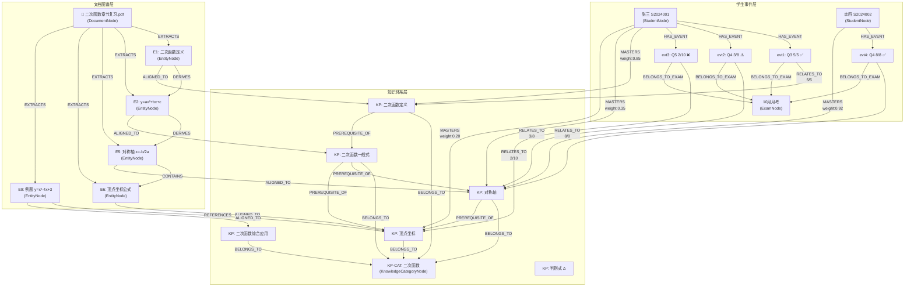

# 知识图谱构建示例：初中数学教辅资料

> 基于 [基于图谱技术的 AI 上下文处理与精准问答系统](./基于图谱技术的%20AI%20上下文处理与精准问答系统.md) 功能文档，按 GraphNexus 图模型设计给出完整构建示例。
>
> 日期：2026-06-13 | 作者：Jay

---

## 假设输入

一份 **初中数学二次函数** 的教辅 PDF（15页），包含以下内容：

- 二次函数的定义、图像性质（开口方向、对称轴、顶点坐标）
- 三种表达式：一般式 `y=ax²+bx+c`、顶点式 `y=a(x-h)²+k`、交点式 `y=a(x-x₁)(x-x₂)`
- 典型例题（3道）配详细解答
- 配套考试错题记录（CSV）：学生A在一次月考中二次函数相关题目得分

下面分五个步骤，完整演示从原始资料到宽图谱的构建过程。

---

## 第一步：PDF 文档图谱化 — 抽取实体与关系

**输入**：`二次函数章节复习.pdf`

**LLM 抽取产出**（模拟 NER/RE 结果，对应 `EntityNode` + `ReferencesEdge`）：

### 抽取的实体 (EntityNode)

| 实体 | entityType | 原文片段 | 所在页码 |
|------|-----------|---------|---------|
| `E1` | 定义 | "二次函数是指形如 y=ax²+bx+c（a≠0）的函数" | p2 |
| `E2` | 公式 | `y=ax²+bx+c`（一般式） | p2 |
| `E3` | 公式 | `y=a(x-h)²+k`（顶点式） | p3 |
| `E4` | 公式 | `y=a(x-x₁)(x-x₂)`（交点式） | p3 |
| `E5` | 概念 | "对称轴：直线 x=-b/(2a)" | p4 |
| `E6` | 概念 | "顶点坐标：(-b/(2a), (4ac-b²)/(4a))" | p4 |
| `E7` | 概念 | "开口方向：a>0 开口向上，a<0 开口向下" | p4 |
| `E8` | 概念 | "判别式 Δ=b²-4ac，Δ>0 与 x 轴有两个交点" | p5 |
| `E9` | 例题 | "已知二次函数 y=x²-4x+3，求顶点坐标和对称轴" | p8 |
| `E10` | 解法 | "配方法：y=(x-2)²-1，顶点(2,-1)，对称轴 x=2" | p9 |

### 实体间关系 (ReferencesEdge)

```
E1 -[DERIVES]-> E2   （定义推导出一般式）
E3 -[DERIVES]-> E4   （顶点式可展开为交点式）
E5 -[CONTAINS]-> E6  （对称轴概念包含顶点坐标公式）
E2 -[DERIVES]-> E5   （一般式→配方→对称轴公式）
E8 -[CONTAINS]-> E2  （判别式概念引用了 a,b,c 参数来自一般式）
E9 -[REFERENCES]-> E3  （例题解答引用了顶点式）
E10 -[DERIVES]-> E6  （配方法过程推导出顶点坐标）
```

### 实体对齐到知识点 (AlignedToEdge)

每个 `EntityNode` 需要对齐到标准 `KnowledgePointNode`：

```
E1 -[ALIGNED_TO]-> KP:二次函数定义
E2 -[ALIGNED_TO]-> KP:二次函数一般式
E3 -[ALIGNED_TO]-> KP:二次函数顶点式
E4 -[ALIGNED_TO]-> KP:二次函数交点式
E5 -[ALIGNED_TO]-> KP:对称轴
E6 -[ALIGNED_TO]-> KP:顶点坐标
E7 -[ALIGNED_TO]-> KP:开口方向
E8 -[ALIGNED_TO]-> KP:判别式
E9 -[ALIGNED_TO]-> KP:二次函数综合应用
```

---

## 第二步：知识点分类体系 — `KnowledgeCategoryNode` 树

知识点按教学大纲组织为层次分类树：

```
KP-CAT:初中数学
├── KP-CAT:代数
│   ├── KP-CAT:函数
│   │   ├── KP-CAT:一次函数
│   │   │   ├── KP:一次函数定义
│   │   │   └── KP:一次函数图像
│   │   └── KP-CAT:二次函数          ← 本 PDF 所在的分类
│   │       ├── KP:二次函数定义      ← E1 对齐到这里
│   │       ├── KP:二次函数一般式    ← E2 对齐到这里
│   │       ├── KP:二次函数顶点式    ← E3 对齐到这里
│   │       ├── KP:二次函数交点式    ← E4 对齐到这里
│   │       ├── KP:对称轴           ← E5 对齐到这里
│   │       ├── KP:顶点坐标         ← E6 对齐到这里
│   │       ├── KP:开口方向         ← E7 对齐到这里
│   │       ├── KP:判别式 Δ         ← E8 对齐到这里
│   │       └── KP:二次函数综合应用  ← E9 对齐到这里
│   └── KP-CAT:方程
│       └── KP-CAT:一元二次方程
│           └── KP:求根公式  ← 与判别式有前置关系
```

边类型：
- `KnowledgePoint -[BELONGS_TO]-> KnowledgeCategory`
- `KnowledgeCategory -[CHILD_OF]-> KnowledgeCategory`

---

## 第三步：知识点前置依赖 — `PrerequisiteEdge`

在 `KnowledgePoint` 之间建立前置依赖链，这是后续 **任务驱动剪枝** 的关键：

```
KP:二次函数定义   ──[PREREQUISITE_OF]──▶ KP:二次函数一般式
KP:二次函数一般式 ──[PREREQUISITE_OF]──▶ KP:对称轴
KP:二次函数一般式 ──[PREREQUISITE_OF]──▶ KP:顶点坐标
KP:对称轴──────── ──[PREREQUISITE_OF]──▶ KP:顶点坐标
KP:开口方向────── ──[PREREQUISITE_OF]──▶ KP:二次函数综合应用
KP:顶点坐标────── ──[PREREQUISITE_OF]──▶ KP:二次函数综合应用
KP:一次函数定义── ──[PREREQUISITE_OF]──▶ KP:二次函数定义   ← 跨分类依赖
KP:求根公式────── ──[PREREQUISITE_OF]──▶ KP:判别式 Δ       ← 跨分类依赖
```

**边属性示例**（`strength` 表示依赖强度 0-1，`description` 解释原因）：

```json
{
  "strength": 0.95,
  "description": "理解一般式 y=ax²+bx+c 才能计算对称轴 x=-b/(2a)"
}
```

---

## 第四步：结构化数据事件化 — 成绩 CSV → 事件图谱

**输入 CSV**（模拟学生成绩表）：

| student_no | student_name | exam_id | exam_name | exam_date | question_no | kp_name | max_score | raw_score |
|---|---|---|---|---|---|---|---|---|
| S2024001 | 张三 | EXAM-03 | 10月月考 | 2024-10-15 | Q3 | 二次函数定义 | 5 | 5 |
| S2024001 | 张三 | EXAM-03 | 10月月考 | 2024-10-15 | Q4 | 对称轴 | 8 | 3 |
| S2024001 | 张三 | EXAM-03 | 10月月考 | 2024-10-15 | Q5 | 顶点坐标 | 10 | 2 |
| S2024002 | 李四 | EXAM-03 | 10月月考 | 2024-10-15 | Q4 | 对称轴 | 8 | 8 |

### 转换后的图节点与边

#### 生成的节点

```cypher
// 学生节点 (StudentNode) — 如果已存在则复用
CREATE (s1:Student {studentNo: 'S2024001', name: '张三', className: '初三(1)班', grade: '初三'})
CREATE (s2:Student {studentNo: 'S2024002', name: '李四', className: '初三(1)班', grade: '初三'})

// 考试节点 (ExamNode)
CREATE (exam:Exam {name: '10月月考', subject: '数学', examDate: '2024-10-15', totalScore: 120})

// 事件节点 (EventNode) — 每行 CSV → 一个事件
CREATE (evt1:Event {eventType: 'EXAM_QUESTION', rawScore: 5, maxScore: 5, eventTime: '2024-10-15'})
CREATE (evt2:Event {eventType: 'EXAM_QUESTION', rawScore: 3, maxScore: 8, eventTime: '2024-10-15'})
CREATE (evt3:Event {eventType: 'EXAM_QUESTION', rawScore: 2, maxScore: 10, eventTime: '2024-10-15'})
CREATE (evt4:Event {eventType: 'EXAM_QUESTION', rawScore: 8, maxScore: 8, eventTime: '2024-10-15'})
```

#### 生成的关系边

```
S2024001 -[HAS_EVENT]-> evt1    (张三 → 考试事件1)
evt1 -[RELATES_TO {score:5, maxScore:5, weightDelta:+0.08}]-> KP:二次函数定义
evt1 -[BELONGS_TO_EXAM]-> exam

S2024001 -[HAS_EVENT]-> evt2    (张三 → 考试事件2)
evt2 -[RELATES_TO {score:3, maxScore:8, weightDelta:-0.15}]-> KP:对称轴
evt2 -[BELONGS_TO_EXAM]-> exam

S2024001 -[HAS_EVENT]-> evt3    (张三 → 考试事件3)
evt3 -[RELATES_TO {score:2, maxScore:10, weightDelta:-0.25}]-> KP:顶点坐标
evt3 -[BELONGS_TO_EXAM]-> exam

S2024002 -[HAS_EVENT]-> evt4    (李四 → 考试事件4)
evt4 -[RELATES_TO {score:8, maxScore:8, weightDelta:+0.12}]-> KP:对称轴
evt4 -[BELONGS_TO_EXAM]-> exam
```

> `weightDelta` 是根据得分率计算的知识点掌握度变化量，后续用于更新 `MasteryEdge.weight`。

---

## 第五步：宽图谱融合 — 全局拓扑

将文档图谱 + 知识体系 + 事件图谱全部融合，形成完整宽图谱。

### 拓扑缩略总览

```
Document ──EXTRACTS──▶ Entity ──ALIGNED_TO──▶ KnowledgePoint ◀──BELONGS_TO── KnowledgeCategory
                                                    ▲                        ▲
                                                    │                        │
Student ──HAS_EVENT──▶ Event ──RELATES_TO──────────┘              CHILD_OF
                │                  ▲                                   │
                │                  │                                   ▼
                └──SCORES_ON──▶ Question ──TESTS───┘          KnowledgeCategory (parent)
                                     ▲
                              Exam ──┘ CONTAINS
```

### 完整 Mermaid 图



---

## 关键路径解读：张三为什么顶点坐标得分低？

以 **"张三为什么顶点坐标得分低？"** 为例，图中有两条因果路径同时作用：

```
路径 A（文档源头）：
  PDF → E1: 二次函数定义 → E2: 一般式 → E5: 对称轴 → E6: 顶点公式
                                ↓                     ↓
                          KP: 一般式 ──PREREQ──▶ KP: 顶点坐标
                                ↑                     ↓
                          张三 MASTERS(weight:0.85)  MASTERS(weight:0.20 ❌)

路径 B（成绩证据）：
  evt2: 对称轴 3/8 ⚠️ ——RELATES_TO——▶ KP: 对称轴 ──PREREQ──▶ KP: 顶点坐标
  evt3: 顶点 2/10 ❌ ——RELATES_TO——▶ KP: 顶点坐标
```

**推理链**：

> 张三一般式掌握尚可(0.85)，但对称轴得分低(3/8)，而对称轴是顶点坐标的前置知识(`PREREQUISITE_OF`, strength=0.95)，所以根本原因是 **"对称轴未掌握"导致顶点坐标失分**，而非顶点公式本身记错。

这就是 **宽图谱融合** 的核心价值：文档结构 + 知识点前置依赖 + 成绩事件三条线索交叉验证，给出可解释的归因分析。

---

## 附录：任务驱动剪枝示意

如果 LLM 收到问题 **"分析张三的二次函数薄弱点"**，剪枝策略如下：

| 步骤 | 操作 | 说明 |
|------|------|------|
| **1. 锚点定位** | 锁定 `Student(张三)` 节点 | 确定查询的根节点 |
| **2. 一跳遍历** | 沿 `HAS_EVENT → RELATES_TO` 拿到掌握度 < 0.6 的知识点 | 定位薄弱点：对称轴(0.35)、顶点坐标(0.20) |
| **3. 二跳扩展** | 沿 `PREREQUISITE_OF` 反向追溯前置知识链 | 顶点坐标 ← 对称轴 ← 一般式 ← 二次函数定义 |
| **4. 三跳外扩** | 沿 `EXTRACTS ← ALIGNED_TO` 拿到原始文档中的定义/公式实体 | 作为给 LLM 的参考材料 |
| **5. 子图输出** | 将上述路径上的所有节点和边构造成精简子图 | 约 15 节点 20 边，作为 LLM 上下文 |

经过剪枝后，LLM 的输入量从整个宽图谱的数万条边缩减到一个高度相关的小子图，避免了上下文噪音和截断，使得 LLM 能够精准回答：

> **"张三的薄弱点是顶点坐标，根因是对称轴公式未掌握，建议从配方法入手复习。"**

---

## 涉及的图节点与边清单

本示例覆盖了 GraphNexus 设计中的全部核心节点与边类型（参考 [logical-view.md](../docs/design-view/logical-view/logical-view.md)）：

### 使用的节点类型（7/8 种）

| 节点类 | Neo4j Label | 本示例实例 |
|:--|:--|:--|
| `StudentNode` | `:Student` | 张三、李四 |
| `KnowledgePointNode` | `:KnowledgePoint` | 二次函数定义、对称轴、顶点坐标 等 9 个 |
| `KnowledgeCategoryNode` | `:KnowledgeCategory` | 初中数学、代数、函数、二次函数 等 |
| `DocumentNode` | `:Document` | 二次函数章节复习.pdf |
| `EntityNode` | `:Entity` | E1~E10 共 10 个实体 |
| `ExamNode` | `:Exam` | 10月月考 |
| `EventNode` | `:Event` | evt1~evt4 共 4 个考试事件 |

> 仅 `QuestionNode` 未在本示例中使用（需更细粒度的试卷结构定义，属于延伸场景）。

### 使用的边类型（9/13 种）

| 边类 | Neo4j Type | 本示例关系 |
|:--|:--|:--|
| `MasteryEdge` | `MASTERS` | 张三 → 知识点的掌握度 |
| `PrerequisiteEdge` | `PREREQUISITE_OF` | 知识点间的学习前置依赖 |
| `BelongsToEdge` | `BELONGS_TO` | 知识点 → 知识分类 |
| `ChildOfEdge` | `CHILD_OF` | 知识分类 → 父分类 |
| `ExtractsEdge` | `EXTRACTS` | 文档 → 实体 |
| `ReferencesEdge` | `REFERENCES/DERIVES/CONTAINS` | 实体间引用/推导/包含 |
| `AlignedToEdge` | `ALIGNED_TO` | 实体 → 知识点对齐 |
| `HasEventEdge` | `HAS_EVENT` | 学生 → 事件 |
| `RelatesToEdge` | `RELATES_TO` | 事件 → 知识点关联 |
| `BelongsToExamEdge` | `BELONGS_TO_EXAM` | 事件 → 考试归属 |